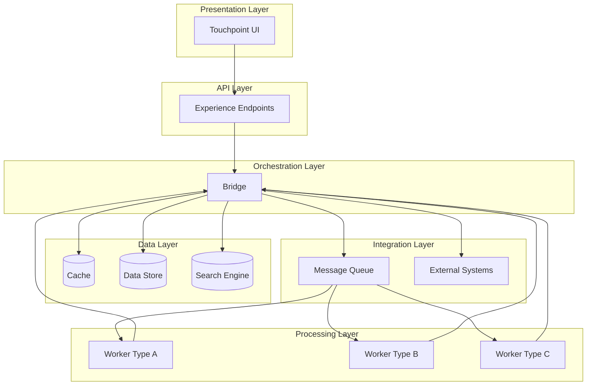
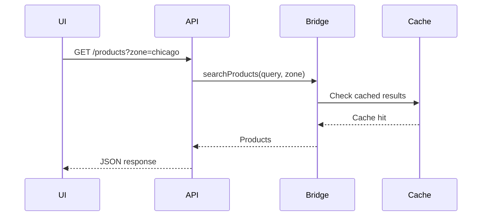
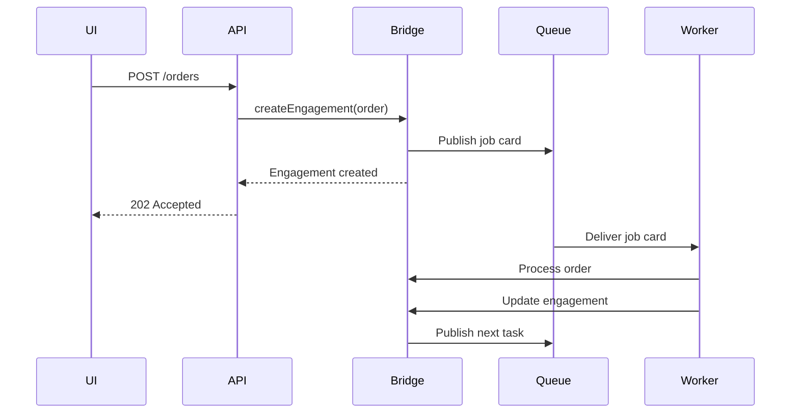
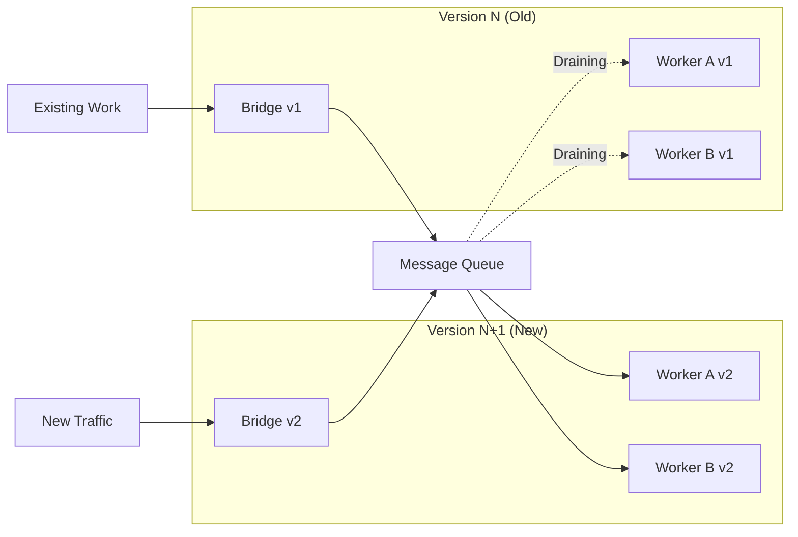

# Architecture
**Use when:** Understanding how CommerceBridge components work together.

## System Overview

CommerceBridge follows a distributed architecture with clear separation of concerns across four primary layers.



## Core Layers

### 1. Admin and Monitoring Layer
- Manages communities and workers
- Provides community monitoring
- Provides the configuration framework for Touchpoint
- Manages datastores and data syncing

### 2. API Layer (Experience Endpoints)
- REST APIs for UI consumption
- Request validation and routing
- Session management
- Bridge coordination

### 3. Orchestration Layer (Bridge)
- State management and coordination
- Business logic enforcement
- Multi-tenant resource management
- Integration hub

### 4. Processing Layer (Workers)
- Async task execution
- Stateless, scalable processors
- Message queue consumers
- Business task specialization

### 5. Data Layer
- **Datastore:** Persistent data sinks used as a data abstraction layer
- **Common Data Models:** Used across CommerceBridge, Touchpoint and Eidos

### 6. Integration Layer
- **Message Queue:** Worker task distribution
- **External Systems:** ERP, payment, shipping, etc. (via Bridge extensions)
- **Search Engine:** Full-text and spatial queries

## Communication Patterns

### Synchronous Operations



**Use for:**
- Data queries (products, pricing, availability)
- Read operations
- Cache-backed requests
- Real-time UI updates

### Asynchronous Operations



**Use for:**
- Order processing
- Inventory allocation
- External system sync
- Notifications
- Complex workflows

## Design Patterns

### 1. Extension Over Modification

**Problem:** Need to add integrations without modifying core code.

**Solution:** Extend the base Bridge class:

```ts
export class TenantBridge extends BaseBridge {
  // Add your integrations
  async customIntegration() { }
}
```

### 2. Queue-Based Decoupling

**Problem:** Tight coupling between services.

**Solution:** All async communication through message queues:

- APIs publish job cards
- Workers consume job cards
- No direct service-to-service calls
- Natural retry and fault tolerance

### 3. Stateless between Workers, Stateful Within a Worker

**Problem:** Scaling stateful services is complex.

**Solution:** Workers maintain state only within the cycle:

- Workers are disposable
- Scale by adding instances
- Deploy new versions alongside old
- Some state between jobs and job tasks processed within the same worker can be held to increase efficiency

### 4. Multi-Tenant Isolation

**Problem:** Securely isolate tenant data.

**Solution:** Tenant context enforced at every layer:

- Data namespaced by tenant
- Cache keys prefixed with tenant ID
- Job cards include tenant context
- Workers validate tenant access

## Do / Don't

### ✅ Do

- Use message queues for async operations
- Keep workers stateless and focused
- Extend the Bridge for custom integrations
- Enforce tenant context everywhere
- Use Mermaid diagrams to explain flows
- Design for horizontal scaling

### ❌ Don't

- Create direct worker-to-worker communication
- Store state in workers
- Create side-services outside Bridge/Worker pattern
- Mix tenant-specific logic in base components
- Hardcode infrastructure details
- Bypass the orchestration layer

## Deployment Model



**Philosophy:** "Starve old workers, evolve ecosystems"

- Deploy new versions alongside old
- Route new work to new workers
- Let old workers finish their jobs
- No rolling restarts needed
- Zero-downtime deployments

## IP Safety

This documentation describes:
- **Public:** Architecture patterns, component interactions, design principles
- **Private (not shown):** Specific queue names, database schemas, infrastructure configurations, deployment scripts

---

**Architecture: Distributed by design, simple by principle.**
