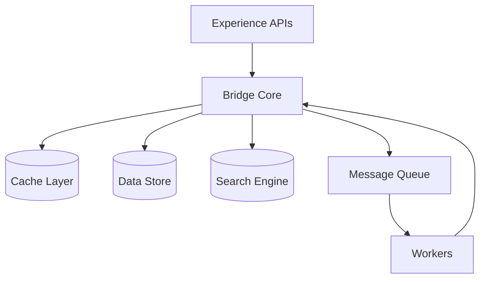

# The Bridge
Central orchestration layer that manages state, coordinates workers, and provides the foundation for all commerce operations.

## Responsibilities

### State Management
- Owns all persistent and cached state in the system
- Manages engagement lifecycle state
- Coordinates distributed caching layer
- Ensures state consistency across workers

### Orchestration
- Routes operations to appropriate handlers
- Coordinates multi-step workflows
- Manages async task distribution to workers
- Ensures transactional consistency

### Integration Foundation
- Provides base functions for commerce operations
- Extensible interface for custom integrations
- Multi-tenant resource coordination
- API gateway for experience layer

## Lifecycle

### 1. Initialization
Bridge initializes with configuration for:
- Data storage connections
- Cache layer connections
- Message queue connections  
- Search infrastructure
- Tenant context

### 2. Operation
Bridge handles requests by:
- Validating tenant context
- Executing requested operation
- Managing state changes
- Publishing tasks to workers (if async)
- Returning results

### 3. Extension
Developers extend the base Bridge with custom functionality while inheriting core operations.

## Architecture


```mermaid
flowchart TB
    API[Experience APIs]
    BRIDGE[Bridge Core]
    CACHE[(Cache Layer)]
    STORE[(Data Store)]
    SEARCH[(Search Engine)]
    QUEUE[Message Queue]
    WORKERS[Workers]
    
    API --> BRIDGE
    BRIDGE --> CACHE
    BRIDGE --> STORE
    BRIDGE --> SEARCH
    BRIDGE --> QUEUE
    QUEUE --> WORKERS
    WORKERS --> BRIDGE
```

## Interfaces (Public-Safe)

### Base Bridge Interface

```ts
export interface Bridge {
  // Engagement operations
  createEngagement(params: EngagementParams): Promise<Engagement>
  getEngagement(id: string): Promise<Engagement>
  updateEngagement(id: string, updates: Partial<Engagement>): Promise<Engagement>
  
  // Pricing operations
  calculatePrice(context: PricingContext): Promise<PricingResult>
  applyPriceModifiers(base: number, modifiers: Modifier[]): Promise<number>
  
  // Fulfillment operations
  allocateInventory(engagementId: string, items: LineItem[]): Promise<AllocationResult>
  checkAvailability(query: AvailabilityQuery): Promise<AvailabilityResult>
  
  // State operations
  cacheData(key: string, value: unknown, ttl?: number): Promise<void>
  getFromCache(key: string): Promise<unknown>
  invalidateCache(pattern: string): Promise<void>
  
  // Queue operations
  publishTask(queue: string, task: JobCard): Promise<void>
  
  // Multi-tenant operations
  getTenantConfig(tenantId: string): Promise<TenantConfig>
}
```

## Example (Pseudo)

### Using the Base Bridge

```ts
import { BaseBridge } from '@commercebridge/core'

const bridge = new BaseBridge({
  dataStore: { /* connection config */ },
  cache: { /* connection config */ },
  queue: { /* connection config */ },
  tenantId: 'tenant-alpha'
})

// Create an engagement
const engagement = await bridge.createEngagement({
  customerId: 'customer-123',
  type: 'order'
})

// Calculate pricing
const pricing = await bridge.calculatePrice({
  productId: 'product-456',
  quantity: 100,
  customerId: 'customer-123'
})

// Allocate inventory
const allocation = await bridge.allocateInventory(
  engagement.id,
  engagement.lineItems
)
```

### Extending the Bridge

```ts
import { BaseBridge } from '@commercebridge/core'

export class CustomBridge extends BaseBridge {
  // Add your integrations
  async syncToExternalSystem(data: unknown) {
    // Your integration logic
  }
  
  // Add custom business logic
  async applyCustomPricingRules(engagement: Engagement) {
    // Your pricing logic
  }
}
```

## Extension Points

### 1. Custom Integrations

Extend the Bridge to add external system integrations:
- ERP systems
- Messaging services
- Payment gateways
- Shipping carriers
- Analytics platforms

### 2. Custom Business Logic

Add tenant-specific business rules:
- Pricing calculations
- Approval workflows
- Inventory policies
- Customer validation

### 3. Custom Data Operations

Extend data handling:
- Additional caching strategies
- Custom search queries
- Data transformations
- Reporting aggregations

## Do / Don't

### ✅ Do

- Extend the base Bridge for your needs
- Keep all integrations in the Bridge (don't scatter across workers)
- Use dependency injection for external clients
- Maintain multi-tenant awareness in all operations
- Document your custom functions

### ❌ Don't

- Modify the base Bridge directly
- Create side-services for integrations
- Bypass the Bridge from workers
- Hardcode credentials or tenant-specific values
- Mix tenant logic in base implementations

## IP Safety

This documentation describes:
- **Public:** Interfaces, patterns, extension points
- **Private (not shown):** Specific schemas, infrastructure details, tenant configurations

---

**The Bridge provides the foundation. You bring the integrations.**
