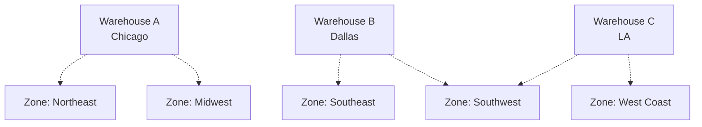

# Fulfillment Engine
Intelligent item availability across multiple warehouses. The purpose of this module is not to manage fulfillment but to answer the question of if this produc tis available. 

## Responsibilities

### Inventory Management
- Track inventory across multiple warehouses
- Sync with external inventory systems

### Delivery Zone Management
- Define geographic delivery boundaries
- Filter warehouses by deliverable zones
- Estimate delivery time estimates
- Apply zone-based constraints

### Availability Checking
- Real-time inventory availability
- Multi-warehouse aggregation
- Zone-filtered results

## Delivery Zones

### Concept

Delivery zones define geographic areas where warehouses can deliver.

### Zone Types

**Geographic polygon:**
- State or province boundaries
- Custom drawn regions
- Multi-state territories

### Zone Properties

Each zone has:
- Geographic boundaries
- Delivery time estimates
- Serving warehouses
- Pricing modifiers
- Carrier restrictions

## Multi-Warehouse Scenarios

### Scenario 1: Single Warehouse

**Order:** 50 units to Chicago  
**Warehouse A (Milwaukee):** 100 units in stock, serves Chicago, 1-day delivery  
**Result:** Allocate all 50 from Warehouse A

### Scenario 2: Split Shipment

**Order:** 150 units to Chicago  
**Warehouse A (Milwaukee):** 100 units in stock  
**Warehouse B (Indianapolis):** 60 units in stock  
**Result:** Split - 100 from A, 50 from B

### Scenario 3: Zone Constraint

**Order:** 100 units to rural Montana  
**Warehouse A:** 200 units, doesn't serve Montana  
**Warehouse B:** 80 units, serves Montana  
**Result:** Can fulfill 80 units max

### Scenario 4: Optimization

**Order:** 200 units to Dallas  
**Warehouse A:** Has stock, 800 miles away, 4 days, $150 shipping  
**Warehouse B:** Has stock, 200 miles away, 2 days, $75 shipping  
**Result:** Optimize for Warehouse B

## Spatial Filtering

Uses search engine for geographic queries:

**Point-in-polygon:**
- Is delivery address within zone?

**Radius search:**
- Warehouses within distance of address

**Zone intersection:**
- Does warehouse's delivery zone include this location?

---

**Fulfillment Engine: Smart allocation, optimized delivery.**
