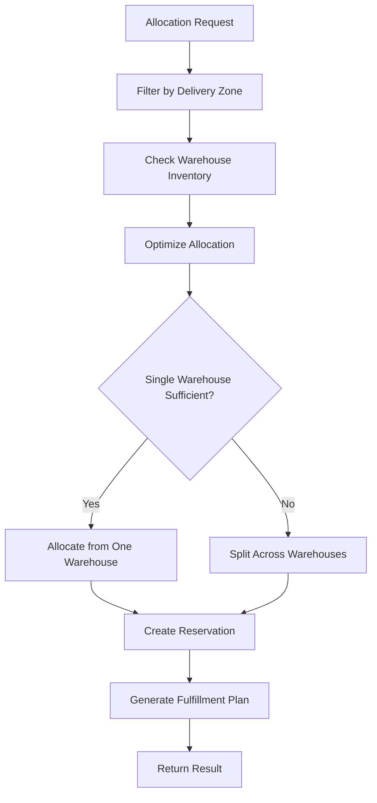
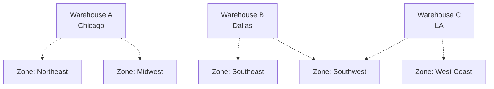

# Fulfillment Engine
Intelligent inventory allocation and delivery orchestration across multiple warehouses.

## Responsibilities

### Inventory Management
- Track inventory across multiple warehouses
- Reserve stock for pending orders
- Release reservations on cancellation
- Sync with external inventory systems

### Delivery Zone Management
- Define geographic delivery boundaries
- Filter warehouses by deliverable zones
- Calculate delivery time estimates
- Apply zone-based constraints

### Availability Checking
- Real-time inventory availability
- Multi-warehouse aggregation
- Zone-filtered results
- Alternative product suggestions

## Lifecycle

### 1. Availability Check
Customer views product or adds to cart:
- Check inventory across warehouses
- Filter by customer's delivery zone
- Calculate estimated delivery
- Return availability status

### 2. Reservation
Customer initiates checkout:
- Reserve inventory at selected warehouse(s)
- Generate reservation ID
- Set expiration timeout
- Hold stock temporarily

### 3. Allocation
Order is confirmed:
- Convert reservation to allocation
- Lock inventory for order
- Generate fulfillment plan
- Assign to warehouse operations

### 4. Fulfillment
Order is shipped:
- Update inventory levels
- Generate tracking information
- Calculate actual shipping costs
- Update engagement status

### 5. Completion
Order is delivered:
- Close allocation
- Update final inventory
- Archive fulfillment data
- Calculate metrics

## Allocation Flow


```mermaid
flowchart TB
    START[Allocation Request] --> ZONES[Filter by Delivery Zone]
    ZONES --> CHECK[Check Warehouse Inventory]
    CHECK --> OPT[Optimize Allocation]
    OPT --> SINGLE{Single Warehouse Sufficient?}
    SINGLE -->|Yes| ALLOC1[Allocate from One Warehouse]
    SINGLE -->|No| SPLIT[Split Across Warehouses]
    ALLOC1 --> RESERVE[Create Reservation]
    SPLIT --> RESERVE
    RESERVE --> PLAN[Generate Fulfillment Plan]
    PLAN --> RETURN[Return Result]
```

## Interfaces (Public-Safe)

```ts
export interface AvailabilityQuery {
  productId: string
  quantity: number
  deliveryZone?: string
  uom?: string
  requestedDate?: Date
}

export interface AvailabilityResult {
  available: boolean
  quantityAvailable: number
  warehouses: WarehouseAvailability[]
  estimatedDelivery?: Date
  alternatives?: Product[]
}

export interface AllocationResult {
  success: boolean
  allocations: WarehouseAllocation[]
  reservationId: string
  expiresAt: Date
  splitShipment: boolean
}

export interface WarehouseAllocation {
  warehouseId: string
  productId: string
  quantity: number
  estimatedShipDate: Date
}
```

## Example (Pseudo)

### Check Availability

```ts
const availability = await bridge.checkAvailability({
  productId: 'product-456',
  quantity: 100,
  deliveryZone: 'midwest'
})

// Returns:
// {
//   available: true,
//   quantityAvailable: 150,
//   warehouses: [
//     { id: 'warehouse-a', available: 100, deliveryDays: 2 },
//     { id: 'warehouse-b', available: 50, deliveryDays: 3 }
//   ],
//   estimatedDelivery: Date(+2 days)
// }
```

### Allocate Inventory

```ts
const allocation = await bridge.allocateInventory(
  'engagement-123',
  lineItems
)

// Returns:
// {
//   success: true,
//   allocations: [
//     { warehouseId: 'warehouse-a', productId: 'product-456', quantity: 100 }
//   ],
//   reservationId: 'reservation-xyz',
//   expiresAt: Date(+30 minutes),
//   splitShipment: false
// }
```

### Optimize Fulfillment

```ts
const plan = await bridge.optimizeFulfillment('engagement-123')

// Returns best warehouse allocation considering:
// - Delivery zone constraints
// - Inventory availability  
// - Shipping costs
// - Delivery speed
// - Warehouse capabilities
```

## Delivery Zones

### Concept

Delivery zones define geographic areas where warehouses can deliver.


```mermaid
graph TB
    W1[Warehouse A<br/>Chicago] -.-> Z1[Zone: Midwest]
    W1 -.-> Z2[Zone: Northeast]
    
    W2[Warehouse B<br/>Dallas] -.-> Z3[Zone: Southwest]
    W2 -.-> Z4[Zone: Southeast]
    
    W3[Warehouse C<br/>LA] -.-> Z5[Zone: West Coast]
    W3 -.-> Z3
```

### Zone Types

**Geographic polygon:**
- State or province boundaries
- Custom drawn regions
- Multi-state territories

**Postal code lists:**
- Specific ZIP/postal codes
- Rural vs urban classifications

### Zone Properties

Each zone has:
- Geographic boundaries
- Delivery time estimates
- Serving warehouses
- Pricing modifiers
- Carrier restrictions

## Multi-Warehouse Scenarios

### Scenario 1: Single Warehouse

**Order:** 50 units to Chicago  
**Warehouse A (Milwaukee):** 100 units in stock, serves Chicago, 1-day delivery  
**Result:** Allocate all 50 from Warehouse A

### Scenario 2: Split Shipment

**Order:** 150 units to Chicago  
**Warehouse A (Milwaukee):** 100 units in stock  
**Warehouse B (Indianapolis):** 60 units in stock  
**Result:** Split - 100 from A, 50 from B

### Scenario 3: Zone Constraint

**Order:** 100 units to rural Montana  
**Warehouse A:** 200 units, doesn't serve Montana  
**Warehouse B:** 80 units, serves Montana  
**Result:** Can fulfill 80 units max, suggest alternatives

### Scenario 4: Optimization

**Order:** 200 units to Dallas  
**Warehouse A:** Has stock, 800 miles away, 4 days, $150 shipping  
**Warehouse B:** Has stock, 200 miles away, 2 days, $75 shipping  
**Result:** Optimize for Warehouse B (closer, faster, cheaper)

## Spatial Filtering

Uses search engine for geographic queries:

**Point-in-polygon:**
- Is delivery address within zone?

**Radius search:**
- Warehouses within distance of address

**Zone intersection:**
- Does warehouse's delivery zone include this location?

---

**Fulfillment Engine: Smart allocation, optimized delivery.**
