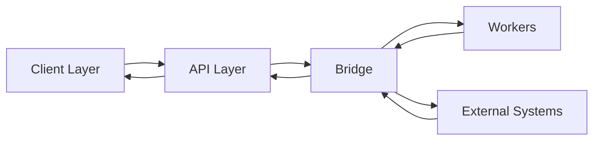
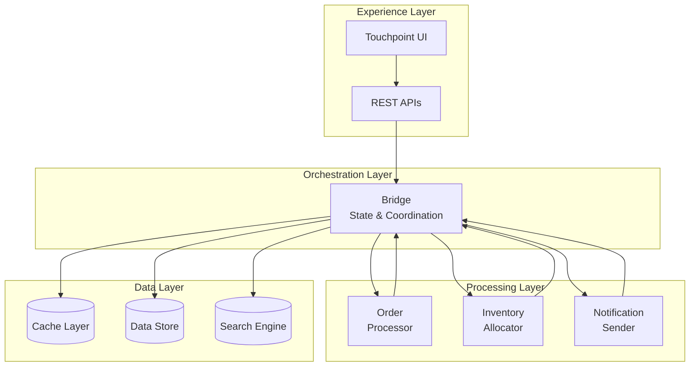

# CommerceBridge Overview
**Tagline:** The framework that models commerce as conversations, not transactions.

## What It Is

CommerceBridge is a distributed commerce orchestration framework built for complex B2B operations. It models the entire commerce journey as an **engagement** rather than isolated transactions.

The framework consists of a central orchestration layer (the Bridge) that coordinates stateless processing units (Workers) to handle sophisticated commerce workflows. It's designed for multi-tenant environments where each tenant extends the base system with their own business logic and integrations.

Unlike cart-focused e-commerce platforms, CommerceBridge handles complex B2B scenarios: configurable products, sophisticated pricing rules, multi-warehouse fulfillment, and long-running commerce conversations.

## Why It Exists

Traditional commerce systems struggle with modern B2B requirements. CommerceBridge addresses these challenges:

| Problem | Solution |
|---------|----------|
| Orders treated as isolated events | Engagements model full conversation lifecycle |
| Monolithic, hard-to-scale architecture | Distributed workers with elastic scaling |
| Rigid, limited pricing models | Multi-stage configurable pricing engine |
| Single-warehouse limitations | Multi-warehouse optimization with delivery zones |
| Tightly coupled business logic | Extension pattern for tenant customization |
| Poor multi-tenant design | Built for multi-tenancy from the ground up |

## Core Abstractions

| Term | Meaning |
|------|---------|
| **Bridge** | Central orchestration layer managing state and coordination |
| **Engagement** | Lifecycle container for the full commerce conversation |
| **Worker** | Stateless processor executing discrete business tasks |
| **Job Card** | Unit of work delivered to workers |
| **Pricing Engine** | Multi-stage price calculation with modifiers |
| **Fulfillment Engine** | Intelligent multi-warehouse inventory allocation |

## High-Level Flow


```mermaid
flowchart LR
    A[Client Layer] --> B[API Layer]
    B --> C[Bridge]
    C --> D[Workers]
    D --> C
    C --> E[External Systems]
    E --> C
    C --> B
    B --> A
```

**Request flow:**
1. Client (UI) makes request
2. API layer receives and validates
3. Bridge orchestrates operation
4. Workers process async tasks
5. Workers use Bridge for all operations
6. Bridge coordinates with external systems
7. Results flow back to client

## System Architecture


```mermaid
flowchart TB
    subgraph "Experience Layer"
        UI[Touchpoint UI]
        API[REST APIs]
    end
    
    subgraph "Orchestration Layer"
        BRIDGE[Bridge<br/>State & Coordination]
    end
    
    subgraph "Processing Layer"
        W1[Order<br/>Processor]
        W2[Inventory<br/>Allocator]
        W3[Notification<br/>Sender]
    end
    
    subgraph "Data Layer"
        CACHE[(Cache Layer)]
        STORE[(Data Store)]
        SEARCH[(Search Engine)]
    end
    
    UI --> API
    API --> BRIDGE
    BRIDGE --> W1
    BRIDGE --> W2
    BRIDGE --> W3
    BRIDGE --> CACHE
    BRIDGE --> STORE
    BRIDGE --> SEARCH
    W1 --> BRIDGE
    W2 --> BRIDGE
    W3 --> BRIDGE
```

## Key Components

### The Bridge
Central orchestration layer that:
- Manages all system state
- Provides core commerce functions
- Coordinates distributed workers
- Enforces multi-tenant isolation

[Learn about The Bridge →](/commercebridge/bridge)

### Workers
Stateless processors that:
- Execute specific business tasks
- Consume job cards from queues
- Scale elastically based on load
- Exit gracefully when replaced

[Learn about Workers →](/commercebridge/workers)

### Engagements
Lifecycle containers that:
- Model commerce as conversations
- Maintain state across interactions
- Track full customer journey
- Provide complete audit trail

[Learn about Engagements →](/commercebridge/engagement)

### Pricing Engine
Calculation engine that:
- Applies multi-stage price modifiers
- Handles volume breaks and customer pricing
- Adjusts for delivery zones
- Caches for performance

[Learn about Pricing Engine →](/commercebridge/pricing-engine)

### Fulfillment Engine
Allocation system that:
- Manages multi-warehouse inventory
- Optimizes delivery from warehouse network
- Filters by delivery zones
- Handles split shipments

[Learn about Fulfillment Engine →](/commercebridge/fulfillment-engine)

## Public vs Private

| Public (Documented Here) | Private (Not Exposed) |
|--------------------------|----------------------|
| Core concepts and patterns | Implementation details |
| Base Bridge function signatures | Database schemas |
| Worker patterns and lifecycle | Queue topic names |
| Extension interfaces | Infrastructure specifics |
| Generic pseudo-code examples | Tenant-specific logic |
| Architectural diagrams | Production configurations |

## Extension Model

CommerceBridge is designed to be **extended, not modified**:

### Extend the Bridge

Add your integrations and business logic:

```ts
export class MyBridge extends BaseBridge {
  async syncToErp(order: Order) {
    // Your ERP integration
  }
  
  async customPricingLogic(context: PricingContext) {
    // Your pricing rules
  }
}
```

### Create Workers

Build task-specific processors:

```ts
export class MyWorker extends BaseWorker {
  async work(job: JobCard) {
    // Your business task
  }
}
```

### Configure Pricing

Define your price modifiers and rules:

```ts
const modifiers = [
  { type: 'volume-discount', value: 0.15, operation: 'multiply' },
  { type: 'zone-upcharge', value: 5, operation: 'add' }
]
```

### Define Zones

Set up your delivery network:

```ts
const zones = [
  { id: 'midwest', warehouses: ['warehouse-a'], deliveryDays: 2 },
  { id: 'southwest', warehouses: ['warehouse-b'], deliveryDays: 3 }
]
```

## Next

- [Overview →](/commercebridge/overview) — Detailed framework overview
- [Architecture →](/commercebridge/architecture) — System architecture and patterns
- [Core Bridge API →](/commercebridge/core-bridge) — Complete function reference

---

**CommerceBridge: Orchestration for complex commerce.**
