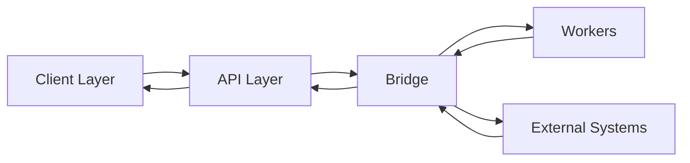
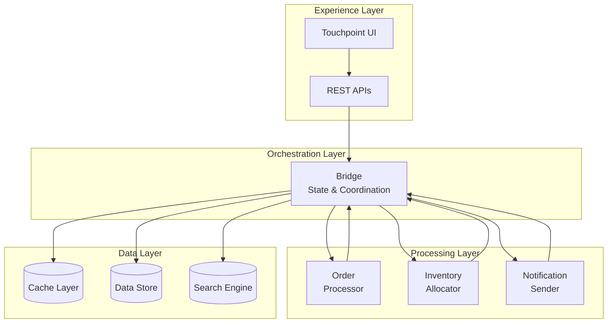

# CommerceBridge Overview
**Tagline:** The framework that models commerce as conversations, not transactions.

## What It Is

CommerceBridge is a distributed commerce orchestration framework built for complex B2B operations. It models the entire commerce journey as an **engagement** rather than isolated transactions.

The framework consists of a central abstraction layer (the Bridge) that provides a common API interface between stateless processing units (Workers) and integrations. It's designed for multi-tenant environments where each tenant extends the base system with their own business logic and integrations.

Unlike cart-focused e-commerce platforms, CommerceBridge handles complex B2B scenarios: configurable products, sophisticated pricing rules, multi-warehouse fulfillment, and long-running commerce conversations.

## Why It Exists

Traditional commerce systems struggle with modern B2B requirements. CommerceBridge addresses these challenges:

| Problem | Solution |
|---------|----------|
| Orders treated as isolated events | Engagements model full conversation lifecycle |
| Monolithic, hard-to-scale architecture | Distributed workers with elastic scaling |
| Rigid, limited pricing models | Multi-stage configurable pricing engine |
| Single-warehouse limitations | Multi-warehouse optimization with delivery zones |
| Tightly coupled business logic | Extension pattern for tenant customization |
| Poor multi-tenant design | Built for multi-tenancy from the ground up |

## Core Abstractions

| Term | Meaning |
|------|---------|
| **Bridge** | Central abstraction layer providing common API interface between Workers and integrations |
| **Engagement** | Lifecycle container for the full commerce conversation |
| **Worker** | Stateless processor executing discrete business tasks |
| **Job Card** | Unit of work delivered to workers |
| **Pricing Engine** | Multi-stage price calculation with modifiers |
| **Fulfillment Engine** | Intelligent multi-warehouse inventory allocation |

## High-Level Flow

**Request flow:**
1. Client (UI) makes request
2. API layer receives and validates
3. Workers process async tasks
5. Workers use Bridge for all operations
6. Bridge coordinates with external systems
7. Results flow back to client

## System Architecture

## Key Components

### The Bridge
Central abstraction layer that:
- Provides common API interface between Workers and integrations
- Centralizes shared integration logic (payments, messaging, shipping)
- Manages multi-tenant data isolation
- Offers core commerce functions and state management
- Enforces access control and Role Based Access

[Learn about The Bridge →](/commercebridge/bridge)

### Workers
Stateless processors that:
- Execute specific business tasks
- Consume job cards from queues
- Scale elastically based on load
- Exit gracefully when replaced

[Learn about Workers →](/commercebridge/workers)

### Engagements
Lifecycle containers that:
- Model commerce as conversations
- Maintain state across interactions
- Track full customer journey
- Provide complete audit trail

[Learn about Engagements →](/commercebridge/engagement)

### Pricing Engine
Calculation engine that:
- Applies multi-stage price modifiers
- Handles volume breaks and customer pricing
- Adjusts for delivery zones
- Caches for performance

[Learn about Pricing Engine →](/commercebridge/pricing-engine)

### Fulfillment Engine
Allocation system that:
- Manages multi-warehouse inventory
- Optimizes delivery from warehouse network
- Filters by delivery zones
- Handles split shipments

[Learn about Fulfillment Engine →](/commercebridge/fulfillment-engine)

## Extension Model

CommerceBridge is designed to be **extended, not modified**. Rather than forking or modifying the core framework, you create custom ecosystems that import the base functionality and add your specific business logic.

Your custom ecosystem combines:
- **Core workers** from the `@mesh/ecosystem` package
- **Custom workers** with your business-specific logic
- **Extended Bridge** with your integrations (ERPs, payment systems, messaging services)
- **Configuration** that defines how everything connects

This approach keeps the core framework clean and upgradeable while giving you complete flexibility to build exactly what your business needs. Workers access both core Bridge functions (engagement management, pricing, fulfillment) and your custom Bridge functions (ERP sync, custom pricing rules, specialized workflows) through a single unified interface.

[Learn how to build Custom Ecosystems →](/commercebridge/integrations)

## Next

- [Overview →](/commercebridge/overview) — Detailed framework overview
- [Architecture →](/commercebridge/architecture) — System architecture and patterns
- [Core Bridge API →](/commercebridge/core-bridge) — Complete function reference

---

**CommerceBridge: Orchestration for complex commerce.**
