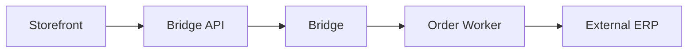

# Integration Examples
**Pattern:** Common integration scenarios with public-safe examples.

## E-Commerce Platform Integration

### Problem
Connect CommerceBridge to a storefront for order intake.

### Solution



### Pattern

```ts
// Storefront checkout webhook
app.post('/webhooks/order-created', async (req, res) => {
  // Create engagement in CommerceBridge
  const engagement = await bridge.createEngagement({
    customerId: req.body.customer.id,
    type: 'order',
    lineItems: req.body.items.map(item => ({
      productId: item.sku,
      quantity: item.quantity,
      uom: 'each'
    }))
  })
  
  // Publish for async processing
  await bridge.publishTask('order-processing', {
    task: 'process-order',
    payload: { engagementId: engagement.id }
  })
  
  res.json({ success: true, engagementId: engagement.id })
})
```

---

## ERP Integration

### Problem
Sync orders bidirectionally with enterprise ERP system.

### Solution

Extend the Bridge with ERP integration:

```ts
export class ErpIntegratedBridge extends BaseBridge {
  async syncOrderToErp(engagement: Engagement) {
    // Transform to ERP format
    const erpOrder = this.transformToErpFormat(engagement)
    
    // Send to ERP (your integration)
    const erpResponse = await this.erpClient.createOrder(erpOrder)
    
    // Store ERP reference
    await this.updateEngagement(engagement.id, {
      metadata: { erpOrderId: erpResponse.id }
    })
    
    return erpResponse
  }
  
  async syncInventoryFromErp() {
    // Fetch from ERP
    const erpInventory = await this.erpClient.getInventory()
    
    // Update CommerceBridge inventory
    for (const item of erpInventory) {
      await this.updateInventoryLevel(
        item.sku,
        item.warehouse,
        item.quantity
      )
    }
  }
}
```

### Worker Implementation

```ts
export class OrderSyncWorker extends BaseWorker {
  private bridge: ErpIntegratedBridge
  
  async work(job: JobCard) {
    const engagement = await this.bridge.getEngagement(job.payload.id)
    
    // Sync to ERP
    await this.bridge.syncOrderToErp(engagement)
    
    // Update engagement with sync status
    await this.bridge.updateEngagement(engagement.id, {
      metadata: { erpSynced: true, syncedAt: new Date() }
    })
  }
}
```

---

## Notification Integration

### Problem
Send customer notifications via SMS and email.

### Solution

```ts
export class NotificationBridge extends BaseBridge {
  async sendOrderConfirmation(engagementId: string) {
    const engagement = await this.getEngagement(engagementId)
    const customer = await this.getCustomer(engagement.customerId)
    
    // Send via your messaging service
    await this.sendEmail(customer.email, 'order-confirmation', {
      orderNumber: engagement.id,
      items: engagement.lineItems,
      total: engagement.pricing.finalPrice
    })
    
    await this.sendSms(customer.phone, 
      `Order ${engagement.id} confirmed! Track at: [link]`
    )
  }
  
  private async sendEmail(to: string, template: string, data: unknown) {
    // Your email service integration
  }
  
  private async sendSms(to: string, message: string) {
    // Your SMS service integration
  }
}
```

---

## Payment Processing

### Problem
Process payments through payment gateway.

### Solution

```ts
export class PaymentBridge extends BaseBridge {
  async processPayment(engagement: Engagement, paymentMethod: unknown) {
    // Calculate final amount
    const amount = engagement.pricing.finalPrice
    
    // Process via payment gateway (your integration)
    const paymentResult = await this.paymentGateway.charge({
      amount,
      currency: engagement.pricing.currency,
      customer: engagement.customerId,
      method: paymentMethod
    })
    
    // Update engagement
    await this.updateEngagement(engagement.id, {
      metadata: {
        paymentId: paymentResult.id,
        paymentStatus: paymentResult.status
      }
    })
    
    // Publish confirmation if successful
    if (paymentResult.status === 'success') {
      await this.publishTask('order-confirmation', {
        task: 'confirm-order',
        payload: { engagementId: engagement.id }
      })
    }
    
    return paymentResult
  }
}
```

---

## Inventory Management System

### Problem
Real-time inventory sync with warehouse management system.

### Solution

```ts
export class InventoryBridge extends BaseBridge {
  async syncInventoryLevels() {
    // Fetch from WMS (your integration)
    const wmsInventory = await this.wmsClient.getCurrentLevels()
    
    // Update cache layer
    for (const item of wmsInventory) {
      await this.cacheData(
        `inventory:${item.warehouse}:${item.sku}`,
        item.quantity,
        300 // 5-minute TTL
      )
    }
  }
  
  async reserveInventory(warehouseId: string, sku: string, quantity: number) {
    // Reserve in WMS
    const reservation = await this.wmsClient.createReservation({
      warehouse: warehouseId,
      sku,
      quantity,
      expiresIn: 1800 // 30 minutes
    })
    
    return reservation
  }
}
```

---

## Webhook Integration

### Pattern
Receive events from external systems.

```ts
// Webhook endpoint
app.post('/webhooks/external-system', async (req, res) => {
  const event = req.body
  
  // Create job card for async processing
  await bridge.publishTask('webhook-processor', {
    task: 'process-webhook',
    payload: {
      source: 'external-system',
      event: event.type,
      data: event.data
    },
    priority: 7
  })
  
  res.json({ received: true })
})

// Worker processes webhook
export class WebhookWorker extends BaseWorker {
  async work(job: JobCard) {
    const { event, data } = job.payload
    
    if (event === 'inventory.updated') {
      await this.bridge.updateInventoryFromWebhook(data)
    } else if (event === 'order.shipped') {
      await this.bridge.updateShippingStatus(data)
    }
  }
}
```

---

## IP Safety

These examples show:
- **Public:** Integration patterns, extension approaches, webhook handling
- **Private (not shown):** Actual API endpoints, authentication tokens, system-specific schemas

---

**Integration Examples: Patterns, not implementations.**
