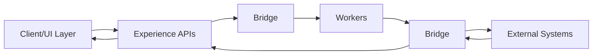
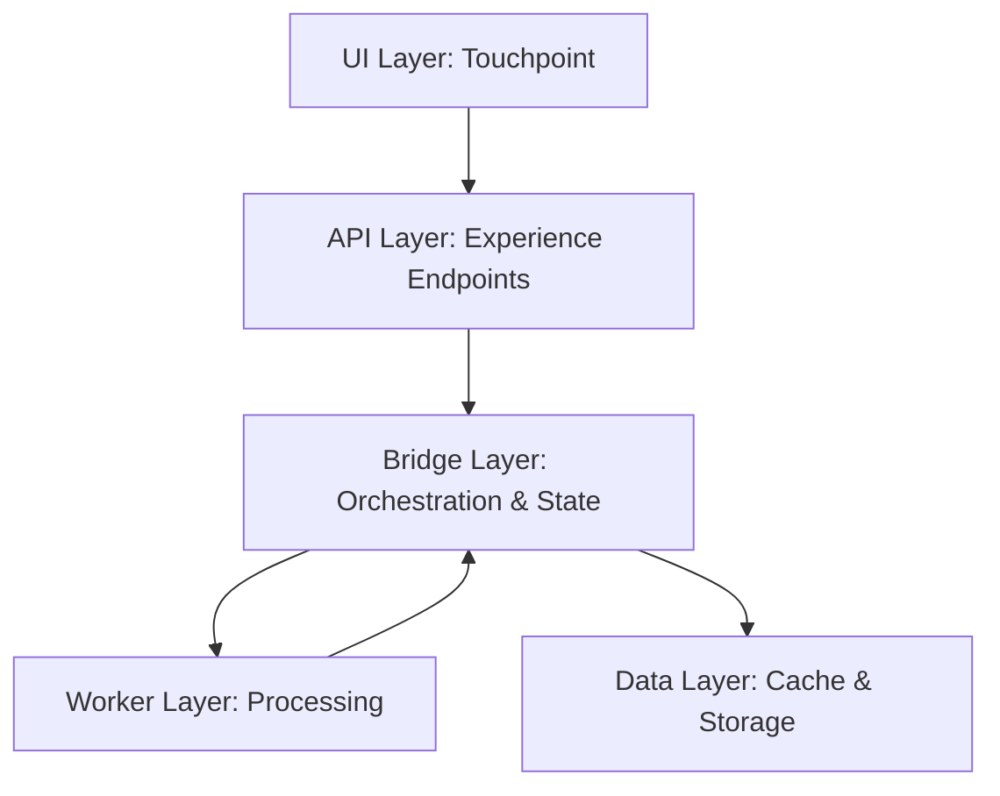

# CommerceBridge Overview
**Tagline:** The framework that models commerce as conversations, not transactions.

## What It Is

CommerceBridge is a distributed commerce orchestration framework designed for complex B2B operations. Instead of treating orders as isolated transactions, it models the entire commerce journey as an **engagement** — from initial inquiry through quoting, ordering, fulfillment, and beyond.

The framework provides a central orchestration layer (the Bridge) that coordinates stateless processing units (Workers) to handle commerce operations at scale. It's built for multi-tenant environments where each tenant can extend the base system with their own business logic and integrations.

Unlike traditional e-commerce platforms that focus on cart-to-checkout flows, CommerceBridge handles sophisticated scenarios: configurable products, complex pricing rules, multi-warehouse fulfillment, and long-running commerce conversations that span days or weeks.

## Why It Exists

Legacy commerce systems struggle with modern B2B complexity. CommerceBridge solves these problems:

| Problem | CommerceBridge Solution |
|---------|------------------------|
| **Orders as isolated transactions** | Engagements model the full conversation lifecycle |
| **Monolithic, hard-to-scale systems** | Distributed worker architecture with elastic scaling |
| **Rigid pricing models** | Multi-stage, configurable pricing engine |
| **Single-warehouse thinking** | Multi-warehouse optimization with delivery zones |
| **Tight coupling of business logic** | Extension pattern allows tenant-specific customization |
| **Poor multi-tenant support** | Built for multi-tenancy from the ground up |

## Core Abstractions

| Term | Meaning |
|------|---------|
| **Bridge** | Central orchestration layer managing state, integrations, and coordination |
| **Engagement** | Lifecycle container representing the full commerce conversation |
| **Worker** | Stateless, autonomous processor of discrete business tasks |
| **Job Card** | Unit of work delivered to workers for processing |
| **Pricing Engine** | Multi-stage price calculation with modifiers and caching |
| **Fulfillment Engine** | Intelligent multi-warehouse inventory allocation |

## High-Level Flow

**Flow description:**
1. Client (Touchpoint UI) makes a request
2. Experience layer API receives request
3. Bridge orchestrates the operation
4. Workers process tasks asynchronously
5. Workers use Bridge to access state and integrations
6. Bridge coordinates with external systems
7. Results flow back through Bridge to client

## Architecture Layers

## Public vs Private

| Public (Documented Here) | Private (Not Exposed) |
|--------------------------|----------------------|
| Core concepts and patterns | Implementation schemas |
| Base Bridge functions | Infrastructure specifics |
| Extension interfaces | Tenant-specific logic |
| Worker patterns | Queue/topic names |
| Generic pseudo-code | Production credentials |
| Architectural diagrams | Database structures |

## Extensibility

CommerceBridge is designed to be extended, not modified:

- **Extend the Bridge** — Add your integrations and business logic
- **Create specialized Workers** — Build task-specific processors
- **Configure pricing** — Define your pricing rules and modifiers
- **Define fulfillment zones** — Set up your warehouse network

The base system provides the patterns and infrastructure. You bring the specifics.

## Next

- [The Bridge →](/commercebridge/bridge) — Central orchestration layer
- [Workers →](/commercebridge/workers) — Stateless task processors
- [Core Bridge API →](/commercebridge/core-bridge) — Base functions reference
