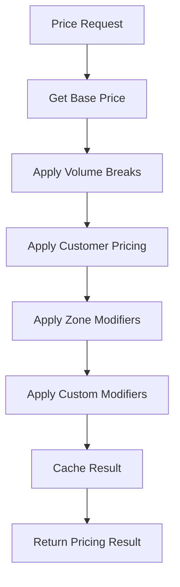

# Pricing Engine
Multi-stage price calculation engine with modifiers, volume breaks, and zone-based adjustments.

## Responsibilities

### Price Calculation
- Calculate final prices from base prices
- Apply multi-stage modifier chains
- Handle volume break tiers
- Process customer-specific pricing
- Adjust for delivery zones

### Cache Management
- Cache calculated prices for performance
- Invalidate caches on price changes
- Warm common price calculations
- Manage cache expiration

### Transparency
- Provide breakdown of all modifiers applied
- Show step-by-step calculation
- Maintain audit trail of price changes
- Support historical price snapshots

## Lifecycle

### 1. Base Price Retrieval
- Fetch product base price
- Apply current date/time context
- Check for promotional overrides

### 2. Modifier Application
Sequential application of modifiers:
- Volume break discounts
- Customer-specific pricing
- Delivery zone adjustments
- Custom tenant modifiers

### 3. Result Caching
- Generate cache key from context
- Store result with appropriate TTL
- Tag for invalidation patterns

## Calculation Flow



## Interfaces (Public-Safe)

```ts
export interface PricingContext {
  productId: string
  quantity: number
  customerId?: string
  deliveryZone?: string
  uom?: string
  metadata?: Record<string, unknown>
}

export interface PricingResult {
  basePrice: number
  modifiers: PriceModifier[]
  finalPrice: number
  currency: string
  calculatedAt: Date
  cacheKey?: string
}

export interface PriceModifier {
  type: string
  value: number
  operation: 'multiply' | 'add' | 'subtract'
  reason: string
  priority: number
}
```

## Example (Pseudo)

### Basic Calculation

```ts
const pricing = await bridge.calculatePrice({
  productId: 'product-456',
  quantity: 100,
  customerId: 'customer-123',
  deliveryZone: 'midwest'
})

// Returns:
// {
//   basePrice: 100,
//   modifiers: [
//     { type: 'volume-discount', value: 0.15, operation: 'multiply', reason: '15% off for 100+ units' },
//     { type: 'zone-upcharge', value: 5, operation: 'add', reason: 'Remote delivery zone' }
//   ],
//   finalPrice: 90,  // (100 * 0.85) + 5
//   currency: 'USD'
// }
```

### Modifier Chain Example

```ts
// Start: $100 base price

// Step 1: Volume break (15% discount)
// $100 * 0.85 = $85

// Step 2: Customer discount (5%)  
// $85 * 0.95 = $80.75

// Step 3: Delivery zone upcharge ($5)
// $80.75 + $5 = $85.75

// Final: $85.75
```

## Price Modifiers

### Volume Breaks

Quantity-based tier pricing:

| Quantity | Price | Discount |
|----------|-------|----------|
| 1-9 | $10.00 | Base |
| 10-49 | $9.00 | 10% |
| 50-99 | $8.50 | 15% |
| 100+ | $8.00 | 20% |

### Customer Pricing

Customer-specific rates:
- Contract pricing
- Negotiated rates
- Account-level discounts
- Payment term adjustments

### Zone-Based Pricing

Location-based adjustments:
- Remote area upcharges
- Urban zone pricing
- Cross-region adjustments
- Logistics cost factors

### Custom Modifiers

Tenant-specific pricing logic:
- Promotional pricing
- Seasonal adjustments
- Inventory-based pricing
- Dynamic market pricing

## Caching Strategy

### What Gets Cached

- Calculated final prices
- Base product prices
- Customer price lists
- Volume break tiers
- Zone modifiers

### Cache Keys

Composite keys from pricing context:

**Pattern:** `price:{tenant}:{product}:{customer}:{qty}:{zone}:{uom}`

**Example:** `price:alpha:p456:c123:100:midwest:case`

### Cache Invalidation

Caches invalidate when:
- Product base price changes
- Customer pricing rules change
- Volume breaks update
- Zone modifiers change
- Promotional periods end

### Cache TTL

Different durations by data type:

| Data Type | TTL | Reason |
|-----------|-----|--------|
| Base prices | 1 hour | Rarely change |
| Customer prices | 30 minutes | Moderate volatility |
| Calculated prices | 15 minutes | Most volatile |
| Zone modifiers | 1 hour | Stable |

## Extension Points

### Custom Modifier Types

```ts
export class CustomBridge extends BaseBridge {
  async calculatePrice(context: PricingContext) {
    const result = await super.calculatePrice(context)
    
    // Add your custom modifiers
    if (this.seasonalPricingActive()) {
      result.modifiers.push({
        type: 'seasonal-discount',
        value: 0.10,
        operation: 'multiply',
        reason: 'Summer promotion'
      })
      result.finalPrice = this.applyModifier(result.finalPrice, 0.10, 'multiply')
    }
    
    return result
  }
}
```

### Custom Cache Strategies

```ts
export class CustomBridge extends BaseBridge {
  // Override caching behavior
  async cachePrice(key: string, result: PricingResult) {
    // Your custom caching logic
    const ttl = this.calculateDynamicTTL(result)
    await super.cachePrice(key, result, ttl)
  }
}
```

## Do / Don't

### ✅ Do

- Use the pricing engine for all price calculations
- Cache aggressively
- Provide modifier transparency
- Invalidate caches appropriately
- Support historical price snapshots
- Make pricing logic testable

### ❌ Don't

- Calculate prices outside the engine
- Skip the cache layer
- Hide modifier details from users
- Hardcode pricing rules
- Ignore cache invalidation
- Mix pricing with other concerns

## IP Safety

This documentation describes:
- **Public:** Pricing concepts, modifier patterns, caching strategies
- **Private (not shown):** Specific price calculation algorithms, cache key structures, tenant pricing rules

---

**Pricing Engine: Sophisticated, transparent, and fast.**
