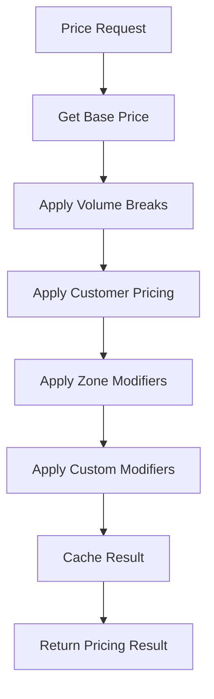

# Pricing Engine
Multi-stage price calculation engine with modifiers, volume breaks, and zone-based adjustments.

## Responsibilities

### Price Calculation
- Calculate final prices from base prices
- Apply multi-stage modifier chains
- Handle volume break tiers
- Process customer-specific pricing
- Adjust for delivery zones

### Snapshot Management
- Capture pricing state at engagement creation
- Store complete context for historical accuracy
- Enable price consistency throughout engagement lifecycle
- Support audit and compliance requirements

### Transparency
- Provide breakdown of all modifiers applied
- Show step-by-step calculation
- Maintain audit trail of price changes
- Support historical price snapshots

## Lifecycle

### 1. Base Price Retrieval
- Fetch product base price
- Apply current date/time context
- Check for promotional overrides

### 2. Modifier Application
Sequential application of modifiers:
- Volume break discounts
- Customer-specific pricing
- Delivery zone adjustments
- Custom tenant modifiers

## Calculation Flow



## Interfaces (Public-Safe)

```ts
export interface PricingContext {
  productId: string
  quantity: number
  customerId?: string
  deliveryZone?: string
  uom?: string
  metadata?: Record<string, unknown>
}

export interface PricingResult {
  basePrice: number
  modifiers: PriceModifier[]
  finalPrice: number
  currency: string
  calculatedAt: Date
  cacheKey?: string
}

export interface PriceModifier {
  type: string
  value: number
  operation: 'multiply' | 'add' | 'subtract'
  reason: string
  priority: number
}
```

## Example (Pseudo)

### Basic Calculation

```ts
const pricing = await bridge.calculatePrice({
  productId: 'product-456',
  quantity: 100,
  customerId: 'customer-123',
  deliveryZone: 'midwest'
})

// Returns:
// {
//   basePrice: 100,
//   modifiers: [
//     { type: 'volume-discount', value: 0.15, operation: 'multiply', reason: '15% off for 100+ units' },
//     { type: 'zone-upcharge', value: 5, operation: 'add', reason: 'Remote delivery zone' }
//   ],
//   finalPrice: 90,  // (100 * 0.85) + 5
//   currency: 'USD'
// }
```

### Modifier Chain Example

```ts
// Start: $100 base price

// Step 1: Volume break (15% discount)
// $100 * 0.85 = $85

// Step 2: Customer discount (5%)  
// $85 * 0.95 = $80.75

// Step 3: Delivery zone upcharge ($5)
// $80.75 + $5 = $85.75

// Final: $85.75
```

## Price Modifiers

### Volume Breaks

Quantity-based tier pricing:

| Quantity | Price | Discount |
|----------|-------|----------|
| 1-9 | $10.00 | Base |
| 10-49 | $9.00 | 10% |
| 50-99 | $8.50 | 15% |
| 100+ | $8.00 | 20% |

### Customer Pricing

Customer-specific rates:
- Contract pricing
- Negotiated rates
- Account-level discounts
- Payment term adjustments

---

**Pricing Engine: Sophisticated, transparent, and fast.**
