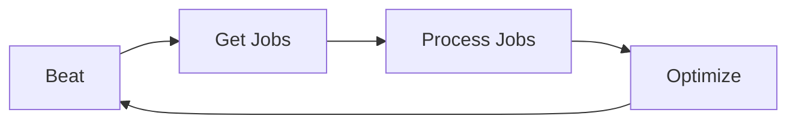

# Workers
Stateless, autonomous processors that execute discrete business tasks.

## Responsibilities

### Task Execution
- Process job cards from message queues
- Execute single, focused business operations
- Use Bridge for all data and state access
- Report results and metrics

### Autonomous Operation
- Self-manage workload consumption
- Handle errors and retries independently
- Scale based on queue depth
- Exit gracefully when replaced

### Stateless Processing
- Maintain no persistent state between jobs
- Fetch all required data from Bridge
- Complete each job independently
- Can be stopped/started without impact

## Lifecycle

### 1. Startup
- Connect to infrastructure (via Bridge)
- Register with worker registry
- Send initial heartbeat
- Begin consumption cycle

### 2. Processing Cycle
Continuous loop of:
```
beat → getJobs → process → optimize → repeat
```

### 3. Graceful Shutdown
- Stop accepting new jobs
- Complete current jobs
- Send final heartbeat
- Close connections cleanly

## The Worker Loop


```mermaid
flowchart LR
    A[Beat] --> B[Get Jobs]
    B --> C[Process Jobs]
    C --> D[Optimize]
    D --> A
```

### Beat (Heartbeat)
Worker announces its presence and health:

```ts
async beat() {
  await this.bridge.publishHeartbeat({
    workerId: this.id,
    workerType: this.type,
    status: 'active',
    timestamp: Date.now()
  })
}
```

### Get Jobs
Worker fetches available work from its queue:

```ts
async getJobs() {
  return await this.bridge.fetchJobsFromQueue(
    this.queueName,
    this.batchSize
  )
}
```

### Process Jobs
Worker executes each job:

```ts
for (const job of jobs) {
  await this.work(job)
}
```

### Optimize
Worker performs housekeeping:

```ts
async optimize() {
  this.clearLocalCache()
  await this.reportMetrics()
  await this.checkForShutdownSignal()
}
```

## Worker Pattern

### Core Principle: Single Responsibility

Each worker handles **one specific business task**.

**Good examples:**
- `order-processor` — Processes new orders
- `notification-sender` — Sends customer notifications
- `inventory-sync` — Syncs inventory levels
- `price-calculator` — Pre-calculates common prices

**Bad examples:**
- `order-handler` — Too broad (multiple responsibilities)
- `general-processor` — Violates single responsibility
- `kitchen-sink-worker` — Unmaintainable

### Isolation

Workers operate independently:
- No shared state with other workers
- No direct worker-to-worker communication
- All coordination through message queues
- Independent scaling and deployment

### Independence

Workers are self-sufficient:
- Contain all logic for their specific task
- Fetch all needed data from Bridge
- Make autonomous decisions
- Can fail without affecting other workers

## Building a Worker

### Step 1: Import Core Models

```ts
import { BaseWorker, JobCard, WorkerConfig } from '@commercebridge/core'
import { CustomBridge } from '../bridge/custom-bridge'
```

### Step 2: Define Worker Class

```ts
export class OrderProcessor extends BaseWorker {
  private bridge: CustomBridge
  
  constructor(config: WorkerConfig) {
    super(config)
    this.bridge = new CustomBridge(config.bridge)
  }
  
  async work(job: JobCard): Promise<void> {
    // Route to task handlers
    switch (job.task) {
      case 'process-order':
        return await this.processOrder(job)
      case 'confirm-order':
        return await this.confirmOrder(job)
      default:
        throw new Error(`Unknown task: ${job.task}`)
    }
  }
}
```

### Step 3: Implement Task Functions

Each task function follows this pattern:

```ts
async processOrder(job: JobCard): Promise<void> {
  return await this.executeTask(job, async () => {
    // 1. Extract payload
    const { orderId } = job.payload
    
    // 2. Access Bridge
    const engagement = await this.bridge.getEngagement(orderId)
    
    // 3. Execute business logic
    const allocation = await this.bridge.allocateInventory(
      engagement.id,
      engagement.lineItems
    )
    
    // 4. Update state
    await this.bridge.updateEngagement(engagement.id, {
      status: 'processing',
      allocation
    })
    
    // 5. Trigger next steps (if needed)
    await this.bridge.publishTask('order-confirmation', {
      task: 'confirm-order',
      payload: { orderId }
    })
  })
}
```

## Job Cards

Job cards are the unit of work delivered to workers.

### Interface

```ts
export interface JobCard {
  id: string
  task: string
  payload: Record<string, unknown>
  priority: number
  attempts: number
  maxAttempts: number
  createdAt: Date
  scheduledFor?: Date
  tenantId: string
}
```

### Example

```ts
{
  id: 'job-abc-123',
  task: 'process-order',
  payload: { orderId: 'order-xyz-789' },
  priority: 5,
  attempts: 0,
  maxAttempts: 3,
  createdAt: new Date(),
  tenantId: 'tenant-alpha'
}
```

### Job Card Delivery

Job cards are created and published by:
- Experience layer APIs
- Other workers (chaining tasks)
- Scheduled job creators
- Event-triggered systems

Workers **consume** job cards, they don't create them for themselves.

## Control Loop (Provided by Core)

The base worker class provides the control infrastructure:

```ts
export abstract class BaseWorker {
  async start() {
    while (this.isRunning) {
      await this.beat()
      const jobs = await this.getJobs()
      
      for (const job of jobs) {
        try {
          await this.work(job)
          await this.acknowledgeJob(job)
        } catch (error) {
          await this.handleError(job, error)
        }
      }
      
      await this.optimize()
      await this.sleep(this.pollInterval)
    }
  }
  
  // You implement this
  abstract work(job: JobCard): Promise<void>
}
```

You implement `work()`. The core handles the loop.

## Task Function Structure

The `executeTask` wrapper provides built-in features:

```ts
async myTask(job: JobCard): Promise<void> {
  return await this.executeTask(job, async () => {
    // Your task logic here
    
    // executeTask automatically provides:
    // - Error catching and logging
    // - Retry logic based on job.maxAttempts
    // - Metrics collection (duration, success/failure)
    // - Transaction management
    // - Timeout enforcement
  })
}
```

## MeshWorker Pattern

For simpler worker implementations, you can extend MeshWorker:

```ts
export class MyWorker extends MeshWorker {
  async work(job: JobCard) {
    // Your business task
  }
}
```

## Accessing the Bridge

Workers access all data and functions through the Bridge:

```ts
export class MyWorker extends BaseWorker {
  private bridge: CustomBridge
  
  constructor(config: WorkerConfig) {
    super(config)
    this.bridge = new CustomBridge(config.bridge)
  }
  
  async work(job: JobCard): Promise<void> {
    // All operations go through Bridge
    const data = await this.bridge.getData(job.payload.id)
    const result = await this.bridge.processData(data)
    await this.bridge.saveResult(result)
  }
}
```

**Never:**
- Access databases directly
- Call external APIs directly (use Bridge)
- Share state between worker instances
- Communicate directly with other workers

## Extension Points

### Custom Worker Types

Create specialized workers for your business tasks:

```ts
export class InventorySyncWorker extends BaseWorker {
  async work(job: JobCard): Promise<void> {
    // Your inventory sync logic
  }
}

export class ReportGeneratorWorker extends BaseWorker {
  async work(job: JobCard): Promise<void> {
    // Your reporting logic
  }
}
```

### Custom Task Routing

Handle multiple related tasks in one worker:

```ts
async work(job: JobCard): Promise<void> {
  const handlers = {
    'send-email': this.sendEmail,
    'send-sms': this.sendSms,
    'send-push': this.sendPush
  }
  
  const handler = handlers[job.task]
  if (!handler) {
    throw new Error(`Unknown task: ${job.task}`)
  }
  
  return await handler.call(this, job)
}
```

## Do / Don't

### ✅ Do

- Keep workers focused on single business tasks
- Use the executeTask wrapper for all task functions
- Access all data through the Bridge
- Handle errors gracefully
- Use job cards for all work
- Report metrics

### ❌ Don't

- Maintain state between jobs
- Communicate directly with other workers
- Access infrastructure directly
- Create your own control loop
- Bypass executeTask wrapper
- Mix multiple business domains in one worker

## IP Safety

This documentation describes:
- **Public:** Worker patterns, interfaces, lifecycle
- **Private (not shown):** Specific task implementations, queue configurations, tenant-specific workflows

---

**Workers: Focused, stateless, and scalable.**
