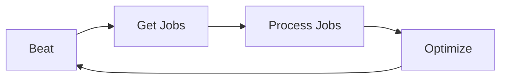

# Workers
Stateless, autonomous processors that execute discrete business tasks.

## Responsibilities

### Task Execution
- Process job cards from message queues
- Execute single, focused business operations
- Use Bridge for all data and state access
- Report results and metrics

### Autonomous Operation
- Self-manage workload consumption
- Handle errors and retries independently
- Scale based on queue depth
- Exit gracefully when replaced

### Stateless Processing
- Maintain no persistent state between jobs
- Fetch all required data from Bridge
- Complete each job independently
- Can be stopped/started without impact

## Lifecycle

### 1. Startup
Connect to base infrastructure (via Bridge)
Register with assigned community
Send initial heartbeat
Begin consumption cycle

### 2. Processing Cycle (the Loop)
Continuous loop of:
```
beat → getJobs → process → optimize → repeat
```

### 3. Graceful Shutdown
- Stop accepting new jobs
- Complete current jobs
- Send final heartbeat
- Close connections cleanly

## The Worker Cycle



### Beat (Heartbeat)
Worker announces its presence and health. Automated managed action through the worker framework. When developing a worker you don't need to manage this process.

### Get Jobs
Worker fetches available work from its queue. Batching, caching and retry/recovery are managed actions through the worker framework. When developing a worker you don't need to manage this process.

### Process Jobs
This invokes the `work()` function within the extension framework. Here is where the business logic is added through a series of modular functions (tasks).

#### Task Functions

The core control method `processJobs` manages the complete job processing lifecycle:

**Purpose:** Provides robust, fault-tolerant batch processing with automatic error handling and retry logic.

**What it does:**
- **Receives:** A batch of job cards and a processor function
- **Batch Processing:** Processes each job card in the batch through the provided function
- **Retry Logic:** Automatically retries failed jobs up to 3 times with exponential backoff
- **Error Management:** Catches and handles errors without stopping the entire batch
- **Failure Management:** Stops batch processing only if a job fails after all retries
- **Timeout Protection:** Prevents jobs from hanging with configurable timeouts
- **Status Tracking:** Updates job card status (Processed/Error) based on results
- **Returns:** The complete batch of job cards with updated statuses

**Configuration Options:**
- `maxRetries`: Number of retry attempts (default: 3)
- `retryDelay`: Delay between retries (default: 1000ms)
- `timeout`: Maximum execution time per job (default: 5000ms)

**State Management:** The worker state management model requires adding the outcome of each task to `jobCard.data` so it is passed on to the next task while maintaining multi-job batch simplicity.

#### The Worker Cycle

This is how the main `work()` function is structured using the underlying framework:

```ts
async work(): Promise<void> {
  // Phase 1: Data extraction
  this.cycleMeta.jobCards = await this.getSourceDataFromRepository(this.cycleMeta.jobCards)
  
  // Phase 2: Data transformation  
  this.cycleMeta.jobCards = await this.transformData(this.cycleMeta.jobCards)
  
  // Phase 3: Data loading
  this.cycleMeta.jobCards = await this.saveProcessedData(this.cycleMeta.jobCards)
}
```

#### Task Functions

Each phase is implemented as a task function using the core control method `cycleMeta.processJobs`:

```ts
// Example task function using cycleMeta.processJobs
protected async transformData(jobCards: JobModel[]): Promise<JobModel[]> {
  return this.cycleMeta.processJobs(async (jobCard: JobModel) => {
    // Your business logic here
    const result = await this.processEngagement(jobCard.data.sourceEngagement)
    
    // Add result to jobCard.data for next task
    jobCard.data.calculatedEngagement = result
    jobCard.status = "Processed"
    
    return jobCard
  }, jobCards)
}
```

Notice the `cycleMeta.processJobs` method which manages the failure, retry and error management for each task run. Also notice the batching methodology.

### Optimize
Worker performs housekeeping. Automated managed action through the worker framework. When developing a worker you don't need to manage this process.

## Worker Pattern

### Core Principle: Single Responsibility

Each worker handles **one specific business task**.

**Good examples:**
- `order-processor` — Processes new orders
- `notification-sender` — Sends customer notifications
- `inventory-sync` — Syncs inventory levels
- `price-calculator` — Pre-calculates common prices

**Bad examples:**
- `order-handler` — Too broad (multiple responsibilities)
- `general-processor` — Violates single responsibility
- `kitchen-sink-worker` — Unmaintainable

### Isolation

Workers operate independently:
- No shared state with other workers
- No direct worker-to-worker communication
- All coordination through message queues
- Independent scaling and deployment

### Independence

Workers are self-sufficient:
- Contain all logic for their specific task
- Fetch all needed data from Bridge
- Make autonomous decisions
- Can fail without affecting other workers

## Job Cards

Job cards are the unit of work delivered to workers.

### Interface

```ts
export interface JobCard {
  id: string
  task: string
  payload: Record<string, unknown>
  priority: number
  attempts: number
  maxAttempts: number
  createdAt: Date
  scheduledFor?: Date
  tenantId: string
}
```

### Example

```ts
{
  id: 'job-abc-123',
  task: 'process-order',
  payload: { orderId: 'order-xyz-789' },
  priority: 5,
  attempts: 0,
  maxAttempts: 3,
  createdAt: new Date(),
  tenantId: 'tenant-alpha'
}
```

### Job Card Delivery

Job cards are created and published by:
- Experience layer APIs
- Other workers (chaining tasks)
- Scheduled job creators
- Event-triggered systems

Workers **consume** job cards, they don't create them for themselves.

## Accessing the Bridge

Workers access all data and functions through the Bridge:

```ts
export class MyWorker extends BaseWorker {
  async work(): Promise<void> {
    this.cycleMeta.jobCards = await this.processData(this.cycleMeta.jobCards)
  }
  
  protected async processData(jobCards: JobModel[]): Promise<JobModel[]> {
    return this.cycleMeta.processJobs(async (jobCard: JobModel) => {
      // All operations go through Bridge
      const result = await this.bridge.processData(jobCard.data)
      
      // Store results in jobCard.data
      jobCard.data.result = result
      jobCard.status = "Processed"
      
      return jobCard
    }, jobCards)
  }
}
```

**Never:**
- Access databases directly
- Call external APIs directly (use Bridge)
- Share state between worker instances
- Communicate directly with other workers

## Building a Worker

### Step 1: Import Core Models

```ts
import { BaseWorker, JobCard, WorkerConfig } from '@commercebridge/core'
import { CustomBridge } from '../bridge/custom-bridge'
```

### Step 2: Define Worker Class

```ts
export class OrderProcessor extends BaseWorker {
  private bridge: CustomBridge
  
  constructor(config: WorkerConfig) {
    super(config)
    this.bridge = new CustomBridge(config.bridge)
  }
  
  async work(): Promise<void> {
    // Phase 1: Fetch order data
    this.cycleMeta.jobCards = await this.fetchOrderData(this.cycleMeta.jobCards)
    
    // Phase 2: Process orders
    this.cycleMeta.jobCards = await this.processOrders(this.cycleMeta.jobCards)
    
    // Phase 3: Update results
    this.cycleMeta.jobCards = await this.saveResults(this.cycleMeta.jobCards)
  }
}
```

### Step 3: Implement Task Functions

Each task function uses `cycleMeta.processJobs` for batch processing with automatic retry/error handling:

```ts
protected async processOrders(jobCards: JobModel[]): Promise<JobModel[]> {
  return this.cycleMeta.processJobs(async (jobCard: JobModel) => {
    // 1. Extract data
    const orderId = jobCard.data.orderId
    
    // 2. Access Bridge for engagement
    const engagement = await this.bridge.getEngagement(orderId)
    
    // 3. Execute business logic
    const allocation = await this.bridge.allocateInventory(
      engagement.id,
      engagement.lineItems
    )
    
    // 4. Add results to jobCard.data for next task
    jobCard.data.engagement = engagement
    jobCard.data.allocation = allocation
    jobCard.status = "Processed"
    
    return jobCard
  }, jobCards)
}
```

## Extension Points

### Custom Task Routing

Handle multiple related tasks with conditional logic:

```ts
async work(): Promise<void> {
  // Phase 1: Determine task type and route
  this.cycleMeta.jobCards = await this.routeMessages(this.cycleMeta.jobCards)
}

protected async routeMessages(jobCards: JobModel[]): Promise<JobModel[]> {
  return this.cycleMeta.processJobs(async (jobCard: JobModel) => {
    const taskType = jobCard.data.messageType
    
    // Route to appropriate handler based on task type
    switch (taskType) {
      case 'email':
        await this.bridge.sendEmail(jobCard.data)
        break
      case 'sms':
        await this.bridge.sendSms(jobCard.data)
        break
      case 'push':
        await this.bridge.sendPush(jobCard.data)
        break
      default:
        throw new Error(`Unknown message type: ${taskType}`)
    }
    
    jobCard.status = "Processed"
    return jobCard
  }, jobCards)
}
```

## Do / Don't

### ✅ Do

- Keep workers focused on single business tasks
- Use `cycleMeta.processJobs` for all task functions
- Access all data through the Bridge
- Store results in `jobCard.data` for next task
- Process job cards in batches
- Return updated job cards from each task

### ❌ Don't

- Maintain state between cycles
- Communicate directly with other workers
- Access infrastructure directly
- Create your own control loop
- Bypass `cycleMeta.processJobs` wrapper
- Mix multiple business domains in one worker
- Process job cards individually (always use batch processing)

---

**Workers: Focused, stateless, and scalable.**
