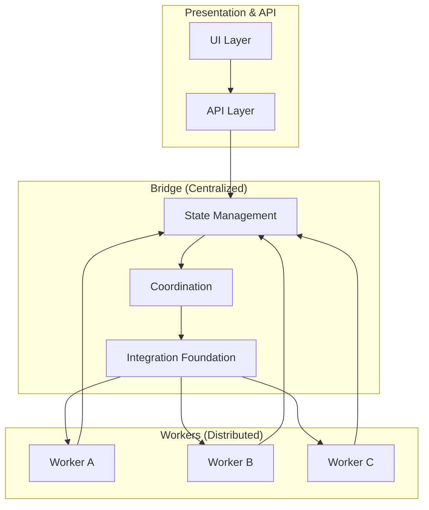
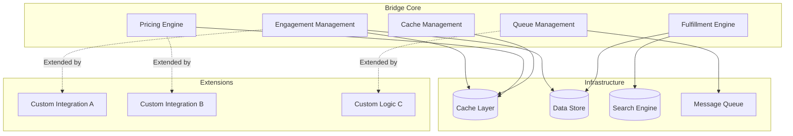

# Bridge Architecture
**Pattern:** Centralized orchestration with distributed execution.

## Problem

Distributed systems face challenges:
- Scattered integration logic across services
- Difficult state management
- Complex service coordination
- Multi-tenant data isolation complexity
- Integration duplication

## Solution

The Bridge pattern centralizes orchestration while distributing execution:


```mermaid
flowchart TB
    subgraph "Presentation & API"
        UI[UI Layer]
        API[API Layer]
    end
    
    subgraph "Bridge (Centralized)"
        STATE[State Management]
        COORD[Coordination]
        INT[Integration Foundation]
    end
    
    subgraph "Workers (Distributed)"
        W1[Worker A]
        W2[Worker B]
        W3[Worker C]
    end
    
    UI --> API
    API --> STATE
    STATE --> COORD
    COORD --> INT
    INT --> W1
    INT --> W2
    INT --> W3
    W1 --> STATE
    W2 --> STATE
    W3 --> STATE
```

### Core Principle

> **All shared, reusable integrations live in the Bridge.**

This prevents:
- Integration logic scattered across workers
- Duplicate integration code
- Inconsistent multi-tenant handling
- Service sprawl

## Bridge Responsibilities

### State Ownership

Bridge owns ALL system state:

- **Hot state** — Active engagements, session data (cache layer)
- **Persistent state** — Historical data, configurations (data store)
- **Search state** — Full-text indexes, spatial data (search engine)

**Workers are stateless.** All state lives in the Bridge.

### Orchestration

Bridge coordinates operations:

- Routes requests to appropriate handlers
- Manages workflow state machines
- Triggers async worker tasks
- Ensures consistency across distributed operations

### Integration Hub

Bridge provides integration foundation:

- Base functions all workers use
- Extension points for custom integrations
- Multi-tenant resource coordination
- Shared infrastructure access

## Architecture Layers


```mermaid
flowchart TB
    subgraph "Bridge Core"
        direction TB
        ENGAGE[Engagement Management]
        PRICE[Pricing Engine]
        FULFILL[Fulfillment Engine]
        CACHE[Cache Management]
        QUEUE[Queue Management]
    end
    
    subgraph "Infrastructure"
        CACHEDB[(Cache Layer)]
        DATASTORE[(Data Store)]
        SEARCH[(Search Engine)]
        MQ[Message Queue]
    end
    
    subgraph "Extensions"
        EXT1[Custom Integration A]
        EXT2[Custom Integration B]
        EXT3[Custom Logic C]
    end
    
    ENGAGE --> CACHEDB
    ENGAGE --> DATASTORE
    PRICE --> CACHEDB
    FULFILL --> DATASTORE
    FULFILL --> SEARCH
    CACHE --> CACHEDB
    QUEUE --> MQ
    
    ENGAGE -.Extended by.-> EXT1
    PRICE -.Extended by.-> EXT2
    QUEUE -.Extended by.-> EXT3
```

## Why Centralize the Bridge?

### Benefits

**Single source of truth:**
- One place for state management
- One place for core business logic
- One place for multi-tenant coordination

**Easier multi-tenancy:**
- Tenant context enforced centrally
- Data isolation managed in one place
- Configuration centralized

**Simpler workers:**
- Workers don't need database logic
- Workers don't need cache management
- Workers don't need tenant validation
- Workers just execute business tasks

**Better extensibility:**
- Extend Bridge once, all workers benefit
- Add integration in one place
- Consistent behavior across ecosystem

### Trade-offs

**Not a silver bullet:**
- Bridge can become bottleneck (mitigated by caching)
- Single point of failure (mitigated by redundancy)
- Potential for Bridge bloat (mitigated by extension pattern)

## Extension Pattern

### Base Bridge (Minimal)

Provides only core operations:
- Engagement CRUD
- Pricing calculation
- Fulfillment allocation
- State management
- Queue operations

### Extended Bridge (Your Ecosystem)

Add your specific needs:

```ts
export class EcosystemBridge extends BaseBridge {
  // Inherit all core functions
  
  // Add your integrations
  async syncToErp(data: unknown) { }
  async processPayment(amount: number) { }
  async sendNotification(message: string) { }
  
  // Add your business logic
  async customWorkflow(engagement: Engagement) { }
}
```

### Workers Use Extended Bridge

```ts
export class MyWorker extends BaseWorker {
  private bridge: EcosystemBridge  // Your extended version
  
  async work(job: JobCard) {
    // Use core functions (inherited)
    const engagement = await this.bridge.getEngagement(job.payload.id)
    
    // Use your custom functions
    await this.bridge.syncToErp(engagement)
    await this.bridge.sendNotification('Order processed')
  }
}
```

## Do / Don't

### ✅ Do

- Centralize state in the Bridge
- Keep workers stateless
- Extend the Bridge for custom logic
- Use the Bridge for all data access
- Enforce tenant context in Bridge
- Cache aggressively
- Make Bridge functions tenant-aware

### ❌ Don't

- Put state in workers
- Create side-services for integrations
- Access infrastructure directly from workers
- Duplicate integration logic
- Mix tenant-specific logic in base Bridge
- Bypass the Bridge from workers
- Create worker-to-worker dependencies

## Comparison

### Bridge Pattern vs Microservices

| Bridge Pattern | Microservices |
|----------------|---------------|
| Centralized state | Distributed state |
| Stateless workers | Stateful services |
| Queue-based async | HTTP/gRPC sync |
| Extension through inheritance | Service proliferation |
| Single orchestrator | Service mesh |
| Simpler multi-tenancy | Complex tenant routing |

Both are valid. Bridge pattern optimizes for:
- Multi-tenant SaaS
- Complex state management
- Frequent deployments
- Worker specialization

## IP Safety

This documentation describes:
- **Public:** Bridge pattern, architecture principles, extension model
- **Private (not shown):** Specific Bridge implementations, infrastructure details, tenant configurations

---

**Bridge Architecture: Centralize orchestration, distribute execution.**
