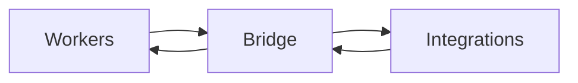

# Bridge Architecture
**Pattern:** The central abstraction layer between workers and integrations.

---

## The Concept

In distributed systems, you need a way to:
- Manage state consistently across multiple processors
- Provide a common API for all operations
- Centralize integration logic (payments, messaging, ERPs)
- Enforce multi-tenant isolation
- Coordinate between stateless workers

The **Bridge Architecture** solves this by creating a central abstraction layer that sits between your workers (the processors) and your integrations (external systems, databases, caches).

---

## Core Principle

> **The Bridge provides a common application interface to abstract integrations.**

Workers don't call databases, payment APIs, or ERPs directly — they call Bridge functions. The Bridge handles the complexity.

This prevents:
- Integration logic scattered across workers
- Duplicate integration code
- Inconsistent multi-tenant handling
- Direct coupling to external systems

---

## What the Bridge Provides

### 1. Common API Interface
Workers call Bridge functions instead of directly accessing systems. The Bridge abstracts the complexity of integrations, state management, and multi-tenant coordination.

### 2. State Management
The Bridge owns all persistent and cached state. Workers are stateless (between instances) and fetch everything they need through the Bridge.

### 3. Integration Foundation
Shared integrations (payments, shipping, messaging) are implemented once in the Bridge and reused by all workers.

### 4. Multi-Tenant Coordination
The Bridge enforces tenant isolation, manages tenant-specific configurations, and ensures secure data access.

---

## Why This Matters

**Without the Bridge:** Each worker would need to implement its own database connections, caching strategies, payment integrations, and multi-tenant logic. This leads to duplication, inconsistency, and maintenance nightmares.

**With the Bridge:** Workers stay focused on business logic. They call simple Bridge functions like `getEngagement()`, `calculatePrice()`, or `allocateInventory()`, and the Bridge handles all the complexity.

---

## Extend, Don't Modify

The Bridge is designed to be extended with your specific integrations and business logic. You create a custom Bridge that inherits from the base and adds your ERP sync, custom pricing rules, or specialized workflows.

This keeps the core clean and upgradeable while giving you complete flexibility.

---

## Learn More

For detailed implementation guidance, see:

- **[The Bridge](/commercebridge/bridge)** — Detailed responsibilities and interfaces
- **[Core Bridge API](/commercebridge/core-bridge)** — Complete function reference
- **[Custom Ecosystems](/commercebridge/integrations)** — How to extend the Bridge
- **[CommerceBridge Architecture](/commercebridge/architecture)** — Complete system architecture

---

**Bridge Architecture: One interface, infinite integrations.**
