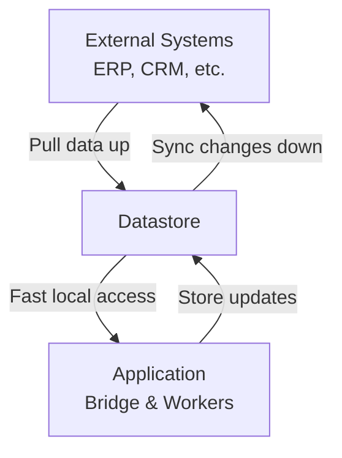

# Datastores
**Concept:** Data sinks that buffer and synchronize data between systems.

---

## Not Traditional Caching

Datastores aren't simple read-through caches. They're **bidirectional data buffers** that:

- Pull data up from external systems
- Store data locally for fast access
- Hold updates from our system
- Sync changes back down to external systems

Think of them as **data sinks** — places where data flows in, gets stored, gets modified, and flows back out.

---

## How Datastores Work

### Upstream Flow (Pull)
- Periodically pull fresh data from external systems
- Store in local datastore
- Index for fast queries
- Make available to application

### Application Access
- Bridge and workers read from datastore (fast local access)
- Application writes updates to datastore
- Changes accumulate in datastore

### Downstream Flow (Sync)
- Push accumulated changes back to external systems
- Update external records
- Maintain consistency across systems

---

## Why This Pattern?

### 1. Speed
Local datastore access is much faster than calling external APIs every time.

### 2. Resilience
If external system is down, application continues working with datastore. Changes sync when system comes back up.

### 3. Buffering
Updates accumulate in datastore and sync in batches, reducing load on external systems.

### 4. Decoupling
Application doesn't directly couple to external system APIs. Datastore abstracts the integration.

---

## Common Datastore Types

### Product Catalog Datastore
- Pulls product data from ERP or PIM
- Stores locally for instant search and display
- Updates flow back when products are modified
- Syncs pricing, inventory, specifications

### Customer Datastore
- Pulls customer data from CRM
- Stores locally for order processing
- Updates flow back when customer info changes
- Syncs addresses, contacts, preferences

### Inventory Datastore
- Pulls inventory levels from warehouse systems
- Stores locally for availability checks
- Updates flow back when allocations happen
- Syncs reservations, allocations, fulfillment

### Order Datastore
- Stores engagement/order data locally
- Syncs to external order management systems
- Bidirectional: pull order status updates, push new orders
- Central source of truth for active engagements

---

## Datastore as Abstraction Layer

Datastores provide a **common data model** across CommerceBridge, Touchpoint, and Eidos:

- Application works with consistent models
- External system differences are abstracted
- Data transformations happen at datastore boundary
- Schema changes isolated to sync layer

---

## Synchronization Strategies

### Real-Time Sync
Changes pushed immediately to external systems (for critical data).

### Batch Sync
Changes accumulated and pushed in batches (for high-volume updates).

### Scheduled Sync
Full reconciliation runs periodically to ensure consistency.

### Event-Driven Sync
External system events trigger datastore updates.

---

## Learn More

For detailed implementation, see:

- **[CommerceBridge Architecture](/commercebridge/architecture)** — Data layer design
- **[Custom Ecosystems](/commercebridge/integrations)** — Datastore configuration

---

**Datastores: Buffer the world, sync the changes.**
