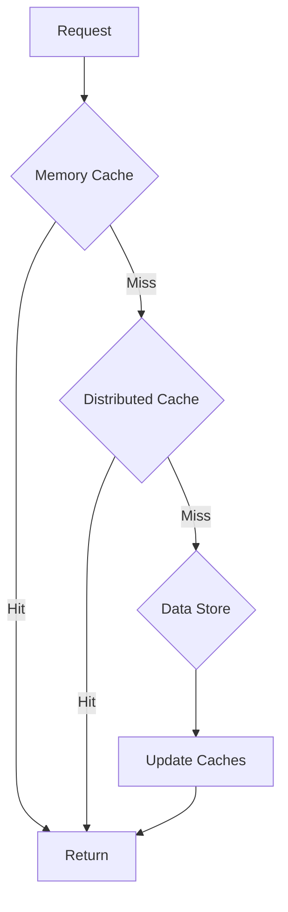

# Caching Strategies
**Pattern:** Multi-layer caching for performance optimization.

## Problem

Distributed commerce systems face performance challenges:
- Database queries are slow
- External API calls are expensive
- Repeated calculations waste resources
- Users expect instant responses

## Solution

Multi-layer caching strategy:


```mermaid
flowchart TB
    REQ[Request] --> L1{Memory Cache}
    L1 -->|Hit| RETURN[Return]
    L1 -->|Miss| L2{Distributed Cache}
    L2 -->|Hit| RETURN
    L2 -->|Miss| L3{Data Store}
    L3 --> CACHE[Update Caches]
    CACHE --> RETURN
```

### Layer 1: In-Memory (Worker Local)
- Fastest access
- Per-worker instance
- Short TTL
- Small dataset

### Layer 2: Distributed Cache
- Cross-worker shared state
- Medium TTL
- Hot data
- Primary cache layer

### Layer 3: Data Store
- Source of truth
- Persistent storage
- Slowest access
- Complete dataset

## What Gets Cached

### Engagement State

- Active engagements (hot data)
- Session state
- Cart data
- TTL: 30 minutes to 2 hours

### Pricing Data

- Calculated prices
- Customer price lists
- Volume break tiers
- TTL: 15 minutes to 1 hour

### Product Catalog

- Product details
- Search results
- Category listings
- TTL: 1 to 24 hours

### Inventory Levels

- Warehouse stock levels
- Availability results
- Allocation status
- TTL: 5 to 15 minutes

### Customer Data

- Customer details
- Addresses
- Preferences
- TTL: 1 hour

## Cache Keys

Structured, namespaced keys:

**Pattern:** `{type}:{tenant}:{identifier}:{context}`

**Examples:**
```
engagement:alpha:eng-123
price:alpha:prod-456:cust-123:100:midwest
inventory:alpha:warehouse-a:prod-456
customer:alpha:cust-123
```

## Invalidation Strategies

### Event-Driven

Invalidate when source data changes:

```ts
// Product price updated
await dataStore.updateProductPrice(productId, newPrice)

// Invalidate all cached prices for this product
await cache.invalidatePattern(`price:*:${productId}:*`)
```

### Time-Based Expiry

Set appropriate TTL for each data type:
- Stable data: Long TTL
- Volatile data: Short TTL
- Real-time data: Very short or no cache

### Version-Based

Invalidate all caches on version change:

```ts
// New pricing rules deployed
const newVersion = await deployPricingRules()

// Invalidate all pricing caches
await cache.invalidatePattern(`price:*`)
```

### Selective Warming

Pre-calculate common requests:

```ts
// Warm cache for popular products
for (const product of popularProducts) {
  for (const quantity of commonQuantities) {
    await bridge.calculatePrice({
      productId: product.id,
      quantity
    }) // Result auto-cached
  }
}
```

## Cache Performance Targets

| Operation | Target | Notes |
|-----------|--------|-------|
| Cache hit | Above 90% | Indicates good key design |
| Cache read | Under 5ms | Distributed cache latency |
| Cache write | Under 10ms | Async acceptable |
| Invalidation | Under 100ms | Pattern matching overhead |

## Do / Don't

### ✅ Do

- Cache aggressively
- Use structured cache keys
- Set appropriate TTLs
- Invalidate on source changes
- Monitor cache hit rates
- Use cache warming for common data
- Consider cache size limits

### ❌ Don't

- Cache forever (set TTLs)
- Use random cache keys
- Forget to invalidate
- Cache sensitive data without encryption
- Ignore cache misses (they indicate problems)
- Cache everything (be selective)
- Create circular cache dependencies

## IP Safety

This describes:
- **Public:** Caching strategy patterns, invalidation approaches, performance targets
- **Private (not shown):** Specific cache implementations, key structures, TTL values

---

**Caching: The secret to perceived performance.**
