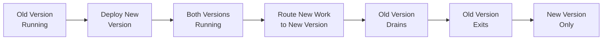

# DevOps Philosophy
**Pattern:** "Starve old workers, evolve ecosystems."

---

## The Core Idea

Traditional deployments stop services, update code, restart services. This causes downtime.

Worker ecosystems evolve continuously without stopping. New versions deploy alongside old versions. Old workers finish their work and exit naturally. No downtime. No "maintenance windows."

**Evolution, not migration.**

---

## Deployment Strategy

### Zero-Downtime Deployments

**Traditional approach (causes downtime):**
1. Stop service
2. Deploy new version
3. Start service
4. ❌ **Downtime during deployment**

**Worker ecosystem approach (no downtime):**
1. Deploy new worker version alongside old
2. Route new work to new workers
3. Old workers finish current jobs
4. Old workers exit when idle
5. ✅ **No downtime**

### Example Deployment

```bash
# Before deployment
Workers running:
  order-processor-v1 (5 instances)
  
# During deployment
Workers running:
  order-processor-v1 (5 instances) ← Draining (finishing current work)
  order-processor-v2 (5 instances) ← Receiving new work
  
# After old workers drain
Workers running:
  order-processor-v2 (5 instances)
```

---

## Gradual Evolution



**Benefits:**
- Incremental changes, not big-bang migrations
- Easy rollback (just stop routing to new version)
- Test in production gradually
- Lower risk
- Continuous delivery

---

## Worker Lifecycle Management

### Graceful Startup
Workers connect to infrastructure, register with their community, and begin processing work.

### Continuous Processing
Workers run the processing cycle: beat → getJobs → process → optimize → repeat.

### Graceful Shutdown
When a worker receives a shutdown signal (SIGTERM):
1. Stop accepting new jobs
2. Finish current jobs
3. Send final heartbeat
4. Close connections cleanly
5. Exit

**No forced kills. No interrupted jobs. Clean exits.**

---

## Why This Matters

**Traditional deployments:**
- Schedule "maintenance window"
- Notify customers of downtime
- Rush to complete deployment
- Hope nothing breaks
- Stress

**Worker ecosystem deployments:**
- Deploy anytime
- No customer notification needed
- Workers drain naturally
- Easy rollback if needed
- Calm

---

## Philosophy in Practice

### Starve Old Workers
Don't kill them — just stop feeding them new work. They finish what they're doing and exit naturally.

### Replicate, Don't Scale
Need more capacity? Add more worker instances. Don't try to make individual workers bigger.

### Evolve, Don't Migrate
Don't plan "migration projects." Deploy new worker versions continuously and let the ecosystem evolve.

### Fail Gracefully
Workers will fail. Design for it. Retry logic, error handling, and dead letter queues are core to the architecture.

---

## Learn More

For detailed implementation, see:

- **[Workers](/commercebridge/workers)** — Worker lifecycle and management
- **[Worker Ecosystems](/core/worker-ecosystems)** — Distributed processing patterns
- **[Custom Ecosystems](/commercebridge/integrations)** — Building and deploying ecosystems

---

**DevOps: Evolve systems, don't rebuild them.**
