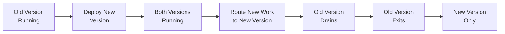
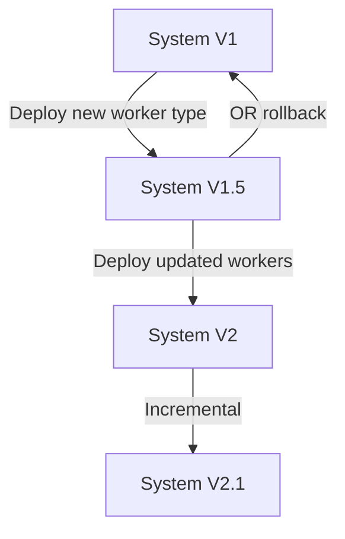

# DevOps Philosophy
**Pattern:** "Starve old workers, evolve ecosystems."

## Core Philosophy

Systems evolve through worker ecosystems, not through migrations.


```mermaid
flowchart LR
    OLD[Old Version<br/>Running] --> DEPLOY[Deploy New<br/>Version]
    DEPLOY --> BOTH[Both Versions<br/>Running]
    BOTH --> ROUTE[Route New Work<br/>to New Version]
    ROUTE --> DRAIN[Old Version<br/>Drains]
    DRAIN --> EXIT[Old Version<br/>Exits]
    EXIT --> NEW[New Version<br/>Only]
```

**Key principle:** Deploy new, drain old, no downtime.

## Deployment Strategy

### Zero-Downtime Deployments

**Traditional approach (bad):**
1. Stop service
2. Deploy new version
3. Start service
4. **Downtime during deployment**

**Worker ecosystem approach (good):**
1. Deploy new worker version alongside old
2. Route new work to new workers
3. Old workers finish current jobs
4. Old workers exit when idle
5. **No downtime**

### Example

```bash
# Before deployment
Workers running:
  order-processor-v1 (5 instances)
  
# During deployment
Workers running:
  order-processor-v1 (5 instances) ← Draining
  order-processor-v2 (5 instances) ← Receiving new work
  
# After old workers drain
Workers running:
  order-processor-v2 (5 instances)
```

## Evolution, Not Migration

### Problem

Traditional "big bang" migrations:
- High risk
- All-or-nothing
- Rollback difficult
- Long downtime
- Stressful deployments

### Solution

Gradual evolution through workers:


```mermaid
flowchart TB
    V1[System V1]
    V1_5[System V1.5]
    V2[System V2]
    
    V1 -->|Deploy new worker type| V1_5
    V1_5 -->|Deploy updated workers| V2
    V1_5 -->|OR rollback| V1
    V2 -->|Incremental| V2_1[System V2.1]
```

**Benefits:**
- Incremental changes
- Easy rollback
- Test in production gradually
- Lower risk
- Continuous delivery

## Infrastructure as Code

Everything defined in code:

### Configuration

```ts
// Worker configuration in code
export const workerConfig = {
  type: 'order-processor',
  instances: 5,
  pollInterval: 1000,
  resources: {
    memory: '512MB',
    cpu: '0.5'
  }
}
```

### Deployment

```yaml
# Deployment configuration (generic example)
version: '2'
services:
  worker:
    type: order-processor
    version: '1.2.0'
    replicas: 5
    resources:
      memory: 512M
```

## Observability

### Structured Logging

```ts
logger.info('Order processed', {
  workerId: this.id,
  jobId: job.id,
  engagementId: engagement.id,
  duration: executionTime,
  success: true
})
```

### Metrics

Track worker performance:
- Jobs processed per second
- Average job duration
- Success/failure rates
- Queue depth
- Worker health

### Distributed Tracing

Trace requests across system:

```
Request ID: req-abc-123
├── API Call (50ms)
├── Bridge Operation (20ms)
├── Worker Job (300ms)
│   ├── Database Query (100ms)
│   ├── Cache Operation (10ms)
│   └── External API (150ms)
└── Total: 370ms
```

## Feature Flags

Enable gradual rollout:

```ts
if (await bridge.checkTenantFeature(tenantId, 'new-pricing-engine')) {
  // Use new pricing logic
  await newPricingEngine.calculate(context)
} else {
  // Use old pricing logic
  await oldPricingEngine.calculate(context)
}
```

**Benefits:**
- Test with subset of tenants
- Easy rollback (toggle flag)
- A/B testing
- Gradual migration

## Worker Lifecycle Management

### Health Checks

Workers report health:

```ts
async beat() {
  await this.bridge.publishHeartbeat({
    workerId: this.id,
    status: 'healthy',
    queueDepth: this.currentJobCount,
    memoryUsage: process.memoryUsage(),
    uptime: process.uptime()
  })
}
```

### Graceful Shutdown

```ts
process.on('SIGTERM', async () => {
  console.log('Shutdown signal received')
  
  // Stop accepting new jobs
  this.isRunning = false
  
  // Finish current jobs
  await this.finishCurrentJobs()
  
  // Send final heartbeat
  await this.beat({ status: 'stopped' })
  
  // Close connections
  await this.closeConnections()
  
  process.exit(0)
})
```

## Monitoring

### What to Monitor

**System Health:**
- Worker uptime
- Queue depths
- Cache hit rates
- Database performance

**Business Metrics:**
- Orders processed
- Revenue
- Error rates
- Customer satisfaction

**Alerts:**
- Worker crashes
- Queue buildup
- Error spikes
- Performance degradation

## Do / Don't

### ✅ Do

- Deploy new versions alongside old
- Let old workers drain naturally
- Use infrastructure as code
- Implement structured logging
- Monitor everything
- Use feature flags
- Automate deployments
- Test in production gradually

### ❌ Don't

- Do rolling restarts
- Force-kill workers
- Rely on manual deployments
- Skip monitoring
- Deploy everything at once
- Ignore worker health
- Forget graceful shutdown
- Make big-bang changes

## IP Safety

This describes:
- **Public:** DevOps patterns, deployment strategies, monitoring approaches
- **Private (not shown):** Specific infrastructure, deployment scripts, monitoring configurations

---

**DevOps: Evolve systems, don't rebuild them.**
