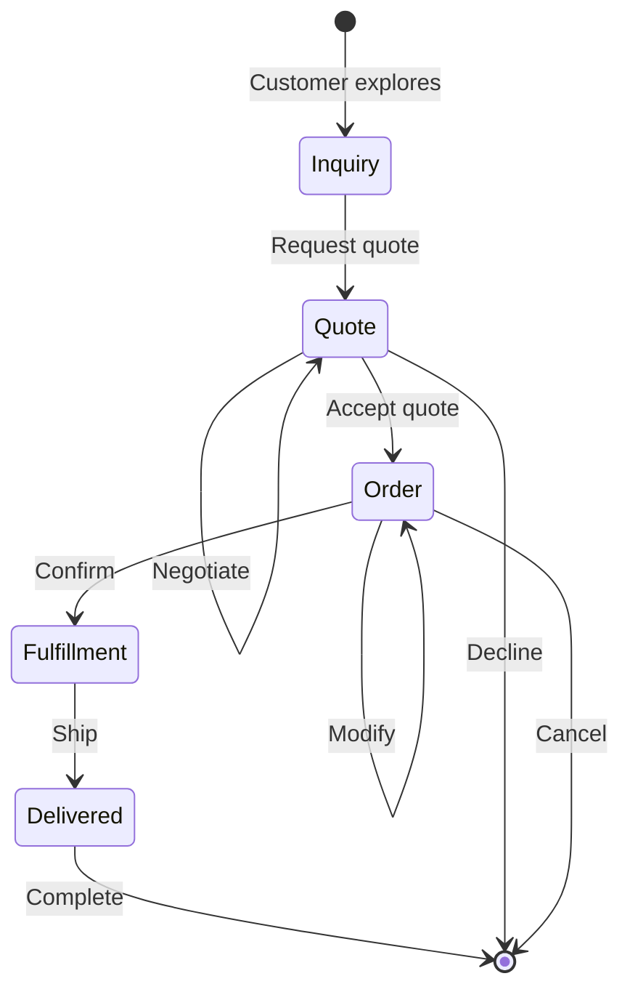

# Engagement-Centric Design
**Pattern:** Model interactions as conversations, not transactions.

## Problem

Traditional commerce systems model **orders** as the primary entity:

- Orders are isolated events
- Quote → Order requires data migration
- Context lost between interactions
- Difficult to model multi-step processes
- Poor audit trail

**Real B2B scenario:**
1. Customer requests quote
2. Back-and-forth negotiation
3. Quote modified several times
4. Customer places order (from quote)
5. Order modified post-placement
6. Partial shipments
7. Returns and adjustments

**Traditional approach:** Multiple disconnected records across systems.

## Solution

Model commerce as **engagements** — continuous conversations that maintain context throughout.



### Engagement Contains Everything

Single engagement tracks:
- Initial inquiry
- Quote development
- Negotiation history
- Order placement
- Fulfillment
- Delivery
- Post-delivery

**All context preserved throughout.**

## Core Concept

### Engagement Lifecycle

**Traditional (Order-Centric):**
```
Quote System → Quote ID: Q-123
  ↓ (Customer accepts)
Order System → Order ID: O-456 (no link to quote)
  ↓ (Order ships)
Fulfillment System → Shipment ID: S-789 (no link to order or quote)
```

**Engagement-Centric:**
```
Engagement ID: E-123
  ├── Inquiry (timestamp, products viewed)
  ├── Quote (pricing, line items, version 1)
  ├── Quote Update (version 2, modified items)
  ├── Quote Acceptance (becomes order)
  ├── Order (locked pricing, confirmed items)
  ├── Fulfillment (warehouse, tracking)
  └── Delivery (completion, signature)
```

**Everything connected, full context available.**

## Benefits

### Complete History

Track the entire journey:
- What products were viewed
- What was quoted
- What changed during negotiation
- Why prices changed
- Who made modifications
- When each step occurred

### Seamless Transitions

Quote evolves into order naturally:
- No data migration needed
- Context preserved
- State transitions tracked
- History maintained

### Better Customer Experience

Customer sees:
- Their full journey
- All interactions in one place
- Consistent engagement ID
- Transparent progression

### Simpler System Design

One entity to manage:
- Fewer data models
- Clearer relationships
- Easier queries
- Better audit trail

## Engagement vs Order

| Engagement Model | Order Model |
|------------------|-------------|
| Continuous conversation | Single transaction |
| State persists throughout | State resets each time |
| Multiple potential outcomes | Fixed outcome (order placed) |
| Rich context and history | Limited metadata |
| Natural multi-step flows | Awkward multi-step handling |

## Example Flow

```ts
// 1. Customer starts exploring
const engagement = await bridge.createEngagement({
  customerId: 'customer-123',
  type: 'quote'
})
// Status: 'draft'

// 2. Customer adds items, requests quote
await bridge.updateEngagement(engagement.id, {
  status: 'active',
  lineItems: [...items]
})

// 3. Sales reviews, adjusts pricing
await bridge.updateEngagement(engagement.id, {
  customPricing: adjustedPrices,
  notes: 'Volume discount applied'
})

// 4. Customer accepts quote → becomes order
await bridge.updateEngagement(engagement.id, {
  type: 'order',
  status: 'processing'
})

// 5. System allocates inventory
await bridge.updateEngagement(engagement.id, {
  status: 'confirmed',
  allocation: allocationResult
})

// 6. Warehouse ships
await bridge.updateEngagement(engagement.id, {
  status: 'fulfilled',
  tracking: trackingInfo
})

// 7. Customer receives
await bridge.finalizeEngagement(engagement.id)
// Status: 'complete'

// At any point, full history available:
const history = await bridge.getEngagementHistory(engagement.id)
```

## Beyond Commerce

This pattern applies to any multi-step process:

### Customer Support
```
Engagement = Support Case
- Initial contact
- Back-and-forth conversation
- Solution attempts
- Resolution
- Follow-up
```

### Project Management
```
Engagement = Project
- Initial scope
- Requirement changes
- Development iterations
- Testing phases
- Delivery
```

### Onboarding
```
Engagement = Customer Onboarding
- Signup
- Configuration
- Training
- Go-live
- Support transition
```

## Do / Don't

### ✅ Do

- Model long-running processes as engagements
- Preserve full context throughout lifecycle
- Track all state transitions
- Maintain complete audit trail
- Allow seamless type transitions (quote → order)
- Use engagement status for workflow control

### ❌ Don't

- Create separate entities for each stage
- Lose context between transitions
- Reset state unnecessarily
- Force rigid type boundaries
- Skip engagement history tracking
- Treat engagements as simple CRUD records

## IP Safety

This documentation describes:
- **Public:** Engagement concept, pattern benefits, lifecycle model
- **Private (not shown):** Engagement schema, state machine implementation, storage structure

---

**Engagement-Centric: Commerce is a conversation.**
