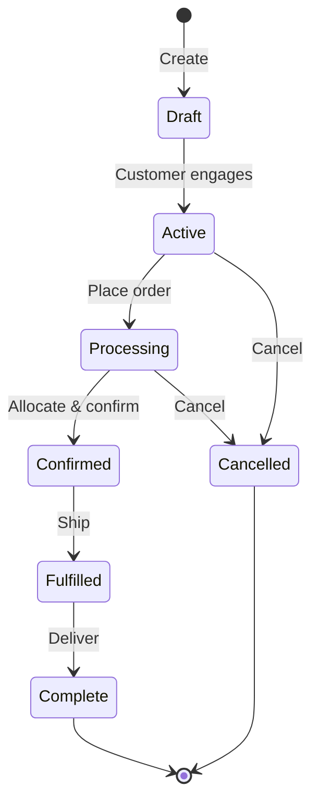

# Engagements
**Concept:** Lifecycle containers that model commerce as conversations, not isolated transactions.

---

## What is an Engagement?

An **engagement** is the complete commerce conversation between your business and a customer. It's not just an order — it's the entire journey:

- Customer browses products
- Requests a quote
- Negotiates pricing
- Configures products
- Places an order
- Inventory is allocated
- Payment is processed
- Items are shipped
- Delivery is confirmed

All of this happens within one **engagement**. Every interaction, every state change, every decision is captured and preserved.

---

## Why Not Just "Orders"?

Traditional e-commerce has:
- **Cart** (temporary, often lost)
- **Order** (transactional, created at checkout)
- **Fulfillment** (separate system, disconnected from order context)

B2B commerce needs:
- **Engagement** (persistent conversation that starts with first product view)
- Complete context throughout the entire journey
- Seamless progression from quote to order to fulfillment
- Full audit trail of decisions and changes

---

## Engagement Lifecycle

Each status represents a stage in the conversation. The engagement carries all context forward through each transition.

---

## What Lives in an Engagement?

- **Identity** — Customer, tenant, channel information
- **Line Items** — Products, quantities, configurations
- **Pricing** — Calculations, modifiers, customer-specific rules
- **Fulfillment** — Inventory allocation, warehouse assignments, tracking
- **Metadata** — Custom fields, notes, references (PO numbers, delivery instructions)
- **Events** — Complete audit trail of every change

Everything needed to understand and complete the commerce conversation.

---

## How Engagements Work Across Systems

### In CommerceBridge
The Bridge manages engagement state, lifecycle transitions, and coordinates workers to process engagement-related tasks.

### In Touchpoint
The UI displays and updates engagements in real-time. As customers add products or change quantities, the engagement updates. When they checkout, the engagement transitions from 'active' to 'processing'.

### In Workers
Workers receive engagement IDs in their job cards, fetch the engagement from the Bridge, perform their task (price calculation, inventory allocation, notification), and update the engagement state.

---

## Benefits

**1. Complete Context**
Every system has access to the full conversation history.

**2. Seamless Workflow**
Quote evolves into order without data loss or system handoffs.

**3. Real-Time Sync**
UI, workers, and integrations all work with the same engagement model.

**4. Audit Trail**
Every action is recorded for compliance and debugging.

---

## Learn More

For detailed implementation, see:

- **[The Bridge](/commercebridge/bridge)** — How the Bridge manages engagements
- **[Core Bridge API](/commercebridge/core-bridge)** — Engagement operations reference
- **[Workers](/commercebridge/workers)** — How workers process engagements
- **[Touchpoint Integration](/touchpoint/commercebridge-integration)** — How Touchpoint uses engagements

---

**Engagements: Where commerce conversations live.**
