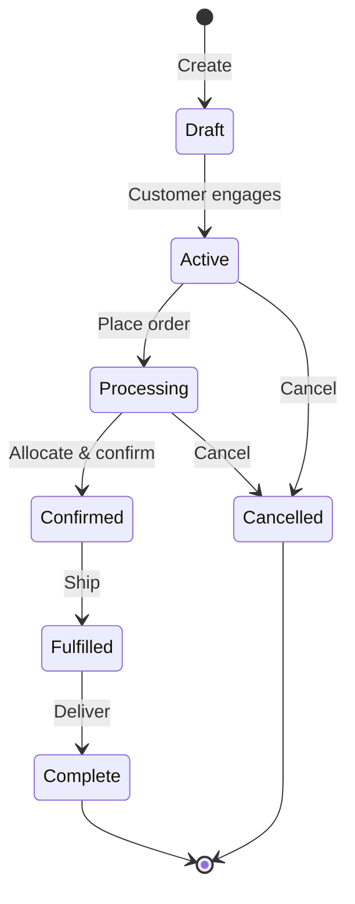

# Engagements
Lifecycle containers that model commerce as conversations, not isolated transactions.

## Responsibilities

### Full Lifecycle Tracking
- Captures the entire customer journey from inquiry to completion
- Maintains state across multiple interactions
- Preserves history and context throughout
- Links related activities into a cohesive narrative

### State Container
- Holds all engagement data (customer, products, pricing, fulfillment)
- Tracks status progression through lifecycle stages
- Maintains audit trail of all changes
- Provides snapshot at any point in time

### Workflow Coordination
- Orchestrates multi-step processes
- Manages transitions between states
- Triggers appropriate workers for each stage
- Ensures business rules are enforced

## Lifecycle


```mermaid
stateDiagram-v2
    [*] --> Draft: Create
    Draft --> Active: Customer engages
    Active --> Processing: Place order
    Processing --> Confirmed: Allocate & confirm
    Confirmed --> Fulfilled: Ship
    Fulfilled --> Complete: Deliver
    Complete --> [*]
    
    Active --> Cancelled: Cancel
    Processing --> Cancelled: Cancel
    Cancelled --> [*]
```

### 1. Creation
- Engagement created in **draft** state
- Customer and tenant context established
- Initial data captured (products, quantities)
- Unique identifier assigned

### 2. Active State
- Customer building cart or requesting quote
- Dynamic pricing calculations
- Real-time availability checks
- State persists across sessions

### 3. Processing
- Order placement triggered
- Inventory allocated
- Payment processing initiated
- Workers handle async tasks

### 4. Confirmation
- Inventory confirmed
- Payment confirmed
- Customer notified
- Fulfillment initiated

### 5. Fulfillment
- Items shipped from warehouse(s)
- Tracking information captured
- Status updates sent
- Delivery in progress

### 6. Completion
- Delivery confirmed
- Final state captured
- Historical record preserved
- Engagement closed

## Interfaces (Public-Safe)

```ts
export interface Engagement {
  id: string
  tenantId: string
  customerId: string
  type: 'quote' | 'order' | 'subscription'
  status: EngagementStatus
  lineItems: LineItem[]
  pricing?: PricingResult
  fulfillment?: FulfillmentPlan
  metadata?: Record<string, unknown>
  createdAt: Date
  updatedAt: Date
}

export type EngagementStatus = 
  | 'draft' 
  | 'active' 
  | 'processing' 
  | 'confirmed'
  | 'fulfilled'
  | 'complete' 
  | 'cancelled'

export interface LineItem {
  id: string
  productId: string
  quantity: number
  uom: string
  configuration?: Record<string, unknown>
}
```

## Example (Pseudo)

### Creating an Engagement

```ts
const engagement = await bridge.createEngagement({
  customerId: 'customer-123',
  type: 'quote',
  lineItems: [
    { productId: 'product-456', quantity: 100, uom: 'each' }
  ]
})
// Status: 'draft'
```

### Progressing Through Lifecycle

```ts
// Customer reviews quote, adds more items
await bridge.updateEngagement(engagement.id, {
  status: 'active',
  lineItems: [...engagement.lineItems, newItem]
})

// Customer places order
await bridge.updateEngagement(engagement.id, {
  status: 'processing'
})

// Worker allocates inventory
await bridge.updateEngagement(engagement.id, {
  status: 'confirmed',
  allocation: allocationResult
})

// Worker marks shipped
await bridge.updateEngagement(engagement.id, {
  status: 'fulfilled',
  tracking: trackingInfo
})

// Delivery complete
await bridge.finalizeEngagement(engagement.id)
// Status: 'complete'
```

### Retrieving Engagement History

```ts
const events = await bridge.getEngagementHistory(engagement.id)
// Returns audit trail of all state changes
```

## Why Engagements vs Orders

| Traditional Approach | Engagement Approach |
|---------------------|---------------------|
| Order is the primary entity | Engagement contains multiple potential orders |
| State resets with each order | State persists across the full journey |
| Quote and order are separate | Quote evolves into order seamlessly |
| Limited historical context | Full conversation history |
| Hard to model complex B2B flows | Natural fit for multi-step processes |

## Extension Points

### Custom Engagement Types

```ts
// Define your own engagement types
type CustomEngagementType = 
  | 'quote' 
  | 'order' 
  | 'subscription'
  | 'contract'  // Your custom type
  | 'rfq'       // Your custom type
```

### Custom Metadata

```ts
// Add tenant-specific data
await bridge.updateEngagement(engagement.id, {
  metadata: {
    customerPO: 'PO-12345',
    deliveryInstructions: 'Loading dock B',
    accountManager: 'user-789'
  }
})
```

### Custom Lifecycle Hooks

Extend Bridge to add custom logic at lifecycle transitions:

```ts
export class CustomBridge extends BaseBridge {
  async updateEngagement(id: string, updates: Partial<Engagement>) {
    // Custom validation before update
    if (updates.status === 'processing') {
      await this.validateOrderRequirements(id)
    }
    
    // Call base implementation
    const updated = await super.updateEngagement(id, updates)
    
    // Custom logic after update
    if (updated.status === 'confirmed') {
      await this.notifyWarehouse(updated)
    }
    
    return updated
  }
}
```

## IP Safety

This documentation describes the engagement **concept** and **interface**, not:
- Specific state machine implementations
- Database schemas
- Cache key structures
- Event payloads
- Tenant-specific workflows

---

**Engagements: Where commerce conversations live.**
