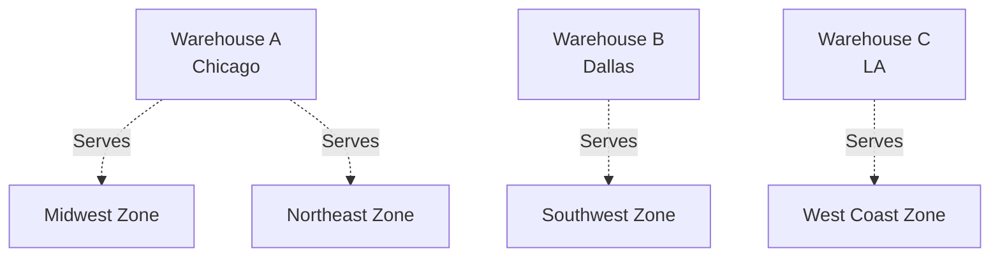
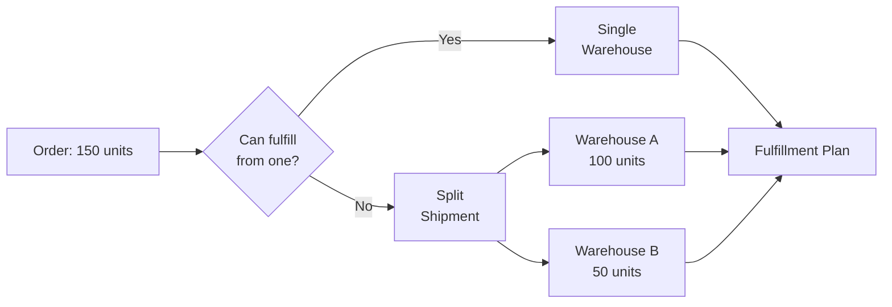
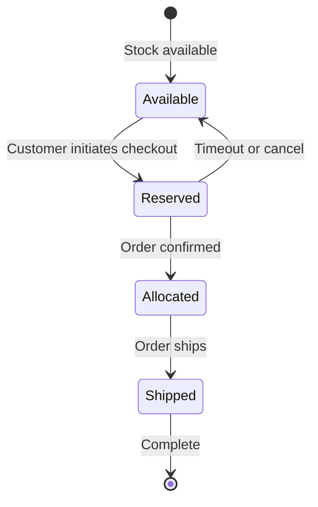

# Fulfillment Concepts
**Concept:** Multi-warehouse inventory management and delivery orchestration.

## Core Idea

Modern B2B requires sophisticated fulfillment:
- Products stored in multiple locations
- Customers in various geographic areas
- Different delivery requirements
- Cost optimization needs

**Solution:** Intelligent allocation system that:
- Knows what's where
- Understands delivery constraints
- Optimizes for cost, speed, and customer preference
- Handles complex scenarios (split shipments, backorders)

## Key Concepts

### Delivery Zones

Geographic areas defining where warehouses can deliver:


```mermaid
graph TB
    W1[Warehouse A<br/>Chicago] -.Serves.-> Z1[Midwest Zone]
    W1 -.Serves.-> Z2[Northeast Zone]
    
    W2[Warehouse B<br/>Dallas] -.Serves.-> Z3[Southwest Zone]
    
    W3[Warehouse C<br/>LA] -.Serves.-> Z4[West Coast Zone]
```

**Zone properties:**
- Geographic boundaries
- Delivery time estimates
- Associated warehouses
- Pricing adjustments

### Spatial Filtering

Filter products/warehouses by deliverability:

**Customer in Chicago:**
1. System determines delivery zone (Midwest)
2. Filters warehouses serving Midwest
3. Shows only products available from those warehouses
4. Calculates delivery time estimates

**Result:** Customer only sees deliverable options.

### Multi-Warehouse Allocation

Optimize inventory allocation:

**Scenario:** Order 150 units to Chicago

**Options:**
- Warehouse A (Milwaukee): 100 units, 1-day delivery
- Warehouse B (Indianapolis): 60 units, 2-day delivery

**Optimization:**
- **Option 1:** Split shipment (100 from A, 50 from B)
- **Option 2:** Wait and consolidate
- **Option 3:** Fulfill 100 now, backorder 50

**Decision factors:**
- Customer preference
- Cost comparison
- Delivery urgency
- Product characteristics

### Split Shipment Handling

When one warehouse isn't enough:


```mermaid
flowchart LR
    ORDER[Order: 150 units] --> OPT{Can fulfill<br/>from one?}
    OPT -->|Yes| SINGLE[Single<br/>Warehouse]
    OPT -->|No| SPLIT[Split<br/>Shipment]
    
    SPLIT --> W1[Warehouse A<br/>100 units]
    SPLIT --> W2[Warehouse B<br/>50 units]
    
    SINGLE --> DONE[Fulfillment Plan]
    W1 --> DONE
    W2 --> DONE
```

## Optimization Criteria

### 1. Minimize Shipments
Prefer single warehouse when possible.

### 2. Minimize Distance
Choose closest warehouse to customer.

### 3. Minimize Cost
Factor in shipping costs.

### 4. Minimize Time
Meet delivery date requirements.

### 5. Balance Load
Distribute across warehouse network.

## Inventory Reservation


```mermaid
stateDiagram-v2
    [*] --> Available: Stock available
    Available --> Reserved: Customer initiates checkout
    Reserved --> Allocated: Order confirmed
    Reserved --> Available: Timeout or cancel
    Allocated --> Shipped: Order ships
    Shipped --> [*]: Complete
```

**Reservation lifecycle:**
1. **Available** — Stock in warehouse
2. **Reserved** — Held for pending order (15-30 min timeout)
3. **Allocated** — Committed to confirmed order
4. **Shipped** — Out for delivery
5. **Complete** — Delivered

## Real-Time Availability

Availability is dynamic, not static:

**Not just "in stock" or "out of stock":**

- Stock levels by warehouse
- Reserved vs available
- Incoming shipments
- Lead times
- Alternative products

**Example response:**
```
Product X:
- 75 units available now (Warehouse A)
- 25 units available in 3 days (incoming)
- Alternative: Product Y, 200 units available
```

## IP Safety

This describes:
- **Public:** Fulfillment concepts, optimization patterns, zone model
- **Private (not shown):** Warehouse locations, allocation algorithms, inventory schemas

---

**Fulfillment: Right product, right place, right time.**
