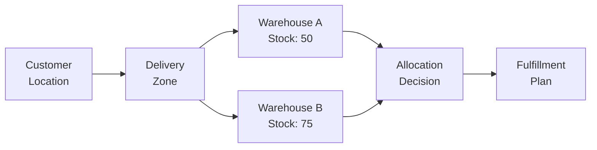

# Fulfillment
**Concept:** Intelligent multi-warehouse inventory allocation and delivery optimization.

---

## The Challenge

B2B fulfillment is complex:
- Multiple warehouses across different regions
- Delivery zones with different capabilities
- Split shipments from multiple locations
- Customer delivery preferences
- Cost vs speed optimization
- Real-time inventory visibility

---

## The Solution: Zone-Based Allocation

Instead of simple "is it in stock?" checks, the system performs intelligent allocation:

1. **Identify delivery zone** — Where is the customer?
2. **Find serving warehouses** — Which warehouses can deliver there?
3. **Check inventory** — What's available at each warehouse?
4. **Optimize allocation** — Minimize shipments, cost, or delivery time
5. **Create fulfillment plan** — Multi-warehouse splits if needed

---

## Key Concepts

### Delivery Zones

Geographic areas that define:
- Which warehouses can deliver there
- Delivery capabilities (same-day, next-day, standard)
- Shipping costs and restrictions
- Service level agreements

### Warehouse Networks

Multiple warehouses work together:
- Each has its own inventory
- Each serves specific zones
- Allocation optimizes across the network
- Split shipments when necessary

---

## How It Works in Practice

**Example Scenario:**
Customer in Chicago orders 100 units of Product X.

**System evaluates:**
- Chicago is in "Midwest" delivery zone
- Midwest zone is served by 3 warehouses: Milwaukee (60 units), Indianapolis (50 units), Detroit (40 units)
- Milwaukee can fulfill 60 units
- Indianapolis can fulfill remaining 40 units
- Result: Split shipment from 2 warehouses

**Alternative strategy:**
If customer prefers single shipment, system could allocate from Indianapolis (50 units) and backorder the rest, or route to a different warehouse network.

---

## Integration with Other Systems

### With Engagements
Fulfillment allocation is stored in the engagement. As allocation happens, the engagement updates with warehouse assignments, tracking info, and delivery estimates.

### With Pricing
Delivery zone affects pricing (shipping costs, zone surcharges). Pricing and fulfillment work together to give customers accurate total costs.

### With Inventory
Real-time inventory checks ensure allocations are valid. Inventory reservations are created during allocation and released if the engagement is cancelled.

---

## Learn More

For detailed implementation, see:

- **[Fulfillment Engine](/commercebridge/fulfillment-engine)** — Complete fulfillment documentation
- **[Core Bridge API](/commercebridge/core-bridge)** — Fulfillment operations reference

---

**Fulfillment: Smart allocation across warehouse networks.**
