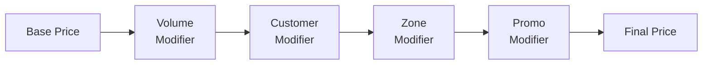

# Pricing Models
**Concept:** Multi-stage price calculation with transparent modifiers.

## Problem

Simple pricing (one price per product) doesn't work for B2B:
- Volume discounts needed
- Customer-specific contracts
- Location-based pricing
- Promotional pricing
- Complex business rules

## Solution

Multi-stage pricing model where base price flows through a modifier chain:


```mermaid
flowchart LR
    BASE[Base Price] --> VOL[Volume<br/>Modifier]
    VOL --> CUST[Customer<br/>Modifier]
    CUST --> ZONE[Zone<br/>Modifier]
    ZONE --> PROMO[Promo<br/>Modifier]
    PROMO --> FINAL[Final Price]
```

Each modifier:
- Has a type and reason
- Applies a specific calculation
- Is ordered by priority
- Is fully transparent

## Modifier Types

### Volume Breaks

Quantity-based tier pricing:

| Quantity | Discount |
|----------|----------|
| 1-9 | Base price |
| 10-49 | 10% off |
| 50-99 | 15% off |
| 100+ | 20% off |

### Customer-Specific

Contract or negotiated pricing:
- Custom price lists
- Account-level discounts
- Payment term adjustments
- Relationship-based pricing

### Zone-Based

Location affects price:
- Remote delivery upcharges
- Regional pricing variations
- Cross-border adjustments
- Logistics cost factors

### Promotional

Time-limited pricing:
- Seasonal discounts
- Clearance pricing
- Bundle offers
- Limited-time promotions

### Custom Business Rules

Tenant-specific logic:
- Industry-specific pricing
- Regulatory adjustments
- Market-based dynamic pricing
- Inventory-level pricing

## Calculation Pattern

```ts
// Start with base
let price = product.basePrice // $100

// Apply volume break
if (quantity >= 100) {
  price = price * 0.80  // 20% off
} // $80

// Apply customer discount
if (customerTier === 'platinum') {
  price = price * 0.95  // Additional 5% off
} // $76

// Apply zone upcharge
if (deliveryZone === 'remote') {
  price = price + 10  // Remote delivery fee
} // $86

// Final price: $86
```

## Transparency

All modifiers visible to customer:

```
Base Price:                    $100.00
Volume Discount (20%):         -$20.00
Customer Discount (5%):        -$4.00
Delivery Upcharge:             +$10.00
────────────────────────────────────
Final Price:                   $86.00
```

## Caching Strategy

Cache calculated prices with context-aware keys:

**Cache key:** `price:{tenant}:{product}:{customer}:{qty}:{zone}`

**TTL varies by stability:**
- Base prices: Long TTL (stable)
- Customer prices: Medium TTL (occasional changes)
- Calculated prices: Short TTL (volatile)

**Invalidation:** When any input changes

## IP Safety

This describes:
- **Public:** Pricing model concept, modifier types, calculation pattern
- **Private (not shown):** Specific algorithms, price calculation code, tenant pricing rules

---

**Pricing Models: Transparent, flexible, and fast.**
