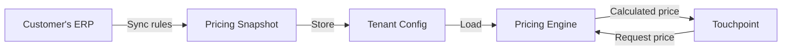
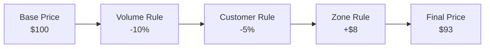

# Pricing
**Concept:** Flexible rule-based pricing engine that adapts to any ERP system.

---

## The Challenge

Every ERP system has its own pricing rules:
- Volume breaks, tier pricing, contract pricing
- Customer-specific discounts and surcharges
- Location-based pricing and shipping costs

**The problem:** Each ERP does pricing differently. Building custom integration logic for every ERP is unsustainable.

---

## The Solution: Universal Pricing Engine

Instead of trying to replicate every ERP's pricing logic, we provide a **flexible rule-based engine** that can represent pricing rules from any system.

### How It Works

**1. Sync Rules from ERP**
Customer's pricing rules and base prices are pulled from their ERP system (SAP, NetSuite, custom system, etc.)

**2. Convert to Our Model**
ERP rules are converted into a **snapshot** using our pricing model representation. This snapshot contains:
- Base prices
- Modifier rules (volume, customer, zone, promo, etc.)
- Rule priorities and conditions
- Calculation methods

**3. Store as Configuration**
The snapshot is stored as tenant-specific pricing configuration.

**4. Engine Calculates**
When Touchpoint (or any system) needs a price, our pricing engine:
- Loads the tenant's pricing snapshot
- Applies rules in priority order
- Calculates final price
- Returns transparent breakdown

---

## Why This Works

### Decoupling
Touchpoint doesn't need to understand SAP vs NetSuite pricing. It just calls our pricing engine with product, customer, quantity, and zone. The engine handles the rest.

### Flexibility
Any ERP's pricing rules can be represented in our model. New rule types can be added without changing core engine.

### Performance
Pricing snapshots are pre-calculated and stored. Real-time pricing is fast because we're not calling the ERP for every calculation.

### Transparency
Every price calculation returns a full breakdown of modifiers applied, so customers see exactly why they're paying a specific price.

---

## Pricing Flow

---

## Example: Multi-Stage Calculation

Each modifier is a rule from the pricing snapshot. The engine applies them in order, creating a transparent calculation chain.

---

## Rule Types Supported

Our pricing model can represent:
- **Volume/Tier Pricing** — Quantity-based breaks
- **Customer-Specific** — Contract pricing, negotiated rates

---

## Learn More

For detailed implementation, see:

- **[Pricing Engine](/commercebridge/pricing-engine)** — Complete engine documentation
- **[Core Bridge API](/commercebridge/core-bridge)** — Pricing operations reference

---

**Pricing Models: Any ERP's rules, one engine.**
