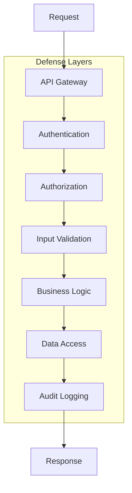

# Security
**Pattern:** Defense-in-depth security approach.

## Philosophy

Security is implemented at **every layer**, not just authentication:



## Security Layers

### 1. API Gateway

First line of defense:
- Rate limiting
- IP filtering
- DDoS protection
- Request size limits
- SSL/TLS enforcement

### 2. Authentication

Verify identity:
- Token-based authentication
- Tenant claims in tokens
- Token expiration
- Refresh token rotation

### 3. Authorization

Verify permissions:
- Role-based access control (RBAC)
- Tenant-scoped permissions
- Resource-level permissions
- Operation-level permissions

### 4. Input Validation

Validate all inputs:
- Schema validation
- Type checking
- Range validation
- Sanitization
- Injection prevention

### 5. Business Logic

Enforce business rules:
- State transition validation
- Workflow guards
- Tenant isolation enforcement
- Resource quota checks

### 6. Data Access

Secure data operations:
- Always include tenant filter
- Encrypted at rest
- Encrypted in transit
- Audit all access

### 7. Audit Logging

Track everything:
- Who did what
- When it happened
- What changed
- Why (if available)

## Authentication Pattern

### Token-Based

```ts
interface AuthToken {
  userId: string
  tenantId: string
  roles: string[]
  issuedAt: number
  expiresAt: number
}
```

### Validation

```ts
async validateRequest(req: Request) {
  const token = extractToken(req)
  const claims = await verifyToken(token)
  
  // Check expiration
  if (claims.expiresAt < Date.now()) {
    throw new AuthenticationError('Token expired')
  }
  
  // Check tenant matches
  if (req.body.tenantId !== claims.tenantId) {
    throw new AuthorizationError('Tenant mismatch')
  }
  
  return claims
}
```

## Authorization Pattern

### Role-Based Access Control

```ts
interface Permission {
  resource: string  // 'engagement', 'product', 'customer'
  action: string    // 'read', 'write', 'delete'
  tenantId: string
}

async checkPermission(userId: string, permission: Permission) {
  const user = await this.getUser(userId)
  const roles = await this.getUserRoles(userId)
  
  for (const role of roles) {
    if (role.permissions.includes(permission)) {
      return true
    }
  }
  
  return false
}
```

## Input Validation

### Schema-Based

```ts
const engagementSchema = {
  customerId: { type: 'string', required: true },
  type: { type: 'enum', values: ['quote', 'order'], required: true },
  lineItems: { type: 'array', minLength: 1, required: true }
}

async createEngagement(params: unknown) {
  // Validate before processing
  const validated = await validate(params, engagementSchema)
  return await this.create(validated)
}
```

### Sanitization

```ts
function sanitizeInput(input: string): string {
  // Remove potentially dangerous characters
  return input
    .trim()
    .replace(/[<>]/g, '')  // Strip HTML
    .substring(0, 1000)    // Limit length
}
```

## Data Encryption

### At Rest

- Sensitive fields encrypted in data store
- Encryption keys managed securely
- Key rotation supported

### In Transit

- TLS for all connections
- Certificate validation
- Secure protocols only

## Audit Logging

### What Gets Logged

- All data modifications
- Authentication attempts
- Authorization failures
- Configuration changes
- System errors

### Log Structure

```ts
interface AuditLog {
  timestamp: Date
  tenantId: string
  userId: string
  action: string
  resource: string
  resourceId: string
  changes?: Record<string, unknown>
  ipAddress: string
  userAgent: string
}
```

## Do / Don't

### ✅ Do

- Implement security at every layer
- Validate all inputs
- Enforce tenant context everywhere
- Use strong authentication
- Implement RBAC
- Log all sensitive operations
- Encrypt sensitive data
- Regular security audits
- Principle of least privilege

### ❌ Don't

- Trust client input
- Skip authentication
- Rely on single security layer
- Log sensitive data (passwords, tokens)
- Use weak encryption
- Share credentials across tenants
- Ignore security best practices
- Bypass authorization checks

## IP Safety

This describes:
- **Public:** Security patterns, defense-in-depth approach, validation concepts
- **Private (not shown):** Encryption keys, authentication mechanisms, specific security configurations

---

**Security: Defense in depth, secure by default.**
