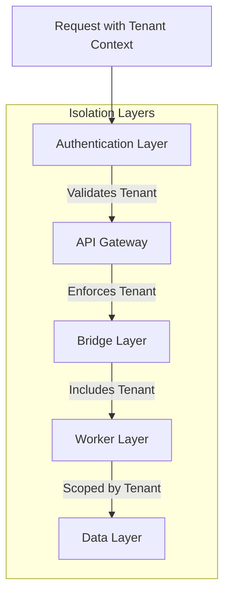

# Tenant Isolation
**Pattern:** Secure multi-tenant data separation.

## Problem

Multi-tenant SaaS requires absolute data isolation:
- No cross-tenant data leakage
- Secure tenant boundaries
- Independent tenant configurations
- Performance isolation

##Solution

Defense-in-depth isolation across all system layers:



## Isolation Layers

### 1. Authentication Layer

Every request includes tenant context:

```ts
// JWT token includes tenant claim
{
  userId: 'user-123',
  tenantId: 'tenant-alpha',  // Tenant context
  roles: ['admin']
}
```

### 2. API Gateway

Validates tenant access:

```ts
middleware.validateTenant = async (req, res, next) => {
  const token = req.headers.authorization
  const claims = verify(token)
  
  // Ensure tenant in request matches token
  if (req.body.tenantId !== claims.tenantId) {
    return res.status(403).json({ error: 'Tenant mismatch' })
  }
  
  req.tenantId = claims.tenantId
  next()
}
```

### 3. Bridge Layer

All operations tenant-scoped:

```ts
export class BaseBridge {
  constructor(config: BridgeConfig) {
    this.tenantId = config.tenantId
  }
  
  async getEngagement(id: string) {
    // Automatically filter by tenant
    return await this.dataStore.find({
      id,
      tenantId: this.tenantId  // Enforced
    })
  }
}
```

### 4. Worker Layer

Workers process tenant-scoped job cards:

```ts
async work(job: JobCard) {
  // Job card includes tenant context
  const tenantId = job.tenantId
  
  // Bridge initialized with tenant context
  const bridge = new Bridge({ tenantId })
  
  // All operations automatically scoped
  await bridge.getEngagement(job.payload.id)
}
```

### 5. Data Layer

Data namespaced by tenant:

**Data store collections:**
```
tenants/
├── tenant-alpha/
│   ├── engagements/
│   ├── products/
│   └── customers/
└── tenant-beta/
    ├── engagements/
    ├── products/
    └── customers/
```

**Cache keys:**
```
engagement:alpha:eng-123
engagement:beta:eng-456
```

**Search indexes:**
```
products-alpha
products-beta
```

## Security Boundaries

### Data Queries

Always include tenant filter:

```ts
// ✅ Correct
await dataStore.find({
  customerId: 'customer-123',
  tenantId: 'tenant-alpha'  // Required
})

// ❌ Wrong
await dataStore.find({
  customerId: 'customer-123'
  // Missing tenant filter - security risk!
})
```

### Cache Access

Prefix all keys with tenant:

```ts
// ✅ Correct
const key = `price:${tenantId}:${productId}:${customerId}`

// ❌ Wrong
const key = `price:${productId}` // Missing tenant - data leak risk!
```

### Queue Messages

Include tenant in all job cards:

```ts
// ✅ Correct
await bridge.publishTask('orders', {
  id: generateId(),
  task: 'process-order',
  payload: { orderId: 'order-123' },
  tenantId: 'tenant-alpha'  // Required
})
```

## Configuration Isolation

Each tenant has independent configuration:

```ts
interface TenantConfig {
  tenantId: string
  features: {
    advancedPricing: boolean
    multiWarehouse: boolean
    customWorkflows: boolean
  }
  settings: {
    currency: string
    timezone: string
    locale: string
  }
  limits: {
    maxEngagements: number
    maxWorkers: number
    apiRateLimit: number
  }
}
```

## Performance Isolation

Prevent one tenant from affecting others:

### Rate Limiting

Per-tenant API limits:
```ts
const limit = await rateLimiter.check(tenantId)
if (limit.exceeded) {
  return 429 // Too Many Requests
}
```

### Resource Quotas

Per-tenant resource limits:
- Max active engagements
- Max worker instances
- Cache size limits
- Query complexity limits

## Do / Don't

### ✅ Do

- Include tenant context in every operation
- Validate tenant at multiple layers
- Use tenant-prefixed cache keys
- Namespace data by tenant
- Enforce rate limits per tenant
- Audit tenant data access
- Test cross-tenant isolation

### ❌ Don't

- Skip tenant validation
- Use global cache keys
- Share data across tenants
- Allow cross-tenant queries
- Ignore tenant in worker jobs
- Forget tenant in logs/metrics
- Trust client-provided tenant ID without validation

## IP Safety

This describes:
- **Public:** Tenant isolation patterns, security boundaries, configuration approach
- **Private (not shown):** Specific data structures, actual tenant IDs, infrastructure configurations

---

**Tenant Isolation: Secure by design, isolated by default.**
