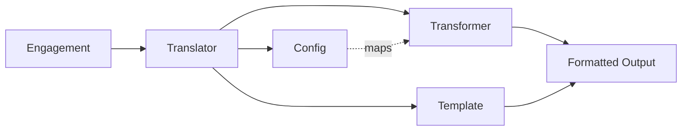

# Translator Framework
**Pattern:** Modular, declarative translation layer for serializing Engagements into external data formats.

---

## What is the Translator Framework?

The **Translator Framework** provides a standardized way to convert internal Engagement data into external data exchange formats like **cXML**, **UBL**, **JSON schemas**, and custom XML formats required by procurement systems, ERPs, and trading partners.

Rather than hardcoding transformation logic for each format, the framework uses three cooperating components:

1. **Config** — Declarative field mappings (JSON/YAML)
2. **Transformer** — Type-safe data extraction and normalization (TypeScript class)
3. **Template** — Format output definition (Liquid/Handlebars)

This separation allows new formats to be added quickly, versioned independently, and customized per tenant without modifying core logic.

---

## Why This Matters

**The Problem:**
B2B commerce requires integrating with dozens of procurement and ERP systems, each with their own data format:
- cXML for Ariba, Coupa, Jaggaer
- UBL for government procurement
- Custom XML schemas for enterprise ERPs
- Proprietary JSON formats for partner systems

Without a framework, you end up with:
- Hardcoded transforms scattered across the codebase
- Duplication when multiple formats need similar data
- No way to override mappings per tenant
- Breaking changes when internal models evolve

**The Solution:**
The Translator Framework decouples **what data** (config), **how to extract it** (transformer), and **how to format it** (template). This means:
- New formats are added by creating three files
- Tenant overrides only touch configs, not code
- Schema versions coexist (e.g., cXML 1.2.014 and 1.2.038)
- Templates stay clean because transformers handle all the logic

---

## Architecture



### Components

**1. Config (Mapping)**
Defines how Engagement fields map to the format's data model.

```json
{
  "order.id": "engagement.order.id",
  "order.total": "engagement.totals.total",
  "order.currency": "engagement.currency",
  "shipTo.city": "engagement.shipTo.address.city",
  "items": "engagement.items"
}
```

**2. Transformer (Logic)**
TypeScript class that extracts, normalizes, validates, and formats data.

```typescript
class CXMLTransformer extends BaseTransformer {
  transform(engagement: Engagement): CXMLData {
    return {
      orderId: this.get('order.id'),
      total: this.formatCurrency(this.get('order.total')),
      currency: this.get('order.currency'),
      shipTo: this.extractAddress('shipTo'),
      items: this.transformItems(this.get('items'))
    }
  }
}
```

**3. Template (Format)**
Liquid or Handlebars template that defines the final serialized output.

```xml
<?xml version="1.0" encoding="UTF-8"?>
<cXML version="1.2.014">
  <Request>
    <OrderRequest>
      <OrderRequestHeader orderID="{{ orderId }}" orderDate="{{ orderDate }}">
        <Total>
          <Money currency="{{ currency }}">{{ total }}</Money>
        </Total>
      </OrderRequestHeader>
    </OrderRequest>
  </Request>
</cXML>
```

---

## How It Works

### 1. Registration
Translators are registered in a central factory with a unique identifier:

```typescript
translators.register('cxml_1_2_014', {
  config: require('./translators/cxml/1.2.014/config.json'),
  transformer: CXMLTransformer,
  template: readFileSync('./translators/cxml/1.2.014/template.xml')
})
```

### 2. Translation
Workers or integrations request a specific translator:

```typescript
const translator = translators.get('cxml_1_2_014')
const output = translator.translate(engagement)
// Returns cXML formatted string
```

### 3. Tenant Overrides
Tenants can override configs without modifying transformers or templates:

```json
// tenant-123/cxml_1_2_014/config.json
{
  "order.id": "engagement.metadata.customOrderNumber",
  "order.supplierCode": "engagement.metadata.vendorId"
}
```

The framework automatically loads tenant-specific configs if they exist, falling back to defaults.

---

## Schema Versioning

Different versions of the same format coexist as separate translators:

```
/translators
  /cxml
    /1.2.014
      config.json
      transformer.ts
      template.xml
    /1.2.038
      config.json
      transformer.ts
      template.xml
  /ubl
    /2.1
      config.json
      transformer.ts
      template.xml
    /2.3
      config.json
      transformer.ts
      template.xml
```

This allows:
- Different customers to use different schema versions
- Safe migration paths (deploy new version, migrate tenants gradually)
- Legacy support without technical debt

---

## Transformer Responsibilities

The **Transformer** is where all logic lives. It's responsible for:

### Data Extraction
Using config mappings to pull data from Engagements:
```typescript
this.get('order.id') // Uses config to resolve engagement.order.id
```

### Type Enforcement
Ensuring data matches format requirements:
```typescript
validateRequired(['order.id', 'order.total', 'order.currency'])
validateType('order.total', 'number')
```

### Formatting
Applying format-specific rules:
```typescript
formatCurrency(amount: number): string {
  return amount.toFixed(2) // cXML requires 2 decimal places
}

formatDate(date: Date): string {
  return date.toISOString() // cXML uses ISO 8601
}
```

### Business Logic
Handling format-specific requirements:
```typescript
// cXML requires different node structures for catalog vs punchout orders
transformItems(items: Item[]): CXMLItemData[] {
  return items.map(item => ({
    lineNumber: item.position,
    quantity: item.quantity,
    unitPrice: this.formatCurrency(item.unitPrice),
    // cXML-specific: include supplier part number
    supplierPartID: item.sku || item.metadata?.supplierSKU
  }))
}
```

This keeps templates clean and focused purely on structure, not logic.

---

## Template Best Practices

Templates should be **purely presentational**:

**✅ Good:**
```xml
<Money currency="{{ currency }}">{{ total }}</Money>
```

**❌ Bad:**
```xml
<Money currency="{{ currency }}">{{ total | toFixed: 2 }}</Money>
```
*Formatting belongs in the transformer, not the template.*

**✅ Good:**
```xml
{{#each items}}
  <Item lineNumber="{{ lineNumber }}">
    <Quantity>{{ quantity }}</Quantity>
  </Item>
{{/each}}
```

**❌ Bad:**
```xml
{{#each engagement.items}}
  <Item lineNumber="{{ @index }}">
    <Quantity>{{ qty || quantity }}</Quantity>
  </Item>
{{/each}}
```
*Logic and fallbacks belong in the transformer.*

---

## Benefits

### 1. Rapid Format Addition
Add a new format in minutes by creating three files: config, transformer, template. No changes to core systems.

### 2. Tenant Flexibility
Clients can customize field mappings without code changes. Deploy config overrides independently.

### 3. Version Coexistence
Support multiple schema versions simultaneously. Migrate tenants on their schedule, not yours.

### 4. Clean Separation
- Configs are pure data (JSON/YAML)
- Transformers contain all logic (testable TypeScript)
- Templates are pure structure (readable XML/JSON)

### 5. Type Safety
TypeScript transformers catch errors at compile time. Configs are validated against schemas.

### 6. Testability
Each component can be tested independently:
- Config: validate mappings resolve correctly
- Transformer: unit test data extraction and formatting
- Template: validate output against format schemas

---

## Use Cases

### Procurement Integration
Translate Engagements into **cXML PunchOut Order Messages** for procurement systems like Ariba, Coupa, and Jaggaer.

### ERP Sync
Convert Engagements into **custom ERP formats** (XML, JSON, or flat files) for systems like SAP, Oracle, NetSuite.

### Government Compliance
Generate **UBL invoices and orders** for government procurement portals that require standardized formats.

### Partner APIs
Produce **custom JSON payloads** matching partner-specific API schemas without writing one-off transformation code.

### Document Export
Generate **human-readable formats** like PDF-ready HTML or formatted Excel structures from Engagement data.

---

## Implementation Details

### Directory Structure
```
/translators
  /[format]        # e.g., cxml, ubl, custom
    /[version]     # e.g., 1.2.014, 2.3
      config.json
      transformer.ts
      template.[xml|json|hbs]
    index.ts       # Format registry
  index.ts         # Main factory
  base.ts          # BaseTransformer class
```

### Base Transformer
All transformers extend `BaseTransformer`:

```typescript
abstract class BaseTransformer {
  protected config: TranslatorConfig
  protected engagement: Engagement
  
  abstract transform(): any
  
  protected get(path: string): any {
    // Resolve config mapping and extract from engagement
  }
  
  protected validateRequired(fields: string[]): void
  protected validateType(field: string, type: string): void
  protected formatCurrency(amount: number): string
  protected formatDate(date: Date): string
}
```

### Translation Pipeline
```typescript
class Translator {
  constructor(config, transformer, template) {
    this.config = config
    this.transformer = transformer
    this.template = template
  }
  
  translate(engagement: Engagement): string {
    // 1. Apply config mappings
    const mappedData = this.applyConfig(engagement)
    
    // 2. Run transformer
    const transformedData = new this.transformer(mappedData).transform()
    
    // 3. Validate
    this.validate(transformedData)
    
    // 4. Render template
    return this.render(this.template, transformedData)
  }
}
```

---

## Extending the Framework

### Adding a New Format

**Step 1: Create Config**
```json
// translators/edifact/d96a/config.json
{
  "order.id": "engagement.order.id",
  "order.date": "engagement.order.createdAt",
  "buyer.code": "engagement.customer.buyerCode"
}
```

**Step 2: Create Transformer**
```typescript
// translators/edifact/d96a/transformer.ts
export class EDIFACTTransformer extends BaseTransformer {
  transform(): EDIFACTData {
    return {
      messageType: 'ORDERS',
      orderId: this.get('order.id'),
      orderDate: this.formatDate(this.get('order.date'), 'YYMMDD'),
      buyer: this.get('buyer.code')
    }
  }
  
  formatDate(date: Date, format: string): string {
    // EDIFACT-specific date formatting
  }
}
```

**Step 3: Create Template**
```
UNH+{{ messageRef }}+ORDERS:D:96A:UN'
BGM+220+{{ orderId }}+9'
DTM+137:{{ orderDate }}:102'
NAD+BY+++{{ buyer }}'
UNT+{{ segmentCount }}+{{ messageRef }}'
```

**Step 4: Register**
```typescript
// translators/edifact/index.ts
translators.register('edifact_d96a', {
  config: require('./d96a/config.json'),
  transformer: EDIFACTTransformer,
  template: readFileSync('./d96a/template.edi', 'utf8')
})
```

---

## Learn More

For implementation details and integration guidance, see:

- **[Engagements](/core/engagements)** — The data model being translated
- **[Bridge Architecture](/core/bridge-architecture)** — Where translators are invoked
- **[Workers](/commercebridge/workers)** — How workers use translators for output
- **[Integrations](/commercebridge/integrations)** — Connecting translators to external systems

---

**Translator Framework: One model, infinite formats.**

