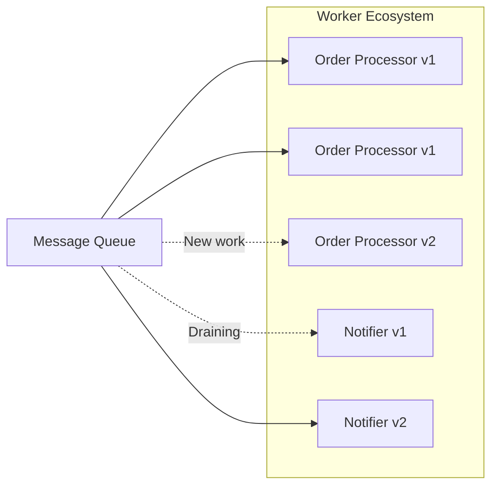

# Worker Ecosystems
**Pattern:** Autonomous, specialized processors that scale elastically.

---

## The Concept

Instead of building large, monolithic services, you build **ecosystems of specialized workers** — each handling one specific business task.

A worker ecosystem is a community of processors that:
- **Specialize** — Each worker type does one thing well
- **Replicate** — Scale by adding more instances
- **Evolve** — Deploy new versions alongside old ones
- **Retire** — Gracefully drain and replace workers

---

## Why Workers?

**Traditional approach:** Build a large order processing service that handles orders, sends notifications, updates inventory, processes payments, etc.

**Worker approach:** Build specialized workers:
- `order-processor` — Processes orders only
- `notification-sender` — Sends notifications only
- `inventory-sync` — Syncs inventory only
- `payment-processor` — Handles payments only

Each worker is simpler, easier to test, and can scale independently.

---

## Core Principles

### Stateless Between Workers, Stateful Within

Workers don't share state with each other. They can hold state during their processing cycle for efficiency, but that state is cleared between cycles. This makes them:
- **Scalable** — Add more instances anytime
- **Replaceable** — Stop and start without data loss
- **Independent** — One worker failure doesn't affect others

### Autonomous Operation

Workers manage themselves:
- Fetch their own work from queues
- Handle their own errors and retries
- Report their own health
- Scale based on queue depth

### Single Responsibility

Each worker type handles one business task. This keeps them:
- **Focused** — Easy to understand and maintain
- **Testable** — Simple to verify behavior
- **Deployable** — Update independently

---

## Evolution, Not Migration

The magic of worker ecosystems is **gradual evolution**:

1. Deploy new worker version (v2)
2. It starts consuming new work alongside v1
3. Old workers (v1) finish their current jobs and drain
4. Eventually all work flows to v2
5. Retire v1 workers

**Zero downtime. Zero "maintenance windows." Continuous evolution.**

---

## Learn More

For detailed implementation guidance, see:

- **[Workers](/commercebridge/workers)** — Complete worker documentation
- **[Custom Ecosystems](/commercebridge/integrations)** — Building your ecosystem
- **[CommerceBridge Architecture](/commercebridge/architecture)** — Full system design

---

**Worker Ecosystems: Evolve, don't migrate.**
