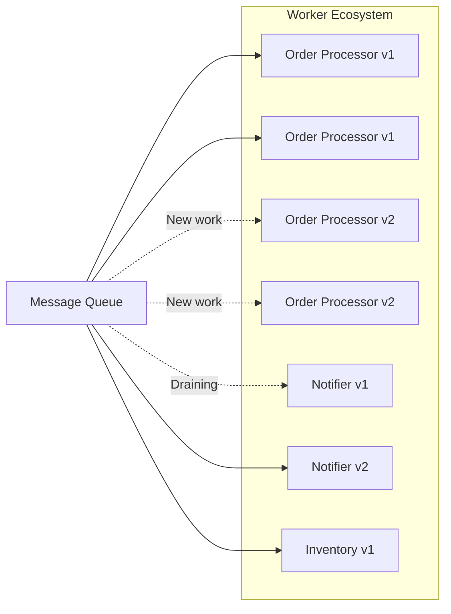
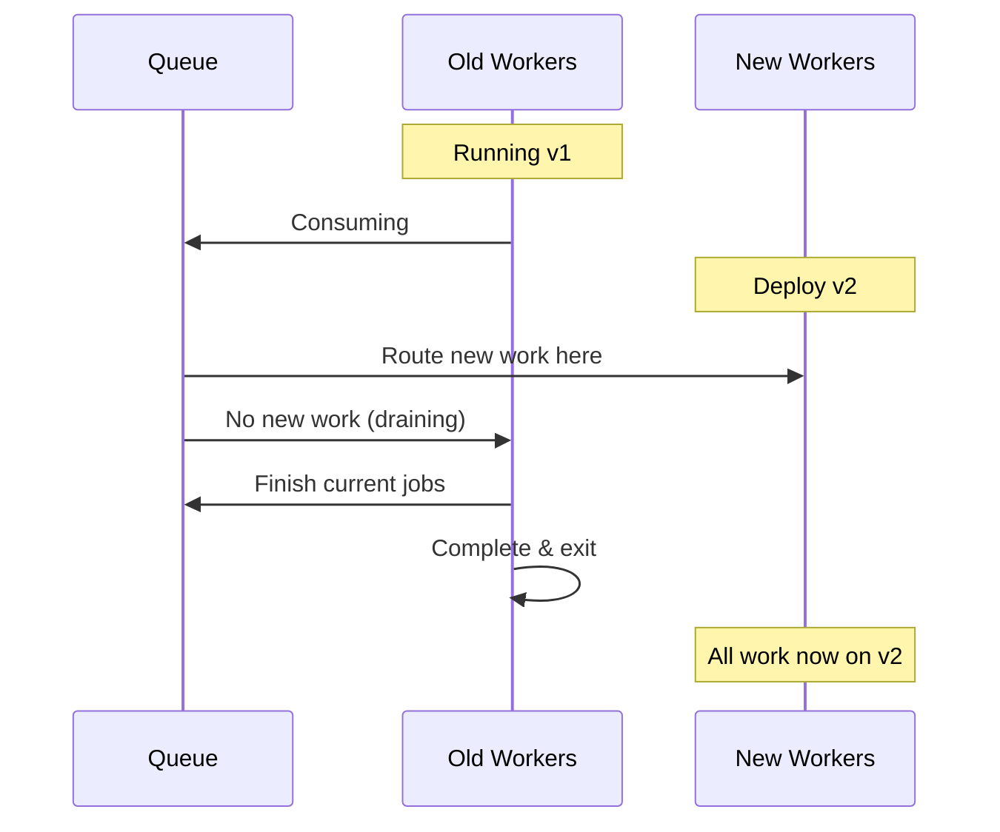

# Worker Ecosystems
**Pattern:** Building distributed, autonomous processing systems.

## Problem

Traditional service architectures struggle with:
- Difficulty scaling individual services
- Complex deployment coordination
- Risk during version updates
- Tight coupling between components
- Monolithic scaling (all or nothing)

## Solution

Worker ecosystems are collections of specialized, stateless processors that:

- **Specialize** — Each worker type handles one specific task
- **Replicate** — Add more instances for more capacity
- **Evolve** — Deploy new versions alongside old
- **Retire** — Gracefully drain and replace workers


```mermaid
flowchart LR
    QUEUE[Message Queue]
    
    subgraph "Worker Ecosystem"
        W1A[Order Processor v1]
        W1B[Order Processor v1]
        W2[Order Processor v2]
        W2B[Order Processor v2]
        
        N1[Notifier v1]
        N2[Notifier v2]
        
        I1[Inventory v1]
    end
    
    QUEUE --> W1A
    QUEUE --> W1B
    QUEUE -.New work.-> W2
    QUEUE -.New work.-> W2B
    
    QUEUE -.Draining.-> N1
    QUEUE --> N2
    
    QUEUE --> I1
```

## Core Principles

### Stateless

Workers maintain no persistent state:
- Fetch all data from Bridge
- No local databases or files
- No session state between jobs
- Complete independence per job

**Benefit:** Workers can be stopped/started/replaced without data loss

### Replaceable

Workers are disposable:
- Stop accepting new work
- Complete current jobs
- Exit cleanly
- New instance takes over

**Benefit:** Zero-downtime deployments

### Elastic

Workers scale based on workload:
- Add instances when queue grows
- Remove instances when queue shrinks
- Auto-scale or manual control
- Independent scaling per worker type

**Benefit:** Resource efficiency and cost optimization

### Autonomous

Workers are self-managing:
- Decide when to process
- Handle their own errors
- Report their own metrics
- Manage their own lifecycle

**Benefit:** Reduced orchestration complexity

## Philosophy: "Starve Old Workers, Evolve Ecosystems"


```mermaid
sequenceDiagram
    participant Queue
    participant Old Workers
    participant New Workers
    
    Note over Old Workers: Running v1
    
    Old Workers->>Queue: Consuming
    
    Note over New Workers: Deploy v2
    
    Queue->>New Workers: Route new work here
    Queue->>Old Workers: No new work (draining)
    
    Old Workers->>Queue: Finish current jobs
    Old Workers->>Old Workers: Complete & exit
    
    Note over New Workers: All work now on v2
```

**Process:**

1. **Deploy new version** alongside existing
2. **Route new work** to new workers only
3. **Let old workers finish** their current jobs
4. **Old workers exit** when idle
5. **System evolved** without downtime

## Worker Types

### Specialized Workers

Each type handles one business task:

```
order-processor:
  - Validates orders
  - Allocates inventory
  - Creates fulfillment plans

notification-sender:
  - Sends customer emails
  - Sends SMS messages
  - Sends push notifications

inventory-sync:
  - Syncs external inventory
  - Updates cache
  - Publishes availability changes

price-calculator:
  - Pre-calculates common prices
  - Warms price cache
  - Updates on price changes
```

### Generalist Workers (Anti-Pattern)

**Avoid:** Workers that handle multiple unrelated tasks

❌ `general-worker` that does orders + inventory + notifications  
❌ `mega-processor` that handles everything  
❌ `kitchen-sink-service` with dozens of responsibilities

✅ Instead: Create focused, specialized workers

## Ecosystem Evolution

### Adding New Functionality

**Don't:** Modify existing workers

**Do:** Add new specialized workers

```
Before:
  order-processor (handles orders + inventory)

After:
  order-processor (handles orders only)
  inventory-allocator (new worker for inventory)
```

### Changing Business Logic

**Don't:** Update and restart workers

**Do:** Deploy new version, drain old

```
Deploy order-processor v2
Route new orders to v2
Let v1 finish existing work
v1 exits when idle
```

### Scaling Workload

**Don't:** Scale entire application

**Do:** Scale specific worker types

```
Order volume increased:
  - Add more order-processor instances

Notification backlog:
  - Add more notification-sender instances

Inventory sync is fine:
  - Keep single instance
```

## Do / Don't

### ✅ Do

- Create focused, single-purpose workers
- Deploy new versions alongside old
- Let old workers drain gracefully
- Scale worker types independently
- Use message queues for coordination
- Monitor worker metrics
- Auto-scale based on queue depth

### ❌ Don't

- Create general-purpose workers
- Do rolling restarts
- Force-kill workers mid-job
- Share state between workers
- Create tight coupling between worker types
- Deploy monolithic changes
- Ignore queue metrics

## Real-World Pattern

### E-commerce System

```
Ecosystem:
├── order-processor (5 instances)
├── payment-processor (3 instances)
├── inventory-allocator (2 instances)
├── notification-sender (10 instances)
├── fulfillment-coordinator (2 instances)
└── analytics-aggregator (1 instance)
```

**Scaling event:** Black Friday traffic surge

**Response:**
- order-processor: 5 → 20 instances
- payment-processor: 3 → 12 instances
- notification-sender: 10 → 30 instances
- Others: No change needed

**Post-event:** Scale back down as queue drains

## IP Safety

This documentation describes:
- **Public:** Worker ecosystem patterns, principles, deployment strategies
- **Private (not shown):** Specific worker implementations, queue configurations, scaling thresholds

---

**Worker Ecosystems: Evolve, don't migrate.**
