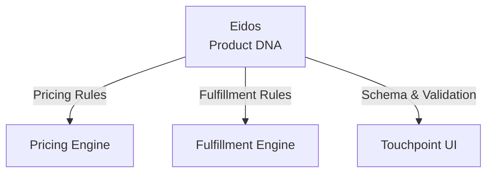
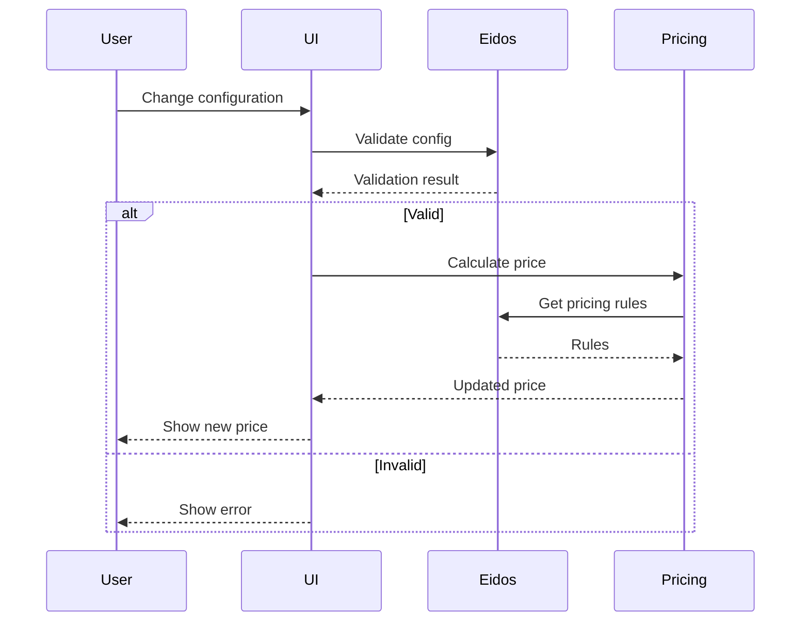

# CommerceBridge Integration
**Pattern:** Product knowledge integrated with commerce operations.

## Integration Points

Eidos integrates with CommerceBridge at multiple levels:



## Pricing Integration

Product configuration affects pricing:

```ts
// User configures product
const config = {
  material: 'composite',
  finish: 'powder-coated',
  dimensions: { length: 120 }
}

// Eidos provides pricing rules
const rules = await eidos.getPricingRules(productId, config)
// [
//   { modifier: 1.20, reason: 'Composite material' },
//   { modifier: 1.10, reason: 'Custom dimensions' }
// ]

// Pricing engine applies rules
const basePrice = 100
const finalPrice = basePrice * 1.20 * 1.10 // $132
```

## Fulfillment Integration

Configuration affects fulfillment:

```ts
// Eidos provides fulfillment rules
const rules = await eidos.getFulfillmentRules(productId, config)
// [
//   { leadTime: +5 days, reason: 'Composite processing' },
//   { warehouse: 'specialty-only', reason: 'Requires special equipment' }
// ]

// Fulfillment engine applies
const baseLeadTime = 7
const totalLeadTime = baseLeadTime + 5 // 12 days

// Warehouse filtering
const eligibleWarehouses = warehouses.filter(w => 
  w.capabilities.includes('specialty-fabrication')
)
```

## UI Integration

Eidos drives dynamic UI generation:

```ts
// Get product schema
const schema = await eidos.getSchema(productId)

// Generate form
for (const [key, attribute] of Object.entries(schema.attributes)) {
  if (attribute.type === 'enum') {
    renderDropdown(key, attribute.values)
  } else if (attribute.type === 'number') {
    renderNumberInput(key, attribute.min, attribute.max)
  }
}

// Validate on change
async onConfigChange(field, value) {
  const config = { ...this.config, [field]: value }
  
  const validation = await eidos.validate(productId, config)
  
  if (validation.errors.length > 0) {
    this.showErrors(validation.errors)
  } else {
    // Recalculate pricing
    const pricing = await bridge.calculatePrice({
      productId,
      configuration: config,
      quantity: this.quantity
    })
    
    this.displayPrice = pricing.finalPrice
  }
}
```

## Validation Flow



## Real-World Example

### Configurable Industrial Equipment

**Product:** Custom conveyor system

**Schema (from Eidos):**
```ts
{
  length: { type: 'number', min: 10, max: 500, unit: 'feet' },
  width: { type: 'number', min: 12, max: 96, unit: 'inches' },
  motor: { type: 'enum', values: ['0.5HP', '1HP', '2HP'] },
  controls: { type: 'enum', values: ['basic', 'variable-speed', 'automated'] }
}
```

**Rules (from Eidos):**
```ts
// Validation
if (length > 200 && motor === '0.5HP') {
  error('Insufficient motor for length > 200ft')
}

// Pricing
if (controls === 'automated') {
  priceModifier = 1.50  // 50% upcharge
}

// Fulfillment
if (length > 300) {
  leadTime += 14  // 2 weeks custom fabrication
  warehouse = 'specialty-only'
}
```

**User Experience:**
1. User selects length: 350 ft
2. System shows motor options (0.5HP disabled with explanation)
3. User selects 1HP motor
4. User selects automated controls
5. Price updates: $5,000 base × 1.50 = $7,500
6. Lead time shows: 21 days
7. Available from: Specialty warehouse only

## Extension Points

### Custom Attribute Types

```ts
eidos.registerAttributeType('material-grade', {
  validate: (value) => isValidMaterialGrade(value),
  display: (value) => formatMaterialGrade(value)
})
```

### Custom Validators

```ts
eidos.registerValidator('industry-standard-compliant', {
  validate: async (config) => {
    return await checkIndustryStandards(config)
  }
})
```

## IP Safety

This describes:
- **Public:** Integration concept, rule application, validation flow
- **Private (not shown):** Specific schemas, business rules, product configurations

---

**Integration: Product knowledge drives commerce.**
