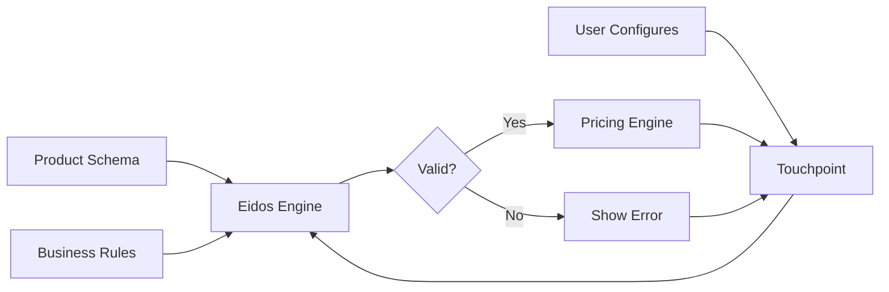

# Eidos Overview
**Tagline:** Structured knowledge for configurable products.

## What It Is

Eidos is a system for defining product "DNA" — the genetic code that determines what a product is, how it can be configured, and how it behaves in pricing and fulfillment contexts.

Rather than hardcoding product logic, Eidos uses declarative schemas and rules that can be modified without code deployments. This enables sophisticated product configuration, dynamic validation, and business rule enforcement.

Think of it as a product knowledge base that other systems (pricing, fulfillment, UI) consult to understand how products work.

## Why It Exists

Complex products need more than attributes in a database. Eidos solves:

| Problem | Solution |
|---------|----------|
| Hardcoded product logic | Declarative schemas and rules |
| Invalid configurations possible | Rule-based validation |
| Code deployment for product changes | Schema updates without code |
| Inconsistent product behavior | Single source of product truth |
| Difficult product versioning | Schema versioning and evolution |

## Core Abstractions

| Term | Meaning |
|------|---------|
| **Product DNA** | Complete definition of product structure and behavior |
| **Schema** | Product attribute definitions and types |
| **Rules** | Validation and business logic constraints |
| **Configuration** | Valid combination of product options |

## High-Level Flow



## Product DNA Concept

Product DNA defines:

### Attributes

What characteristics define this product:
```
Material: [steel, aluminum, composite]
Finish: [powder-coated, anodized, bare]
Dimensions: {length, width, height}
```

### Constraints

What combinations are valid:
```
IF material = composite
THEN finish must be powder-coated
```

### Behaviors

How configuration affects systems:
```
IF material = steel AND finish = powder-coated
THEN add 3 days to lead time
```

### Relationships

How product connects to others:
```
Product A requires Product B (accessory)
Product C substitutes for Product D
```

## Public vs Private

| Public (Documented Here) | Private (Not Exposed) |
|--------------------------|----------------------|
| Schema concepts | Actual product schemas |
| Rule patterns | Specific business rules |
| Integration approach | Schema storage details |
| Extension model | Tenant-specific rules |

## Next

- [Product DNA →](/eidos/product-dna) — Defining product genetic code
- [Data Schema →](/eidos/data-schema) — Schema-driven product modeling
- [Rule Sets →](/eidos/rule-sets) — Business logic and validation

---

**Eidos: Products that know themselves.**
