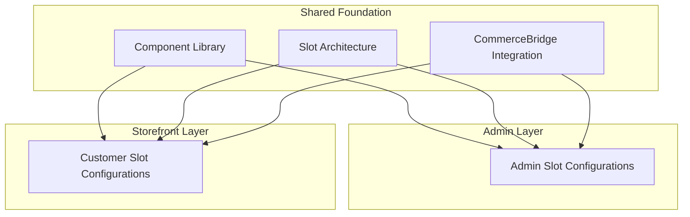

# Admin vs Storefront
**Pattern:** Two experiences, one codebase.

## Concept

Touchpoint provides two interconnected experiences built from the same component system:



## Admin Layer

### Purpose

Management interface for commerce operations.

### Key Features

**Product Management:**
- Catalog configuration
- Pricing rules
- Inventory settings
- Product attributes

**Order Management:**
- Order processing
- Status updates
- Fulfillment coordination
- Customer communication

**Customer Management:**
- Account details
- Pricing rules
- Delivery addresses
- Order history

**System Configuration:**
- Delivery zones
- Warehouses
- Feature flags
- Tenant settings

### UI Characteristics

- Detailed data displays
- Bulk operations
- Advanced filtering
- Audit trails
- System metrics

## Storefront Layer

### Purpose

Customer-facing ordering experience.

### Key Features

**Product Discovery:**
- Search and browse
- Category navigation
- Filtering and sorting
- Product details

**Ordering:**
- Cart building
- Real-time pricing
- Availability checking
- Checkout process

**Account:**
- Order history
- Saved carts
- Delivery addresses
- Account preferences

### UI Characteristics

- Clean, focused interfaces
- Simplified workflows
- Guided experiences
- Mobile-responsive
- Performance-optimized

## Shared Components

Both layers share:

### Component Library

Same base components with different configurations:

```ts
// Admin usage
<ProductCard
  product={product}
  mode="admin"
  showControls={true}
  showMetrics={true}
/>

// Customer usage
<ProductCard
  product={product}
  mode="customer"
  showControls={false}
  showPrice={true}
/>
```

### Data Integration

Same CommerceBridge integration:

```ts
// Both layers use same Bridge functions
const pricing = await bridge.calculatePrice(context)
const availability = await bridge.checkAvailability(query)
```

### State Management

Shared state patterns:
- Same caching layer
- Same real-time updates
- Same engagement model

## Role-Based Rendering

Slots render differently based on user role:

```ts
// Pricing display slot
function PricingSlot({ pricing, userRole }) {
  if (userRole === 'admin') {
    return (
      <div>
        <h3>Pricing Breakdown</h3>
        <div>Base: ${pricing.basePrice}</div>
        {pricing.modifiers.map(mod => (
          <div>{mod.reason}: ${mod.value}</div>
        ))}
        <div>Final: ${pricing.finalPrice}</div>
      </div>
    )
  }
  
  // Customer sees simplified view
  return <div className="price">${pricing.finalPrice}</div>
}
```

## Benefits

### Code Efficiency

One codebase for both experiences:
- Shared components
- Shared logic
- Shared testing
- Easier maintenance

### Consistency

Same data, same integration:
- No sync issues between admin/customer views
- Consistent behavior
- Single source of truth

### Flexibility

Customize each layer independently:
- Admin can be feature-rich
- Storefront can be streamlined
- Both benefit from core improvements

## IP Safety

This describes:
- **Public:** Layer concept, shared architecture, role-based rendering
- **Private (not shown):** Specific component implementations, tenant configurations

---

**Admin vs Storefront: Two faces, one foundation.**
