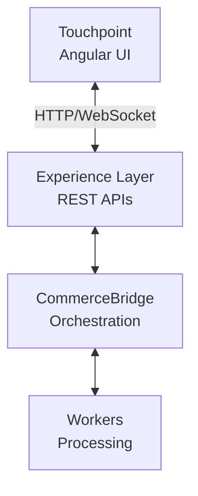

# CommerceBridge Integration
**Pattern:** UI framework integrated with commerce orchestration.

## Integration Architecture


```mermaid
flowchart TB
    UI[Touchpoint<br/>Angular UI]
    EXP[Experience Layer<br/>REST APIs]
    BRIDGE[CommerceBridge<br/>Orchestration]
    WORKERS[Workers<br/>Processing]
    
    UI <-->|HTTP/WebSocket| EXP
    EXP <--> BRIDGE
    BRIDGE <--> WORKERS
```

Touchpoint communicates with CommerceBridge through the Experience Layer (REST APIs).

## Real-Time Features

### Dynamic Pricing

Price updates as user interacts:

```ts
// User changes quantity
onQuantityChange(newQuantity) {
  // Call Bridge via API
  const pricing = await api.calculatePrice({
    productId: this.product.id,
    quantity: newQuantity,
    customerId: this.customer.id
  })
  
  // Update UI immediately
  this.displayedPrice = pricing.finalPrice
  this.priceBreakdown = pricing.modifiers
}
```

### Real-Time Availability

Check stock as user browses:

```ts
// User views product
async loadProduct(productId) {
  const product = await api.getProduct(productId)
  
  // Check availability for user's zone
  const availability = await api.checkAvailability({
    productId,
    quantity: 1,
    deliveryZone: this.userZone
  })
  
  this.product = product
  this.availability = availability
}
```

### Live Cart Updates

Cart recalculates on every change:

```ts
// User adds item to cart
async addToCart(product, quantity) {
  this.cart.items.push({ product, quantity })
  
  // Recalculate entire cart
  const cartPricing = await api.calculateCartPricing(this.cart)
  
  this.cart.pricing = cartPricing
  this.cart.total = cartPricing.finalPrice
}
```

## State Synchronization

### Engagement State

Cart state persists in CommerceBridge engagement:

```ts
// Auto-save cart to engagement
async saveCart() {
  await api.updateEngagement(this.engagementId, {
    lineItems: this.cart.items,
    status: 'active'
  })
}

// Restore cart from engagement
async loadCart() {
  const engagement = await api.getEngagement(this.engagementId)
  this.cart = engagement.lineItems
}
```

### Session Management

User sessions tied to engagements:
- Create engagement on first interaction
- Update throughout session
- Convert to order on checkout
- Maintain across browser sessions

## Search Integration

Product search powered by search engine via Bridge:

```ts
async searchProducts(query, filters) {
  const results = await api.searchProducts({
    query,
    filters: {
      ...filters,
      deliveryZone: this.userZone  // Auto-filtered
    }
  })
  
  // Only shows deliverable products
  this.products = results.items
}
```

### Spatial Filtering

Zone-aware search:
- User's location determines delivery zone
- Products filtered by warehouse zones
- Only deliverable products shown
- Delivery time estimates included

## WebSocket Updates

Real-time updates for:

### Order Status

```ts
// Subscribe to order updates
socket.on('order:updated', (data) => {
  if (data.orderId === this.orderId) {
    this.order.status = data.status
    this.showNotification(`Order ${data.status}`)
  }
})
```

### Inventory Changes

```ts
// Subscribe to availability changes
socket.on('availability:changed', (data) => {
  if (data.productId === this.product.id) {
    this.updateAvailability(data.available)
  }
})
```

## Extension Points

### Custom Slots

Create tenant-specific components:

```ts
// Register custom slot implementation
slotRegistry.register('product-detail', {
  tenant: 'tenant-alpha',
  component: CustomProductDetail
})
```

### Custom Workflows

Define tenant-specific user flows:

```ts
// Custom checkout workflow
const checkoutSteps = [
  { id: 'cart-review', component: CartReview },
  { id: 'delivery-options', component: DeliveryOptions },
  { id: 'custom-approval', component: ApprovalStep },  // Tenant-specific
  { id: 'payment', component: Payment },
  { id: 'confirmation', component: Confirmation }
]
```

## IP Safety

This describes:
- **Public:** Integration patterns, real-time features, slot concept
- **Private (not shown):** Component implementations, API endpoints, state management code

---

**Integration: UI and commerce, seamlessly connected.**
