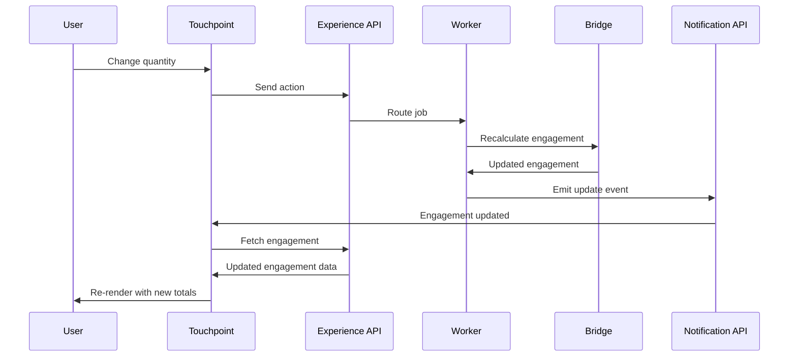

# Abstracted Business Logic
**Pattern:** Business logic lives in CommerceBridge — Touchpoint displays data and triggers actions.

---

## The Philosophy

**Touchpoint has zero business logic.**

It doesn't calculate prices. It doesn't multiply quantity × price. It doesn't allocate inventory. It doesn't validate product configurations.

**All business logic lives in CommerceBridge.**

Touchpoint's job is to:
1. Display data from engagements
2. Capture user actions
3. Send actions to the Experience API
4. Listen for updates
5. Reload and re-render

---

## How It Works

### 1. User Action Triggers API Call

User adds a product to cart, changes quantity, or updates configuration.

Touchpoint sends an **Action** to the Experience API:

```
POST /api/engagement/action
{
  "engagementId": "eng-123",
  "action": "update-line-item",
  "payload": {
    "lineItemId": "item-456",
    "quantity": 10
  }
}
```

### 2. Experience API Routes to Worker

The Experience API:
- Receives the action
- Creates a job card
- Routes to the tenant-configured worker
- Returns immediately (async processing)


### 3. Worker Processes the Engagement

The worker (e.g., `engagementRecalculator`):
- Fetches the engagement from the Bridge
- Recalculates pricing (using pricing engine)
- Recalculates totals (line totals, subtotals, taxes, discounts)
- Updates allocation if needed
- Saves updated engagement back to Bridge

**All calculations happen backend.**

### 4. Notification Emitted

Worker completes and emits notification:
```
Engagement eng-123 updated
```

### 5. Touchpoint Reloads Engagement

Touchpoint receives notification via real-time connection:
- Fetches updated engagement from API
- Re-renders UI with new calculated totals
- Shows updated pricing, availability, allocations

**No frontend calculations. Just display.**

---

## Why This Matters

### Consistency
All calculations use the same pricing engine, fulfillment engine, and business rules. No frontend vs backend discrepancies.

### Accuracy
Complex pricing rules (volume breaks, customer-specific pricing, zone surcharges) are handled by the backend pricing engine, not approximated in the UI.

### Security
Business logic can't be bypassed or manipulated in the frontend. All validation and calculation happens server-side.

### Maintainability
One place for business logic. When pricing rules change, update the Bridge — Touchpoint automatically displays correct results.

### Tenant-Specific Logic
Each tenant's configured worker handles their specific business rules. Touchpoint doesn't need to know tenant-specific logic.

---

## Real-Time Updates

Touchpoint uses real-time connections (WebSocket/SSE) to receive engagement updates:



---

## What Touchpoint Does

### Display
- Renders engagement data (line items, pricing, fulfillment)
- Shows real-time pricing from Price Cards
- Displays availability from fulfillment plans

### Capture
- User interactions (add to cart, change quantity, configure products)
- Form inputs (addresses, payment info, notes)
- User preferences

### Trigger
- Sends actions to Experience API
- Actions become job cards for workers

### Listen
- Subscribes to engagement update notifications
- Reloads data when changes occur

### Render
- Updates UI with fresh data
- No calculations, just presentation

---

## What Touchpoint Doesn't Do

**No Calculations:**
- ❌ Doesn't calculate line totals (qty × price)
- ❌ Doesn't calculate subtotals or taxes
- ❌ Doesn't apply discounts
- ❌ Doesn't validate inventory

**No Business Logic:**
- ❌ Doesn't enforce business rules
- ❌ Doesn't determine pricing
- ❌ Doesn't allocate inventory
- ❌ Doesn't validate product configurations

**No Direct Database Access:**
- ❌ Doesn't query databases
- ❌ Doesn't update engagement state directly
- ❌ Everything flows through Experience API

---

## Benefits of Zero Business Logic

**1. Single Source of Truth**
CommerceBridge engines (pricing, fulfillment) are the only place business logic exists.

**2. Tenant Flexibility**
Each tenant's workers implement their specific business rules. Touchpoint doesn't need tenant-specific code.

**3. Simplified Frontend**
Touchpoint is a pure UI layer. No complex logic to maintain, test, or debug.

**4. Backend Evolution**
Change pricing rules, fulfillment strategies, or validation logic in CommerceBridge — Touchpoint automatically reflects the changes.

---

## Learn More

For detailed implementation, see:

- **[Touchpoint Overview](/touchpoint)** — Complete framework overview
- **[Workers](/commercebridge/workers)** — How workers process engagement actions
- **[Engagements](/core/engagements)** — The engagement model
- **[The Bridge](/commercebridge/bridge)** — How the Bridge manages state

---

**CommerceBridge Integration: Display data, capture actions, zero logic.**
