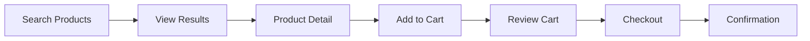
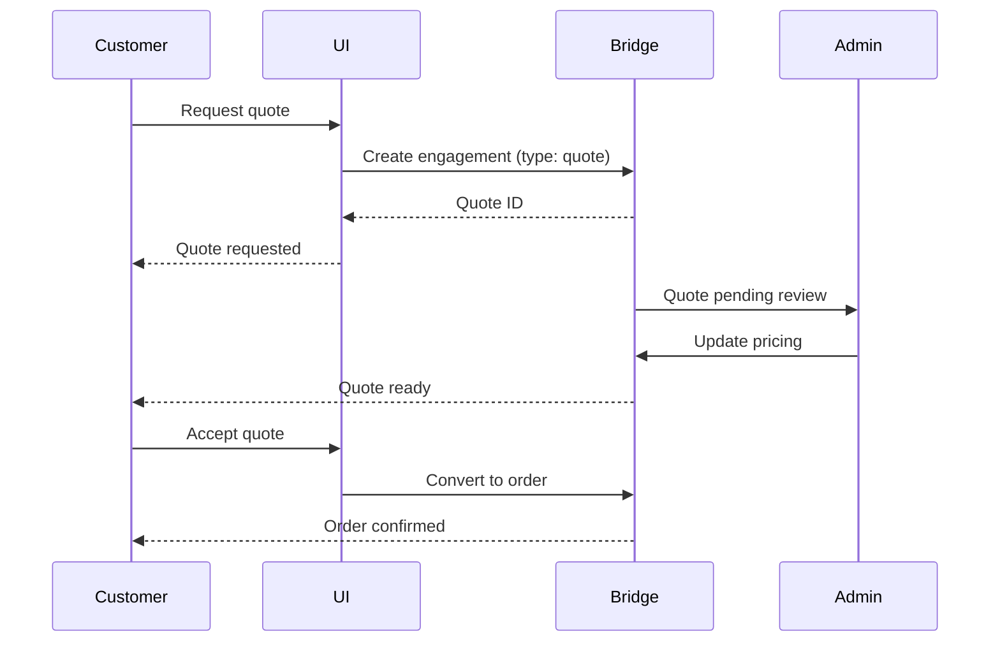

# Example Flows
**Pattern:** Common user journeys through Touchpoint.

## Product Search to Checkout

### Step-by-Step

**1. Search with Location Context**
- User enters location or system detects
- Search filtered by delivery zone
- Only deliverable products shown

**2. View Product**
- Real-time availability check
- Price calculation for user's zone
- Delivery estimate displayed

**3. Add to Cart**
- Cart updates in real-time
- Pricing recalculated
- Availability revalidated

**4. Checkout**
- Final pricing confirmation
- Delivery options presented
- Payment processing

**5. Confirmation**
- Order number generated
- Tracking link provided
- Email/SMS confirmation sent

## Quote Request Flow

## Reorder from History

Quick reordering from past orders:

**1. View Order History**
- Customer accesses past orders
- Sees full order details
- Can filter and search

**2. Select Order to Reorder**
- Click "Reorder"
- System checks current availability
- Checks current pricing

**3. Review Changes**
- Shows price changes since original order
- Shows availability changes
- Customer can modify

**4. Confirm Reorder**
- Creates new engagement
- Uses updated pricing
- Allocates current inventory

## Standing Order Management

Recurring order setup:

**1. Create Standing Order**
- Customer configures:
  - Products and quantities
  - Delivery frequency
  - Delivery location
  - Payment method

**2. Schedule Created**
- System creates recurring schedule
- Worker generates orders automatically

**3. Order Generation**
- Worker creates engagement on schedule
- Checks availability
- Calculates current pricing
- Sends notification to customer

**4. Customer Reviews**
- Customer receives notification
- Can modify before confirmation
- Can skip this occurrence
- Can cancel standing order

## IP Safety

This describes:
- **Public:** User flow patterns, journey concepts
- **Private (not shown):** Specific UI implementations, workflow code

---

**Flows: Designed for real B2B workflows.**
