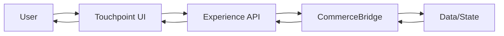
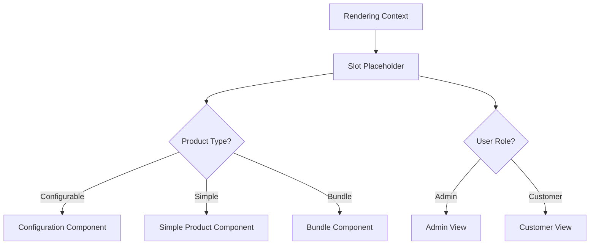

# Touchpoint Overview
**Tagline:** Dynamic ordering experiences for trade and industry.

## What It Is

Touchpoint is a modern UI framework for building B2B commerce experiences. It provides both customer-facing storefronts and admin management interfaces built on a shared component architecture.

The framework uses a slot-based design where UI components dynamically adapt to context (product type, user role, tenant configuration). This allows a single codebase to power vastly different experiences across industries and use cases.

Built from the ground up to integrate with CommerceBridge, Touchpoint delivers real-time pricing, dynamic availability, and sophisticated product configuration directly in the user interface.

## Why It Exists

Generic e-commerce UIs don't work for B2B complexity. Touchpoint solves:

| Problem | Solution |
|---------|----------|
| Rigid, one-size-fits-all UIs | Slot-based components that adapt to context |
| Separate admin and storefront codebases | Unified framework with role-based rendering |
| Static pricing displays | Real-time price calculation integration |
| Poor configurability | Dynamic component composition |
| Limited industry adaptation | Context-aware slot rendering |

## Core Abstractions

| Term | Meaning |
|------|---------|
| **Slot** | Component placeholder that renders based on context |
| **Context** | Product, user, and tenant information driving rendering |
| **Layer** | Admin or storefront experience type |
| **Configuration** | Tenant-specific UI customization |

## High-Level Flow


```mermaid
flowchart LR
    USER[User] --> UI[Touchpoint UI]
    UI --> API[Experience API]
    API --> BRIDGE[CommerceBridge]
    BRIDGE --> DATA[Data/State]
    DATA --> BRIDGE
    BRIDGE --> API
    API --> UI
    UI --> USER
```

## Architecture Layers

### Admin Layer

Management interface for:
- Product catalog configuration
- Pricing rule setup
- Delivery zone management  
- Customer account management
- Order processing
- System configuration

### Storefront Layer

Customer experience for:
- Product discovery and search
- Real-time pricing and availability
- Cart building
- Checkout and payment
- Order tracking
- Account management

### Shared Components

Both layers use the same:
- Base component library
- Slot architecture
- CommerceBridge integration
- State management patterns

## Slot-Based Architecture


```mermaid
flowchart TB
    CONTEXT[Rendering Context] --> SLOT[Slot Placeholder]
    
    SLOT --> TYPE{Product Type?}
    TYPE -->|Configurable| CONFIG[Configuration Component]
    TYPE -->|Simple| SIMPLE[Simple Product Component]
    TYPE -->|Bundle| BUNDLE[Bundle Component]
    
    SLOT --> ROLE{User Role?}
    ROLE -->|Admin| ADMIN[Admin View]
    ROLE -->|Customer| CUSTOMER[Customer View]
```

**Example:**

Same slot, different renderings:
```
ProductDetailSlot + Admin + Configurable Product
  → Configuration editor with pricing tools

ProductDetailSlot + Customer + Simple Product  
  → Clean product display with buy button

ProductDetailSlot + Customer + Configurable Product
  → Guided configuration wizard
```

## Public vs Private

| Public (Documented Here) | Private (Not Exposed) |
|--------------------------|----------------------|
| Slot concept and patterns | Component implementations |
| Integration patterns | Tenant-specific configurations |
| Customization approach | UI state management details |
| Generic examples | Actual tenant themes |

## Next

- [Slot-Based UI →](/touchpoint/slot-based-ui) — Component architecture
- [Admin vs Storefront →](/touchpoint/admin-vs-storefront) — Layer differences
- [CommerceBridge Integration →](/touchpoint/commercebridge-integration) — Data integration

---

**Touchpoint: Adapt to context, deliver experiences.**
