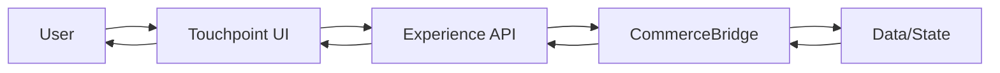
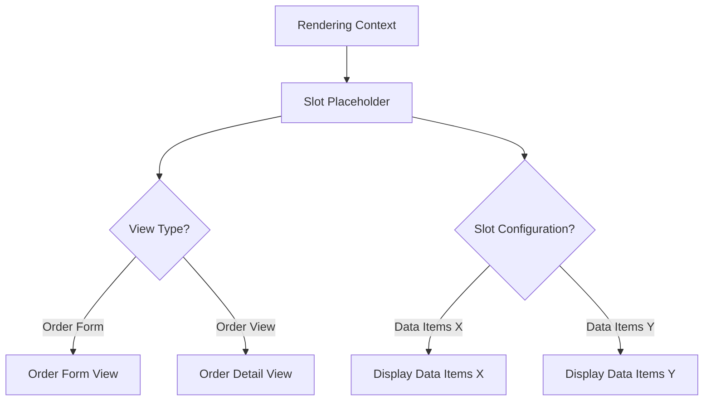

# Touchpoint Overview
**Tagline:** Dynamic ordering experiences

## What It Is

Touchpoint is a modern UI framework for building complex and multi-mode commerce experiences. It provides customer-facing storefronts, built on a shared component architecture and code-based extension framework.

The framework uses a slot-based design where UI components dynamically adapt to context (product type, user role, tenant configuration). This allows a single codebase to power vastly different experiences across industries and use cases.

Built from the ground up to integrate with CommerceBridge, Touchpoint delivers real-time pricing, dynamic availability, and sophisticated product configuration directly in the user interface.

## Why It Exists

Generic e-commerce UIs don't work for B2B complexity. Touchpoint solves:

| Problem | Solution |
|---------|----------|
| Rigid, one-size-fits-all UIs | Slot-based components that adapt to context |
| Separate admin and storefront codebases | Unified framework with role-based rendering |
| Static pricing displays | Real-time price calculation integration |
| Poor configurability | Dynamic component composition |
| Limited industry adaptation | Context-aware slot rendering |

## Core Abstractions

| Term | Meaning |
|------|---------|
| **Slot** | Component placeholder that renders based on context |
| **Context** | Product, user, and tenant information driving rendering |
| **Configuration** | Tenant-specific UI customization |

## High-Level Flow


```mermaid
flowchart LR
    USER[User] --> UI[Touchpoint UI]
    UI --> API[Experience API]
    API --> BRIDGE[CommerceBridge]
    BRIDGE --> DATA[Data/State]
    DATA --> BRIDGE
    BRIDGE --> API
    API --> UI
    UI --> USER
```

## Architecture Layers

### Storefront Layer

Customer experience for:
- Product discovery and search
- Real-time pricing and availability
- Cart building
- Checkout and payment
- Order tracking
- Account management

### Shared Components

Both layers use the same:
- Base component library
- Extensible component framework for advanced customizations
- Slot architecture
- CommerceBridge integration
- State management patterns

### Slot-Based Rendering Engine

The core rendering system that dynamically composes UI based on context:

- **Context Analysis** — Evaluates product type, user role, and tenant configuration
- **Component Selection** — Chooses appropriate components from the library
- **Dynamic Composition** — Renders the optimal UI for the current context
- **Real-time Updates** — Refreshes components when context changes

### Abstracted Commerce Engagement Model

Provides a unified interface to commerce operations:

- **Engagement Abstraction** — Presents complex commerce workflows as simple operations
- **Real-time Integration** — Connects directly to CommerceBridge for live data
- **State Synchronization** — Keeps UI state in sync with backend commerce state
- **Error Handling** — Provides consistent error states across all commerce operations

## Slot-Based Architecture


```mermaid
flowchart TB
    CONTEXT[Rendering Context] --> SLOT[Slot Placeholder]
    
    SLOT --> VIEW{View Type?}
    VIEW -->|Order Form| ORDER[Order Form View]
    VIEW -->|Order View| DETAIL[Order Detail View]
    
    SLOT --> CONFIG{Slot Configuration?}
    CONFIG -->|Data Items X| ITEMS_X[Display Data Items X]
    CONFIG -->|Data Items Y| ITEMS_Y[Display Data Items Y]
```

**Example:**

Same slot, different data configurations without code changes:
```
OrderLineItemSlot + Order Form View
  → Configured to show: SKU, Quantity, Unit Price, Total

OrderLineItemSlot + Order Detail View  
  → Configured to show: SKU, Description, Quantity, Unit Price, Total, Tax, Discounts
```

The slot renders different data items based on configuration, not based on user role or product type.

## Common Model and Service Structure

Touchpoint uses a common model and service structure for managing the engagement. This means that custom business logic can hook into this common model and trigger custom interactions through the engagement data model.

The engagement model serves as the central data structure that:
- **Unifies Commerce State** — All commerce operations work through the same engagement data model
- **Enables Custom Hooks** — Business logic can attach to engagement lifecycle events
- **Supports Custom Interactions** — Custom UI components can trigger and respond to engagement changes
- **Maintains Consistency** — All Touchpoint views operate on the same underlying engagement structure

This architectural approach allows for sophisticated customizations while maintaining the benefits of a unified commerce experience across all Touchpoint interfaces.

---

**Touchpoint: Adapt to context, deliver experiences.**
