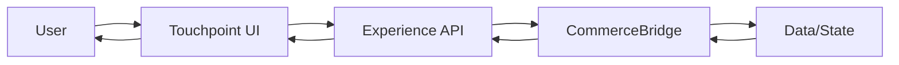

# Touchpoint Overview
**Tagline:** Dynamic ordering experiences

## What It Is

Touchpoint is a modern UI framework for building complex and multi-mode commerce experiences. It provides customer-facing storefronts for cart/order/quote (engagement) building, built on a shared component architecture, data-binding configuration layer, and code-based extension framework.

The framework uses a slot-based design where UI components dynamically adapt to context (product type, user role, tenant configuration). This allows a single codebase to power vastly different experiences across industries and use cases.

Built from the ground up to integrate with CommerceBridge, Touchpoint delivers real-time pricing, dynamic availability, and sophisticated product configuration directly in the user interface.

### Abstracted Business Logic

**Touchpoint contains no business logic.** It doesn't calculate prices, multiply quantities, or validate inventory. All business logic lives in CommerceBridge.

When a user adds a product or changes quantity, Touchpoint:
1. Sends an **action** to the Experience API
2. API routes the job to a tenant-configured worker
3. Worker recalculates the engagement (pricing, totals, allocation)
4. Notification emitted that engagement was updated
5. Touchpoint reloads and re-renders with fresh calculated data

**No frontend calculations. Not even qty × price.** Everything flows through CommerceBridge workers and engines.

This means:
- **Consistency** — Same business logic across all channels
- **Accuracy** — Complex pricing and fulfillment handled by dedicated engines
- **Security** — Business logic can't be bypassed in the frontend
- **Tenant Flexibility** — Each tenant's workers implement their specific rules

### Data-Binding Configuration Layer

Unlike traditional UI frameworks where you turn features on/off, Touchpoint uses a **data-binding configuration** that lets you compose UI from actual data paths.

**Example:**
Instead of toggling "Show SKU: On/Off", you configure a slot with `product.sku`. This means you can add SKU data to any slot, anywhere in the UI — product cards, order forms, detail views, search results. The same data binding (`product.sku`) works everywhere because slots resolve data paths dynamically.

This approach gives you:
- **Complete flexibility** — Add any data field to any slot
- **No code changes** — Configuration-driven data composition
- **Consistency** — Same data binding works across all views
- **Extensibility** — Add custom data paths for your business

### UI Integrity Through Slots

The slot-based approach **maintains UI integrity** by preventing common customization problems:

**Traditional customization issues:**
- Code injection breaks responsive design
- CSS overrides cause layout conflicts
- Custom HTML disrupts accessibility
- Hard-coded styling breaks on mobile

**Touchpoint's slot-based protection:**
- Slots render pre-built, tested components
- Data bindings can't inject arbitrary HTML/CSS
- Responsive design remains intact
- Mobile layouts stay functional
- Accessibility preserved

You get **safe customization** — add data fields, rearrange slots, configure what shows where — without breaking the underlying UI architecture.

## Why It Exists

Generic e-commerce UIs don't work for B2B complexity. Touchpoint solves:

| Problem | Solution |
|---------|----------|
| Rigid, one-size-fits-all UIs | Slot-based components that adapt to context |
| Separate admin and storefront codebases | Unified framework with role-based rendering |
| Static pricing displays | Real-time price calculation integration |
| Poor configurability | Dynamic component composition |
| Limited industry adaptation | Context-aware slot rendering |

## Core Abstractions

| Term | Meaning |
|------|---------|
| **Slot** | Component placeholder that renders based on context |
| **Context** | Product, user, and tenant information driving rendering |
| **Configuration** | Tenant-specific UI customization |

## High-Level Flow

## Architecture Layers

### Storefront Layer

Customer experience for:
- Product discovery and search
- Real-time pricing and availability
- Engagement (Cart/Order/Quote) building
- Checkout and payment
- Account management

### Shared Components

Both layers use the same:
- Base component library
- Extensible component framework for advanced customizations
- Slot architecture
- CommerceBridge integration
- State management patterns

### Slot-Based Rendering Engine

The core rendering system that dynamically composes UI based on context:

- **Context Analysis** — Evaluates product type, user role, and tenant configuration
- **Component Selection** — Chooses appropriate components from the library
- **Dynamic Composition** — Renders the optimal UI for the current context
- **Real-time Updates** — Refreshes components when context changes

## Common Model and Service Structure

Touchpoint uses a common model and service structure for managing the engagement. This provides a unified interface to commerce operations and means that custom business logic can hook into this common model and trigger custom interactions through the engagement data model.

The engagement model serves as the central data structure that:

- **Engagement Abstraction** — Presents complex commerce workflows as simple operations
- **Real-time Integration** — Connects directly to CommerceBridge for live data
- **State Synchronization** — Keeps UI state in sync with backend commerce state
- **Error Handling** — Provides consistent error states across all commerce operations
- **Unifies Commerce State** — All commerce operations work through the same engagement data model
- **Enables Custom Hooks** — Business logic can attach to engagement lifecycle events
- **Supports Custom Interactions** — Custom UI components can trigger and respond to engagement changes
- **Maintains Consistency** — All Touchpoint views operate on the same underlying engagement structure

This architectural approach allows for sophisticated customizations while maintaining the benefits of a unified commerce experience across all Touchpoint interfaces.

---

**Touchpoint: Adapt to context, deliver experiences.**
