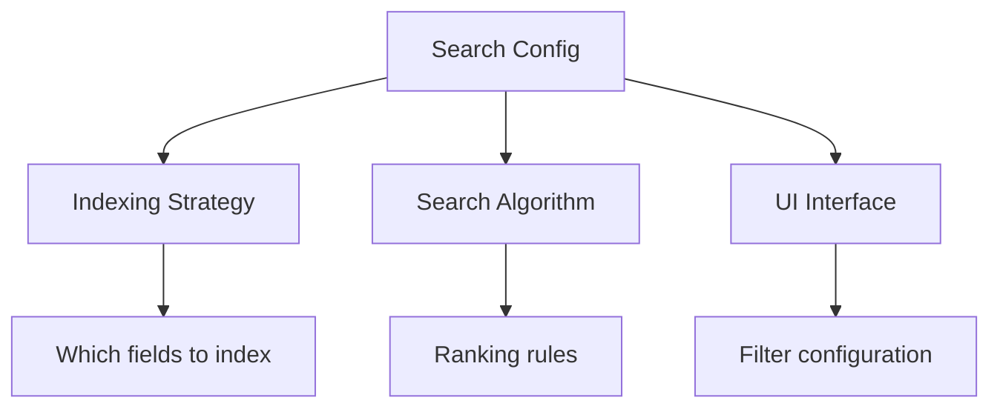
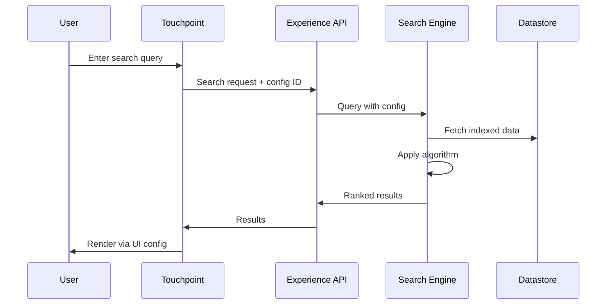

# Search
**Concept:** Configurable search indexing, algorithms, and interfaces.

---

## The Concept

Search in Touchpoint is not a single, monolithic feature. It's a **configurable system** controlled through search configs that define:

- **Indexing** — What data to index and how
- **Algorithm** — How to rank and filter results
- **Interface** — How to display results in the UI

Multiple search configs can exist, allowing different search experiences for different product types, categories, or use cases.

---

## Search Configs

A **search config** defines a complete search experience:



### Multiple Configs for Different Needs

**Example Scenario:**

**Search Config A: "Industrial Supplies"**
- Indexes technical specifications
- Ranks by exact match priority
- Shows detailed filters (material, size, rating)

**Search Config B: "Office Products"**
- Indexes brand and category
- Ranks by popularity
- Shows simple filters (category, price range)

**Search Config C: "Custom Products"**
- Indexes configuration options
- Ranks by customization compatibility
- Shows configuration-aware filters

---

## Indexing Strategy

The search config defines **what gets indexed** and **how**:

### Product Type-Specific Indexing

Different product types index different fields:

**Configurable products:**
- Base product data
- All configuration attributes
- Option values and combinations
- Compatibility rules

**Standard products:**
- Product name, SKU, description
- Category and brand
- Specifications
- Inventory status

**Services:**
- Service description
- Availability schedules
- Pricing tiers
- Location coverage

### Category-Specific Indexing

Refine indexing per category:
- Plumbing supplies → Index dimensions, material, pressure ratings
- Electronics → Index specs, compatibility, certifications
- Apparel → Index sizes, colors, materials

---

## Algorithm Configuration

Each search config can use a different **search algorithm**:

### Ranking Strategies

**Exact Match Priority:**
- Exact SKU matches rank highest
- Exact product name matches next
- Partial matches lower

**Relevance Scoring:**
- TF-IDF or BM25 text matching
- Boost important fields (name, SKU)
- Decay by distance from search terms

**Business Rules:**
- Boost in-stock items
- Boost margin leaders
- Boost featured products
- Demote discontinued items

**Custom Algorithms:**
- Tenant-specific ranking logic
- Industry-specific relevance
- Context-aware scoring

### Filtering Logic

**Hard Filters (Must Match):**
- Category must be "Plumbing"
- Must be in stock
- Must ship to customer's zone

**Soft Filters (Preference):**
- Prefer brand X
- Prefer price range Y
- Prefer recent additions

---

## UI Interface Configuration

The search config defines how results are **displayed**:

### Filter Panels

Configure which filters appear:
```
Product Search Config:
  Filters:
    - Category (multi-select)
    - Price Range (slider)
    - In Stock (toggle)
    - Brand (multi-select)
    - Material (multi-select, if category = "Industrial")
```

### Result Display

Configure data bindings for result cards:
```
Search Result Slot configured with:
  - product.name
  - product.sku
  - pricing.finalPrice
  - inventory.inStock
  - product.primaryImage
```

### Sort Options

Define available sort methods:
- Relevance (default algorithm ranking)
- Price: Low to High
- Price: High to Low
- Newest First
- Name: A-Z

---

## Multi-Config Example

**Scenario:** A distributor sells both industrial supplies and office products.

**Industrial Search Config:**
```
Indexing: Technical specs, materials, dimensions
Algorithm: Exact match priority (customers know part numbers)
UI: Detailed filters (spec-heavy), compact result cards
```

**Office Search Config:**
```
Indexing: Brand, product type, features
Algorithm: Relevance scoring (customers browse)
UI: Simple filters (category, price), visual result cards
```

Same search infrastructure, completely different experiences based on config.

---

## Search Flow



---

## Benefits

### Per-Category Optimization
Refine search for each product category without affecting others.

### Tenant Customization
Each tenant can have custom search algorithms and interfaces.

### A/B Testing
Deploy different search configs and compare results.

### Evolution
Update indexing, algorithms, or UI independently without code changes.

---

## Learn More

For related concepts, see:

- **[Slot-Based UI](/touchpoint/slot-based-ui)** — How search results render through slots
- **[Datastores](/core/caching-strategies)** — How product data is indexed
- **[Touchpoint Overview](/touchpoint)** — Complete framework overview

---

**Search: One engine, infinite configurations.**

