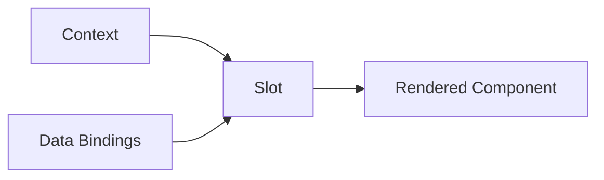

# Slot-Based UI
**Pattern:** Context-aware component rendering with data-binding configuration.

---

## The Problem

Different contexts require different UIs, but traditional approaches fail:

**Code customization:**
- Breaks responsive design
- Disrupts accessibility
- Creates maintenance nightmares
- Conflicts with updates

**Simple on/off toggles:**
- Too rigid
- Can't compose data dynamically
- Limited flexibility
- Doesn't scale to complex needs

---

## The Solution: Slots with Data Binding

**Slots** are component placeholders that:
1. Receive context (product type, user role, tenant config)
2. Accept data-binding configuration (e.g., `product.sku`, `pricing.finalPrice`)
3. Render appropriate components with configured data
4. Maintain UI integrity (no code injection)



---

## Data-Binding Configuration

Instead of simple toggles, slots use **data path bindings**:

### Traditional Toggle Approach (Limited)
```
Show SKU: [ON/OFF]
Show Description: [ON/OFF]
```

### Touchpoint Data-Binding Approach (Flexible)
```
ProductCardSlot configured with:
  - product.sku
  - product.name
  - pricing.finalPrice
  
OrderFormSlot configured with:
  - product.sku
  - product.name
  - lineItem.quantity
  - pricing.subtotal
```

**Same data binding (`product.sku`) works in any slot** — product cards, order forms, search results, detail views. You're composing UI from data paths, not just toggling features.

---

## UI Integrity Protection

The slot-based approach **maintains UI integrity**:

### What's Protected
- ✅ Responsive design stays intact
- ✅ Mobile layouts remain functional
- ✅ Accessibility preserved
- ✅ Component styling consistent
- ✅ Updates don't break customizations

### How It Works
- Slots render **pre-built, tested components**
- Data bindings **can't inject HTML/CSS**
- Configuration is **safe by design**
- Customization through **composition, not code injection**

**Result:** You get powerful customization without the typical risks of breaking the UI.

---

## Context-Aware Rendering

Slots adapt to context automatically:

### Product Type Context
- Simple products → Simple display
- Configurable products → Configuration wizard
- Services → Service booking UI

### User Role Context  
- Customer → Streamlined purchase flow
- Sales rep → Enhanced tools and controls
- Guest → Limited product browsing

### Tenant Configuration
- Industry-specific layouts
- Custom data field visibility
- Branded component styling

---

## Common Model and Service Structure

Touchpoint uses a unified engagement model across all slots and components. This means:

- **Engagement Abstraction** — Complex commerce workflows presented as simple operations
- **Real-time Integration** — Direct connection to CommerceBridge for live data
- **State Synchronization** — UI state stays in sync with backend commerce state
- **Error Handling** — Consistent error states across all operations
- **Custom Hooks** — Business logic can attach to engagement lifecycle events
- **Custom Interactions** — Custom components can trigger and respond to engagement changes

All slots operate on the same underlying engagement structure, enabling sophisticated customizations while maintaining consistency.

---

## Benefits

### Single Codebase
One component system powers multiple industries, user types, product types, and tenants.

### Safe Customization
Configure data composition and slot arrangement without breaking UI integrity.

### Maintainable
Changes in one place, consistent behavior, easier testing, clear boundaries.

### Scalable
Add new data bindings, create custom slots, extend without modifying core.

---

## Learn More

For detailed implementation, see:

- **[Touchpoint Overview](/touchpoint)** — Complete framework overview
- **[CommerceBridge Integration](/touchpoint/commercebridge-integration)** — How slots connect to commerce data
- **[Customization](/touchpoint/customization)** — Extending slots and components

---

**Slots: Safe customization through data composition.**
