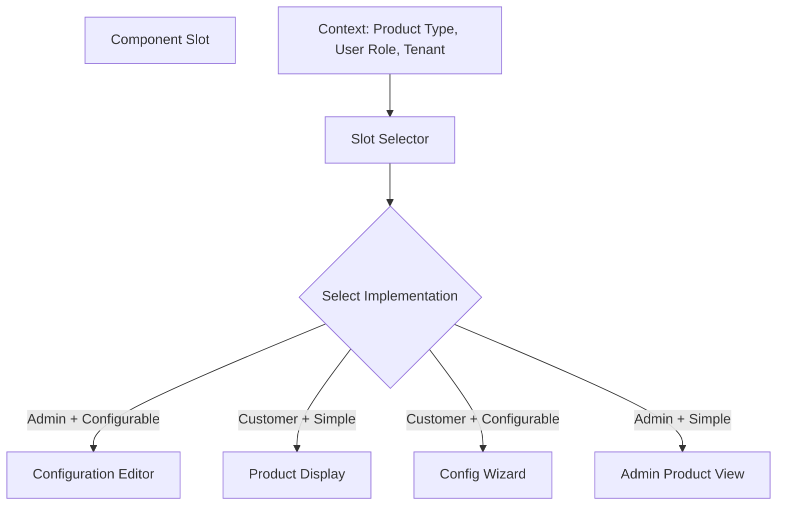

# Slot-Based UI
**Pattern:** Context-aware component rendering.

## Problem

Different contexts require different UIs:
- Admins need detailed controls
- Customers need simplified views
- Configurable products need configuration UIs
- Simple products need basic displays
- Different industries have different needs

**Rigid components can't adapt to all scenarios.**

## Solution

Slot-based architecture where components render based on context:


```mermaid
flowchart TB
    SLOT[Component Slot]
    CONTEXT[Context: Product Type, User Role, Tenant]
    
    CONTEXT --> SELECTOR[Slot Selector]
    SELECTOR --> IMPL{Select Implementation}
    
    IMPL -->|Admin + Configurable| C1[Configuration Editor]
    IMPL -->|Customer + Simple| C2[Product Display]
    IMPL -->|Customer + Configurable| C3[Config Wizard]
    IMPL -->|Admin + Simple| C4[Admin Product View]
```

## How It Works

### Context Determines Rendering

```ts
// Slot receives context
<ProductSlot
  product={product}
  userRole="customer"
  tenantConfig={tenantConfig}
/>

// Slot selects appropriate component
function ProductSlot({ product, userRole, tenantConfig }) {
  if (userRole === 'admin') {
    return <AdminProductView product={product} />
  }
  
  if (product.type === 'configurable') {
    return <ConfigurableProductView product={product} config={tenantConfig} />
  }
  
  return <SimpleProductView product={product} />
}
```

### Slot Types

**ProductSlot:**
- Product detail display
- Renders based on product type and user role

**PricingSlot:**
- Pricing display
- Shows breakdown for admins, final price for customers

**CartSlot:**
- Cart display
- Admin vs customer views

**CheckoutSlot:**
- Checkout process
- Adapts to payment methods and workflows

## Customization

Tenants can customize slot rendering:

```ts
// Tenant configuration
const tenantConfig = {
  productSlot: {
    showInventory: true,
    showDetailedPricing: true,
    layout: 'detailed'
  }
}

// Slot uses config
<ProductSlot config={tenantConfig.productSlot} />
```

## Benefits

### Single Codebase

One component system powers:
- Multiple industries
- Multiple user types
- Multiple product types
- Multiple tenants

### Easy Customization

Change slot behavior without code changes:
- Toggle features via config
- Select different implementations
- Adjust layouts and styling
- Enable/disable sections

### Maintainable

- Changes in one place
- Consistent behavior
- Easier testing
- Clear boundaries

## IP Safety

This describes:
- **Public:** Slot concept, context-based rendering, customization pattern
- **Private (not shown):** Specific component implementations, tenant configurations, UI state details

---

**Slots: One component system, infinite variations.**
