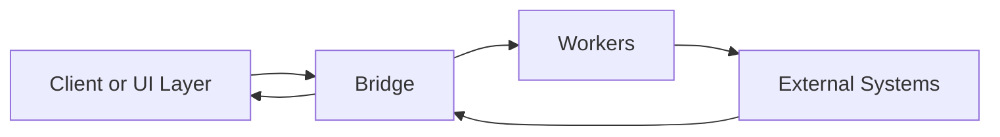

# <Product> Overview
**Tagline:** <One-line purpose statement>

## What It Is
Explain what this framework or product does in plain language (2–3 paragraphs).  
Avoid jargon and implementation detail.

## Why It Exists
Highlight the problems it solves and how it differs from legacy systems.

- Problem 1 → Solution
- Problem 2 → Solution
- Problem 3 → Solution

## Core Abstractions
| Term | Meaning |
|------|----------|
| Bridge | Integration and orchestration layer |
| Engagement | Lifecycle container for commerce actions |
| Worker | Stateless processor of discrete jobs |

## High-Level Flow

## Public vs Private
| Public | Private |
|--------|----------|
| Concepts, safe models, pseudo-SDK functions | Schemas, infra details, tenant-specific logic |

## Next
- [Bridge →](/commercebridge/bridge)
- [Engagement →](/commercebridge/engagement)
- [Workers →](/commercebridge/workers)
